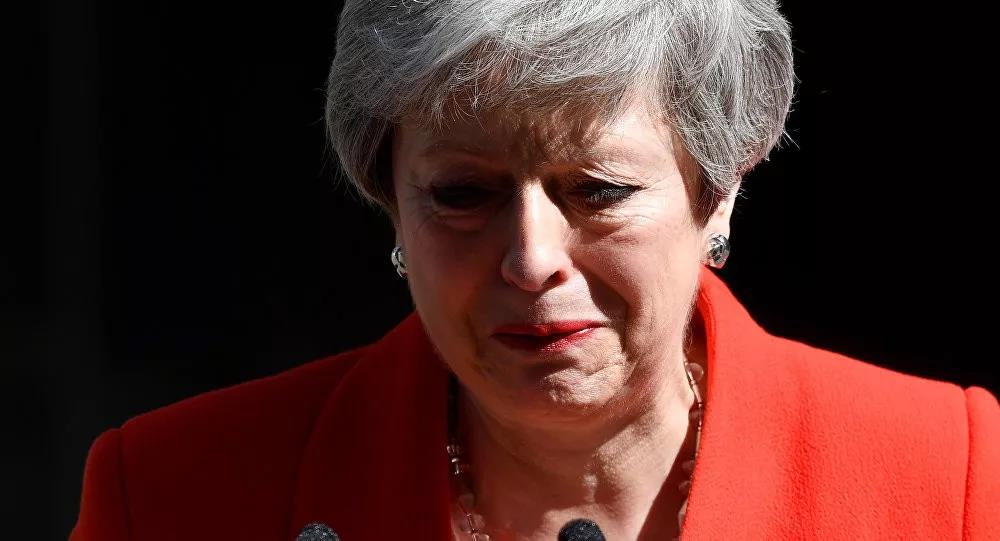
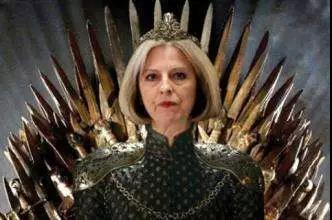
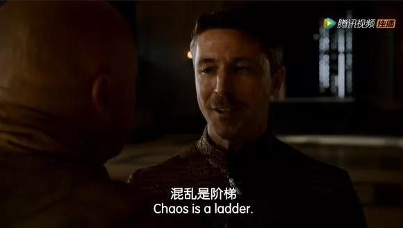

##正文

昨日，随着英国脱欧协议的再一次被否决，受此影响英镑跳水，贬值幅度之大仅次于2016年的脱欧公投。

而比英磅跳水更惨的，则是英国女首相特蕾莎·梅，失败的她站在在唐宁街10号泪流满面地发布声明，将于6月7日卸任英国保守党领袖。

嗯，就像前几天“龙妈”的陨落一样，一场英国脱欧版《权力的游戏》终于落下了帷幕。 

 

说起来，英国作为《权力的游戏》中的原型，梅姨和龙妈这两位女性征服者，有着极大的相似之处。

 

最初，在这场脱欧进程中，梅姨和他的保守党就像龙妈一样拥有了绝对的优势，但是听信自家的“小恶魔”，将英国大选提前，希望进一步扩大优势不战而胜。

可是，原本期望借“脱欧”东风的梅姨在大选中，就像龙妈被铁群岛摆了一道那样，遭遇了工党与其援军苏格兰民主党的完美狙击，原本占据绝对优势的下院多数席位竟然丢了，兵力严重损失之后，不得不考虑跟工党谈判。

在这场最后的脱欧谈判中，梅姨就像在与夜王战斗中的龙妈那样，误信了“小恶魔”对于工党的判断，试图联合工党，达成一份软脱欧协议。

但是，没想到为了推动这份脱欧协议，梅姨自家的保守党损兵折将民意大幅下滑，而此时工党却像瑟曦那样突然翻脸，裹挟着民众强烈反对这份梅姨付出巨大代价搞出来的协议。

而更痛苦的是，在梅姨主导的退欧过程中，内阁会议中有21人先后“背叛”，一度逼着梅姨跟龙妈类似，自己把自己关起来谁都不见，就怕被自己人搞政变干掉。

而致命一击发生在本月22日，梅姨最坚定支持者，曾主动放弃竞争党领袖的Leadsom宣布辞职，就像雪诺推开了龙妈那样，成为了压垮梅姨内心的最后一根稻草......

所以呢，一直试图寻求各方妥协已达成协议的梅姨，面对协议失败、众叛亲离、大本钟敲响了她的哀鸣之后，也就没有再坚持了。

 

大概，也就是梅姨没有一条会喷火的龙，只能含着眼泪黯然卸任，否则这种接连的心里打击，搞不好也会像龙妈那样去毁灭她曾经试图去保护的一切。

 

而随着试图弥合各派达成一致的梅姨谢幕，曾经被视为典范的英国政治体系，很可能也将面临崩溃，接下来英国政坛两大政党有可能会出现“凡是敌人坚持的我们就坚决反对，凡是敌人反对的我们就坚决支持”的局面，**因此英国未来只有硬脱欧一项可选。**

而这背后，是随着全球化的推进，全球化精英们在过程中赚的盆满钵满，但普通民众则饱受移民冲击、失业危机以及贫富差距扩大的打击，选择用投票的方式来发泄自己的不满。

而英国的脱欧公投就像打开了一个潘多拉的魔盒，允许对于政治和经济缺乏了解的选民，直接作出影响深远的政治选择。

此时，民众的愤怒再加上通讯技术的发展，互联网取代了传统政治的纸牌屋，英国梅姨的失败，意味着英国的精英政治们家，也将很难再通过传统的政治手段来弥合内部的矛盾，各方都会选择激进的策略争夺选民的选票。

因此，可以预见的是，随着梅姨这个“糊纸匠”的惨败，英国其他的“糊纸匠”也将失势，接下来的英国政坛，不仅会搞出一纸“无协议硬脱欧”，更会**选出一个的“英式特朗普”。**

 

而“英式特朗普”这个变化，将会对全球政局引发影响深远而不可预料的变化。

在国际政局中，英国就像《权力的游戏》中的“小指头”那样，原本是躲在巨头后面挑拨他们之间互斗而获益，就像去年连续在叙利亚把特朗普和普京坑得够呛那样，英国人几百年来都是沿着混乱的阶梯往上爬。

而此时英国这个全球离岸平衡者一旦“特朗普化”，就像“小指头”突然智商下线那样，全球的权力游戏不仅会突然混乱，接下来“强势英国”的一些所作所为，恐怕很快也要让观众们骂娘了。

当然，这种变化，也将深刻的影响国际政局。

譬如随着英国的右转，几个月后，新的英国首相有可能会挑起民粹以获取政党支持度，因此某些国家**之前与梅姨达成的妥协和谅解，部分可能会失效，甚至不排除可能会出现一些领域上的冲突**，因此得提前做好准备以规避。

不过另一方面，随着英国走向硬脱欧，欧盟各国对英国彻底死心后，也将不得不扩大朋友圈以对冲英国脱离欧盟带来的地缘与经济损失，因此，**我们在欧洲的引进技术、海外并购甚至非洲合作方面，也将迎来一个新的契机。**

机会，往往都是在对方出现巨大失误之际才会出现，就像《权力的游戏》中那句经典名言，chaos is a ladder ！

 

抓住混乱带来的机会，就是最大的赢家。

##留言区
 

