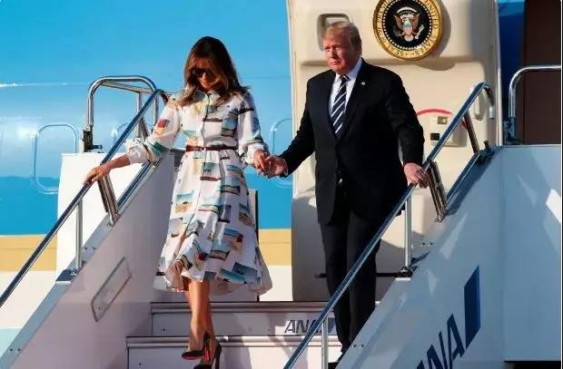
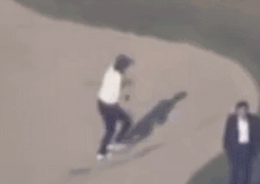
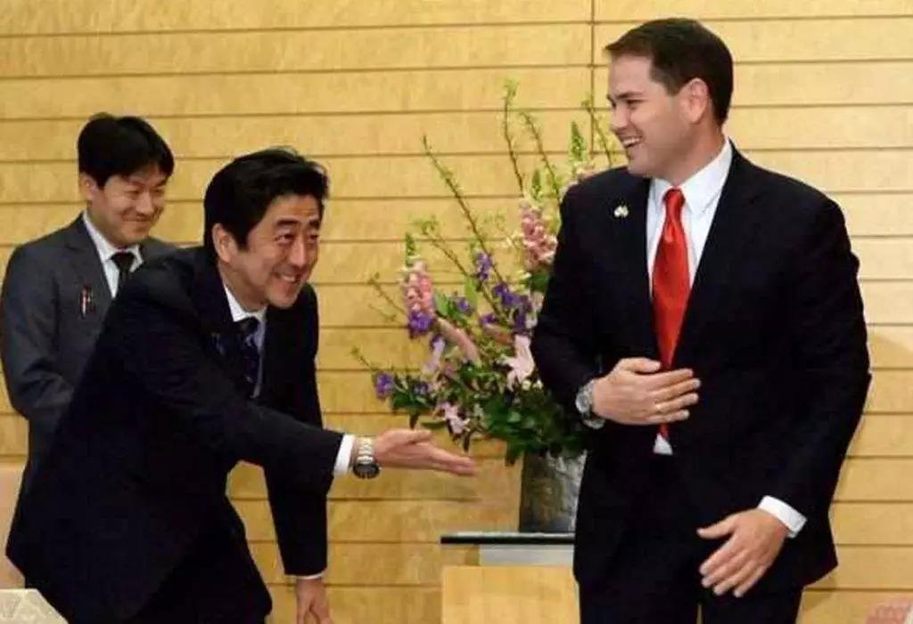
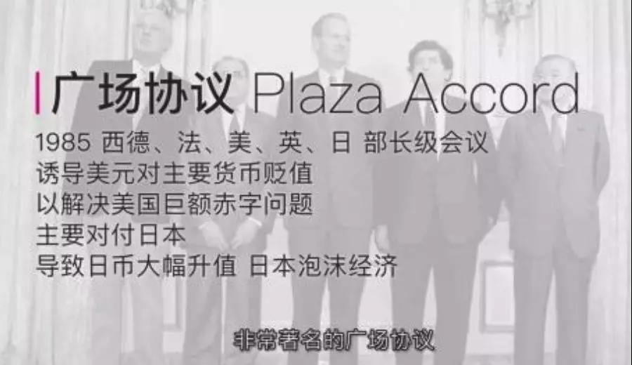

##正文

 

昨天傍晚，特朗普携夫人抵达东京羽田机场，成为日本开启令和时代后，迎接的首位“国宾”。

嗯，按照行程，这位美国总统将于明日拿下刚刚继位的日本德仁天皇的“第一次”......

说起来，政治人物，尤其是世袭政治人物的“第一次”，往往都蕴含着极大的荣耀。因此，此番受邀的特朗普自然也没忘记“吹牛逼”，这几天反复对向外界炫耀自己拿到了日本的“第一次”：

>安倍晋三首相向我传达了我将作为唯一主宾被邀请的消息。在世界所有国家中，我将作为历史性活动的主宾受邀......

>在日本历史性时期，我成为了世界上唯一的主宾......

当然，就像特朗普破天荒把自己上任后的出访“献给”沙特，随后沙特国王就跟特朗普签署了3500亿美元的军火大单那样，荣誉的背后，往往也都有着金钱的交易。

虽然美国白宫方面表示，此次出访的主要目的是“庆祝新到来的日本令和时代。”但是按照双方公开的行程，特朗普在明日会见天皇之后，将与首相安倍磋商双方的贸易关系。

因此，上任前就一直叫嚣要让日本“付出代价”的特朗普，在拿到了天皇的“第一次”之后，被记者被问到美日贸易谈判的问题时，就忽然顾左右而言他了......

毕竟，新任的日本天皇5月1日才登基，而特朗普原计划将在6月底与其他的G20领导人一起齐聚大阪，日方在如此匆忙的时间内，还能把天皇的“第一次”插空留给特朗普着实不易。

而除了搬出天皇来“孝敬”特朗普之外，安倍在更是明天下午的贸易谈判之前，想尽办法投特朗普所好。

譬如声势方面，警视厅出动日本历史上最大规模的25000人为特朗普此行保驾护，同时，大规模交通管制也堪称史无前例。

更不要说接待了，昨天晚上安倍组织承诺将加大对美投资的企业家迎接特朗普，今天上午，安倍亲自陪着特朗普打了一上午的高尔夫，下午，则一同观看专门为特朗普协调时间的相扑决赛，获胜者将获得以特朗普名字命名的奖杯。

 

 

可以说，**安倍花尽了心思，以卑躬屈膝的姿态把用金钱无法买到的仪式感，充斥于本次的访问过程中。**

**目的，就是为了能够在贸易谈判中少花点金钱，多争取点时间，避免按照美贸易谈判代表莱特希泽的想法，在本次会面上发布联合声明。**

说到安倍的外交模式，很多人的第一反应就是“卑躬屈膝”。

譬如是打高尔夫时被特朗普甩在身后，匆忙去追时的窘迫。

 

以及会见普京时著名的一路小跑。

 

甚至那张震惊世界的一路小跑奔向中国驻日使馆.....

 

由于安倍外交的过于卑躬屈膝，使得很多政治评论人士认为，安倍在这些外交中没有取得任何成果，卑躬屈膝只是在掩盖安倍的外交失败。

不过，政事堂看来，那些人实在是过于低估东亚政治家们的水平了，如果把眼光放远一点，在**特朗普刚刚拿下总统大位后，安倍就已经开始为即将到来的美日贸易谈判积极备战了。**

我们可以看一下，安倍在2017年下半年都做了什么：
 
7月，通过主动下调欧洲进口关税释放善意，与欧盟就经济伙伴关系协定（EPA）达成原则性协议。

9月，一路小跑到我使馆出席中国国庆庆典，解冻自钓鱼岛危机来冰封已久的中日关系，随后积极参与区域全面经济伙伴关系（RCEP）谈判。

11月，在特朗普退出TPP，贸易协定分崩离析之际，游走于其他TPP十国，力主发布联合声明，将TPP改为CPTPP。

可以说，在特朗普上台不到一年的时间内，**安倍为了筹备特朗普政府的贸易施压，早早就开始筹备EPA、RCEP、CPTPP这三张可以对抗特朗普的手牌。**

而且，通过之前四次卑躬屈膝的高尔夫式外交，**把原本产业链直接冲突的美日贸易谈判，拖在了其他谈判各方的后面，为自己接下来的动作，争取到了足够的时间。**

我们看一下安倍近期的经贸战绩：

2018年5月9日，中国总理时隔8年访日，中日确定共同开发三方市场。

2018年11月14日，第二次RCEP领导人会议，与会领导人一致同意，在一年内完成区域全面经济伙伴关系协定（RCEP）谈判。

2018年12月30日，全面与进步跨太平洋伙伴关系（CPTPP）协定正式生效。

2019年2月1日，日欧经济伙伴关系协定（EPA）正式生效

甚至上个月，安倍差一点实现了中日关系上的重要突破。

可以说，相比于欧洲的政客们还在因为脱欧、黄马甲、移民等问题上乱成一团的时候，安倍却在此次会见特朗普之前，将全球主要的经济体拉上了日本的经济战车。
 
譬如中日关系，自奥巴马重返亚太以来，日本一直都是包围网的马前卒，可特朗普刚上台，安倍马上就从包围网跳出来，第一个转向，以极其卑躬屈膝的态度对中国示好。

譬如日欧的协议，谈了快十年了也没啥动静，可是特朗普一上台，安倍就主动降低了欧盟出口的肉食关税，以极低的姿态迅速推动。

 

很多人都以为CPTPP和EPA仅仅是经济协议，其实对于安倍来说，这些协议的背后都是政治协议。
 
譬如CPTPP协议的原型TPP协议，是奥巴马政府为“重返亚太”，建立包围网而量身定做的，美国需要为此大规模的输血，原本日本可以搭顺风车蹭美国点油水，现在作为一个没有“武力保证”的领头羊，维系CPTPP反而需要一定的输血。
 
同样，EPA协议由于欧盟和日本都是发达国家，相互之间的关税水平都不高，因此降低关税的实际意义有限，反而日本的农民会因此受到欧洲农产品的冲击。
 
但是，对于安倍来说，手握CPTPP协议和EPA协议，在面对特朗普的贸易大棒时，相当于多了两个筹码，面对莱特希泽“纸飞机”的威胁，日本不至于像30年前签订广场协议时那样，只能屈辱的全盘接受。

毕竟，随着日本签署CPTPP协议和EPA协议，日本对欧洲、澳洲和加拿大的关税大幅下降，这一年来，美国在日的农产品市场逐步被美国的盟友们取代。
 
而农业选区，是特朗普中重要的“摇摆州”，如今迟迟不终止的贸易战，已经成为了特朗普头上的一把随时可以落下的利刃，因此，农产品进口大户的日本对于特朗普团队来说异常重要，这将为安倍争取贸易谈判争取一定的主动权。

同样，日本与中国接下来的贸易协作以及RCEP，也将成为安倍接下来对美贸易谈判中的杀手锏，**尤其能够在美国主张的一些“排他性”的条款中寻求空间。**

而因为此次“盛情款待”导致缺乏特朗普支持的莱特希泽，为了防止日本在压力下推动中日经贸抱团升温，**也不敢轻易对日本极限施压，这将有利于安倍为了从特朗普手中争取一个相对好的协议。**

可以说，吸取了30年多前广场协定的教训，安倍早早的就布下了一盘大棋，并一步步的向前推进。

 

那么，老谋深算的安倍，会在接下来会在美日贸易谈判时取得胜利么？

政事堂认为，哪怕安倍机关算尽，布局多年，安倍拿到手的协议，多半也是要“丧权辱国”的........

一方面，就像30多年前莱特希泽能够吊打日本的谈判官员，不是因为那些官员能力不行，也不是日本的国力不行，而是因为日本领土上有着美国的驻军。

因此，一贯出尔反尔的特朗普一旦变卦，莱特希泽们随时可以能针对日本搞一次极限施压，在驻日美军以及美国全方面的压力下，即使安倍准备得再充分，恐怕也不得不选择“投降”。

而另一方面，安倍除了准备贸易谈判外，这几年他外交工作的第一重心，是趁着特朗普的美国战略收缩，试图在特朗普任期内推动日本的国家正常化。

因此，为了实现二战战败后，日本国家正常化这个历史性责任，经济方面任何损失对于安倍来说都可以接受，只要特朗普敢开价，窃喜的安倍绝不还价。
 
 

最后，说点题外话。

最近，不少境外媒体频频在华为问题上对我们极限施压，不少人也因此惶惶。但是反过来看就会明白，这仗打到现在，战争已经无法扩大，我们需要应对的，主要就只剩下舆论战了。

就像莱特希泽来了中国那么多次，哪次他敢像对日本那样把谈判文件折成纸飞机来丢？中国又怎么可能会像日本那样，每次美国提出了要求，就只能闭嘴默默忍受？

中国不会像日本那样认怂，也不需要向安倍那样委曲求全！这是因为日本在密苏里号里，签署的那叫投降协议！而咱们当年在三八线上，签署的那叫停战协定！

平等谈判的地位不是靠谈出来的，而是靠着上甘岭上、长津湖畔的英雄儿女们，用鲜血换来的！

美方不能像当年对日本那样对我们肆意蹂躏，不是因为我们乖的像安倍那样卑躬屈膝，而是因为那些六十多年前，那些曾将鲜血与青春挥洒在鸭绿江南岸的志愿军！

##留言区
 

