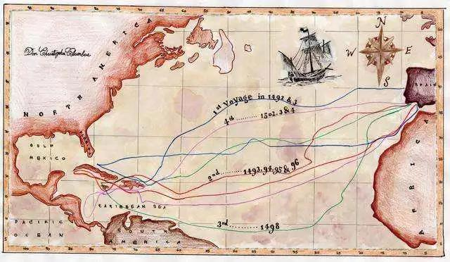
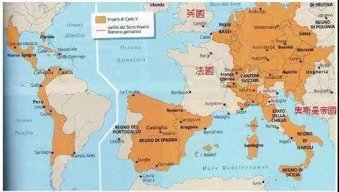

##正文

科创板要来了！

上交所今日发布了科创板上市委2019年第1次审议公告，将于6月5日召开第1次审议会议，审议深圳微芯生物科技股份有限公司、安集微电子科技（上海）股份有限公司、苏州天准科技股份有限公司等3家企业发行上市申请。

不过，今天的故事，先要从大航海时代说起。

六百多年前，在伊比利亚半岛上，游荡着一位贾跃亭式的“大忽悠”，拿着一份商业计划书到处寻求投资。

这个人，就是受马可波罗游记影响，试图寻找黄金之国的哥伦布。

当时，欧洲通向亚洲的商路沿着古丝绸之路向东走，这使得“中间商”阿拉伯人和意大利人累积了巨额的财富。

对此，哥伦布提出了一个方案，根据地球是圆的，一路向西横渡大西洋，可以寻求另一条新航线抵达亚洲，这样就能“没有中间商赚差价”。

哥伦布如此热衷于寻找新航线，是因为当时的法律对于新航线就像如今的知识产权一样，有着严格的保护，谁拿到了新航线，就能确定了自家的5G标准数据码那样，可以躺着赚大钱。

不过，当哥伦布向当时的海上霸主，葡萄牙国王提出这个方案的时候，却被束之高阁。

因为梦想家哥伦布虽然描绘的未来很美好，但是他将地球算得太小了，依照当时的技术，根本不可能在缺乏补给的情况下，横跨大西洋+太平洋这么远的距离。

而且，雪上加霜的是，就在哥伦布售卖自己的PPT之际，葡萄牙探险家迪亚士发现非洲好望角这个通向亚洲的航线，于是，印度+非洲+欧洲，这条既利于补给又能搞三角贸易的航线，使得哥伦布的PPT方案被彻底打入冷宫。

于是，愤恨说着“我一定会回来！”的哥伦布，开始了他的“周游列国”，到处兜售他的PPT方案，但是各国国王都对他的方案没有兴趣，反而大忽悠哥伦布的名号被广为流传。

就在哥伦布准备放弃的时候，他在西班牙的卡斯提尔王国遇到了他的大贵人，伊莎贝拉一世。

当时，伊莎贝拉正准备统一西班牙，而发动统一战争需要大量的军费，而且还得给领主们封地奖励，因此，急需扩张的伊莎贝拉顶住了国内的巨大压力，资助了大忽悠哥伦布。

嗯，甚至当时一度传闻伊莎贝拉为了资助这次远航，这位女王把自己的首饰都卖了。

至于后来航行后面的事情，我们就都知道了，哥伦布发现了“新大陆”。

 

不过，直到哥伦布死的时候，他也没有承认自己发现的是新大陆，而是一口咬定他发现的是印度。

嗯，也是因为哥伦布的“嘴硬”，美洲的印第安人跟亚洲的印度人直到现在还共用一个英文单词，“indian”。

当然，虽然哥伦布没有完成他寻找新大陆的许诺，但是卡斯提尔王国的伊莎贝拉却凭借着哥伦布发现美洲带来的巨大财富，不仅统一了西班牙，还开创了西班牙哈布斯堡王朝，让他的外孙查理五世皇帝更成为了欧洲势力最大的帝王。
 
 

注：领土包括西班牙、德国、荷兰、比利时、奥地利、瑞士、意大利大部、部分法国、捷克斯洛伐克、波兰、匈牙利、南斯拉夫以及部分美洲。

当然，领土这些只是表象，后来的拿破仑和希特勒也没有把欧洲真正捏成一体。哥伦布对于欧洲最大的贡献，在于打破东西方之间的贸易循环，给资本主义的发展创造生存空间。

过去，在长达千余年的国际贸易历史上，勤劳的亚洲人民通过陶瓷、丝绸、茶叶等带来的巨大贸易顺差，将欧洲的金银等货币几乎全部吸走，使得土地和资源原本就贫瘠的欧洲，无法不可能资本主义的原始资本积累。

但是，随着哥伦布发现的美洲，被发掘出大量的金银等贵金属矿，使得欧洲跳出了被亚洲经济束缚的命运。

欧洲在极端的时间内，一方面通过哥伦布发现的美洲，获取了大量的原始资本积累，另一方面，通过海上丝绸之路，打开了亚洲这个巨大的倾销市场。

于是，有了充裕的资本积累与强大的市场预期，在这两者的推动下，欧洲开启了轰轰烈烈的工业革命。

不要低估市场预期的意义，就在哥伦布航行的一百年前，大明朝的郑和舰队就已经开启了新航路的探索之旅。

但是，当大明朝的远洋舰队发现，郑和沿途各国根本没有消费大明朝巨大的生产力之后，这支远洋舰队就被束之高阁，而整个明朝也趋于保守，宋明两代资本主义萌芽也被政府慢慢的掐死。

不要觉得明朝很傻，因为对于一个封建王朝来说，效率大幅提升的机械化生产，意味着同时会造成大规模的失业，在没有寻求到足够大的倾销市场之前，生产力的提升往往意味着巨大的社会动荡。农民起义这词儿大家历史书上可都没少见。

所以呢，从这个角就能够比较容易理解，为什么在奔向工业4.0之际，美国谈判团队，在对日对欧对华的贸易谈判中，诉求都惊人的一致，就是要大规模扩大美国的出口。

从宏观的角度，从美国选出特朗普、英国脱欧，到法国黄马甲、德国难民问题以及意大利极右翼上台能够看出来，全球底层的动荡已然开始愈演愈烈。

因此，整个美国的上层决策集团很清楚，在面对接下来“工业4.0”的产业升级过程中，效率大幅提升带来的大规模失业，将会给整个美国社会乃至全球带来巨大的伤痛和割裂。

于是，就像欧洲当年通过新航线找到了美洲和亚洲那样，只有找到了一个庞大的工业产品倾销地，才能够平稳的实现资本主义的产业升级。

而目有能力同时消费美国的高科技与农业石油的国家，全球范围内只有一个，那就是中国。

所以呢，从全球产业升级的角度，我们就会明白，一方面，我们会承担最猛烈的火力和最多的要求，而另一方面，我们也有着各国中最大的谈判筹码和最硬的底气。

嗯，所以呢，从这个角度就很好理解，我们为什么要加速推动的大城市化，以及国内力推科创企业资本化融资......政府的所作所为都是在给大家争取时间。

最后，再说回科创板。

如今的美国，就像大航海时代最先发家的葡萄牙，其专利就像其拥有大量航线，形成了一个巨大的商贸网，并籍此建立起了庞大的军事武装以维护自身的权益。

而中国，就像与葡萄牙同在伊比利亚半岛上的卡斯提尔王国，各方面实力都远不如，如果试图去争夺葡萄牙的航线，势必遭遇葡萄牙的全面打击和制裁。

因此，就像当年伊莎贝拉选择资助哥伦布，可以一方面另辟蹊径去探寻新世界开拓新航线，另一方面又可以自己聚焦精力建立统一的国内市场。

凭借着国内庞大的市场作为后盾，我们可以派出多支舰队像哥伦布那样避开传统航线抵达目的地，甚至运气好，还可能像当年哥伦布发现美洲那样，获得预料之外的收获。

而唯一需要的，就是力排众议，出资支持科创板“哥伦布们”的探索。

##留言区
 

