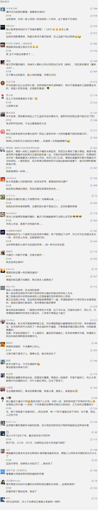

##正文

昨天，奥地利议会搞了一个大瓜，罢免了全球政坛的第一帅哥，奥地利总理库尔茨。

 

说起来，这位棕发碧眼、身高186的库尔茨，不仅是高大帅气的“型男”，还是亲切体贴的“暖男”。

而且，当同龄人还在混基层的时候，他年纪轻轻就跃至权力顶端，24岁出任国务秘书，27岁成为最年轻的外交部长，31岁成为最年轻的总理.......

嗯，大概“玛丽苏”小说的作者，都不敢塑造这么拉风人设，因此，超高人气的库尔茨也就成为了整个奥地利的“国民女婿”和“国民老公”，拥有大批的“妈妈粉”和“女友粉”的坚定支持。

不过，这位奥地利政坛的超级大帅哥，却在昨天被议会弹劾罢免了，成为了二战奥地利从德国独立后，首位被弹劾下台的总理。

 

而罢免的起因，是一段“通俄门”视频上周被流传了出来。

这则视频，拍摄于2017年奥地利议会选举前，库尔茨的执政盟友、自由党党魁在该视频中，向一名自称是俄罗斯寡头资本家的侄女许诺，如果对方能够为其提供选举资助，未来将能够得到奥地利的政府项目。

随即，该视频引发了奥地利国内的巨大震动，奥地利最大反对党、社民党27日在议会发起不信任动议，批评库尔茨对丑闻处置不妥，最终，弹劾通过，库尔茨惨遭罢免。

 

介于奥地利是我们在欧洲最重要的合作伙伴之一，也是中国在新丝绸之路上最坚定的欧盟支持者，因此，政事堂还是要分析一下库尔茨罢免背后的权力游戏是怎么玩的。

首先，泄露这两则“通俄门”视频的，并非奥地利媒体，而是两家德国媒体，《明镜周刊》和《南德意志报》，而且，这俩媒体分别亲基民盟和社民党的，嗯，正是这两个党组建了德国的默克尔政府。

其次，“通俄门”丑闻的对象，并非是库尔茨和他的人民党，而是人民党的执政盟友自由党。而“通俄”和出卖国家利益，能够极大的打击自由党这个极右翼的政党，符合德国的利益。

第三，媒体释放“通俄门”丑闻的时间，恰巧是德国主导的欧洲议会选举的前几天。选择投票权的时间点来释放负面丑闻，显然有明确的政治意味。

这就像去年年底美国民主党猛炒特朗普“通俄”，是为了打击共和党的中期选举，德国媒体放料“通俄”的背后，也是为了在欧洲议会选举中，打击奥地利日益崛起的极右翼势力。

毕竟，奥地利在2016年差点出现二战后欧洲首个极右翼总统....最终是靠着“重新计票”，才勉强把自由党的候选人“干掉”。甚至在奥地利2017年的大选上，自由党也“很巧妙”以极其微弱的劣势，输给库尔茨的人民党。

但即使这样，极右翼的自由党还是凭借着异军突起的支持率，跟人民党一起组阁，拿到了联合政府中的大量职务，尤其包揽了内政、国防和外交这些最重要的部长。

因此，对于德国来说，随着近年来英国脱欧，意大利、法国等欧洲主要国家的极右翼政党异军突起，此时尽可能的遏制和打击极右翼，维系欧盟的统一，成为了欧盟核心德国和默克尔必须要做的抉择。

嗯，德国媒体爆料的直接结果，是本次欧洲议会的选举，奥地利的极右翼自由党遭受重创，大量选票流向自由党的组阁盟友、主张遏制移民的人民党，并创下人民的建党以来的最好成绩。

当然，欧洲议会上大获全胜的库尔茨自然也会再接再厉，一方面，借着“通俄门”勒令联合政府中自由党部长们辞职，另一方面，趁着自由党遭受重创，宣布解散执政联盟，将议会选举提前至今年9月。

这意味着，原本支持率基本相当的人民党和自由党，将在接下来的奥地利议会选举中，出现人民党一家独大的局面，届时，库尔茨可以建立一个强势的奥地利政府。

于是，原本冤家对头的中左翼的社民党和极右翼的自由党，在面对共同的敌人和巨大的威胁面前，果断放弃巨大的政治分歧，凭借着两党目前加在一起超过50%的议会席位，直接先手把总理库尔茨给弹劾了.......

所以呢，如果把这个事情关系理顺了，就会明白，**库尔茨的动作，都是按照计划执行的，毕竟默克尔支持自己这事儿，他大概率是提前知晓的。**

这样，接下来的几个月，大帅哥库尔茨正好可以借着卸任总理能挤出时间，四处为自家的人民党拉票。

而社民党和自由党竟然因为这种破事儿而选择罢免深受女性喜爱的总理，其任性的行为必然会受到民众选票上面的惩罚。

届时，在德国人的配合下，库尔茨大概率会复制欧洲议会的胜利，建立一个人民党的强势政府。

所以呢，可以预料的事，中奥之间的经贸与技术合作，未来很可能会再上一个台阶。

 

而从历史的角度，这也往往有着巨大的相似。

十九世纪，当匈牙利人反抗奥地利统治的时候，奥地利的民族主义者们，竟然选择去支援匈牙利，因为奥地利的主体民族是德意志人，他们认为完整的奥地利是德意志统一的阻碍。

因此，奥地利的民族主义情绪，如果准确说的话，是奥地利的德意志民族主义，毕竟，德意志第三帝国的统帅希特勒，就是奥地利人.....

嗯，些民族主义者，就是如今奥地利自由党的前身。

但是，十九世纪德国伟大的政治家卑斯麦，却并没有支援这些奥地利的德意志民族主义者，反而不断出卖他们，来支持奥地利的哈布斯堡王朝。

原因很简单，德国的崛起要面对最大的敌人是法国，所以卑斯麦想尽办法要维系奥地利的哈布斯堡王朝，并在崛起的过程中，尽可能的保持与英国以及俄罗斯的友好关系。

因此，虽然奥地利的极右翼和其他国家极右翼不一样，他们直到现在还在支持德奥合并，但是如今的德国作为欧盟的老大，在面对誓要分拆欧盟的“特朗普”，就需要建立更广泛的联盟，就只能牺牲“自家人”。

而这个道理，放在现在也是相通的，随着如今英国铁定要脱欧，德国想要维系住欧盟，就只能像当年卑斯麦那样，费尽心思维系“德奥俄的三皇同盟”，避免德国陷入孤军奋战的境地。

从这个角度，我们不仅能够理解吉利北汽入股德国工业上的明珠戴姆勒，也能理解为什么在联邦快递“盗窃华为邮件”之际，德国的英飞凌继续对华为供货，德国运营商们也在力挺华为。

因为德国人在一战和二战中，都有着历史血淋淋的教训。

近期关联文章：

梅姨辞职，权力游戏下的英国即将“特朗普化”

吉利北汽先后入股奔驰，百年豪车品牌要姓“社”？

##留言区
 

