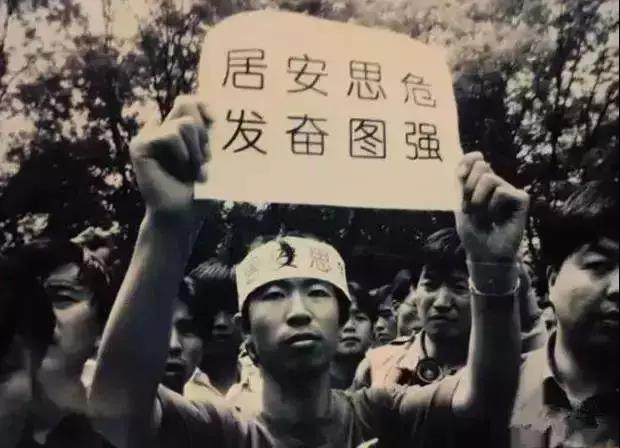

##正文

今天的文章，要评论一下昨天联邦快递将华为包裹偷运至美国的事儿，不过，在评论之前，先花时间，给大家讲一个20年前相似的故事。

1999年5月，以美国为首的北约，对南斯拉夫悍然发动空袭。

北京时间8日凌晨5时45分，3枚精确制导导弹从天而降，落在了贝尔格莱德樱花路3号，造成了我驻南使馆严重的人员伤亡。

毋庸置疑，这一天，是中国外交历上极其黑暗的一天，但同样，对于时任美国总统克林顿来说，也是非常痛苦的一天。

悍然攻击他国大使馆，不仅是外交事件，对于自诩“灯塔”的美国来说，舆论的冲击和盟友们的质问，也让这位全球最有权势的人坐立不安，克林顿听闻后立即打电话向中南海试图道歉，但是却被拒接了电话。

在随后的几天里，3死20伤的血肉模糊、炸弹蹂躏下的断壁残垣陆续传回国内，在媒体的强力传播下，民众的怒火迅速被点燃，一时间，全国各地的爱国群众高喊爱国口号，抗议美国的罪恶行径。

 

而此次轰炸也让美国包装多年的自由民主灯塔国形象轰然倒塌，原本是中国精英们排队求签证的美国大使馆和领事馆，被愤怒的群众们团团包围了起来。

很快，这种愤怒与屈辱被民众的发愤图强心里而取代，中国民众们明白了，只有民族复兴国家强大，才不会陷入“落后就要挨打”的困境。
 
 

而此时的克林顿，在白宫焦急的等了一个星期后，才被“允许”向中南海拨通电话，来表达他的歉意。

而此时令他惊喜的是，电话另一端那位睿智的长者跟他说，他知道克林顿不会下命令轰炸，而是美国国内的对华强硬派不满中美关系走近，而故意在地图上做手脚，试图造成中美分裂。

中方顶住国内压力给出的谅解，不仅使得美国对华鹰派挑拨中国两国关系的阴谋失败，也帮助克林顿走出了危机，让他给了相信“自由灯塔”的民主党选民以及北约盟友一个交代。

而此时，就在十几天前，刚刚对中国经贸代表团进行极限施压，令中美世贸谈判一度破裂的克林顿，自然也不好意思继续极限施压，他要求美国贸易代表巴尔舍夫斯基“尽早”恢复与中国的世贸组织谈判。

甚至，在中美世贸谈判的最后时刻，双方谈判代表各自离席找不到人之际，克林顿在空军一号上，让国务卿奥尔布赖特用卫星电话在后半夜三点，拨通了朱总理的电话......（参见：逆转1999！朱镕基的“极限施压”）

最终，在中美两位最高领导人的默契与智慧之下，中美世贸协定终于落笔签署，产业互补的中美也携手开启了20年的高速发展之旅。

好了，历史讲完了，回到现实中。

昨天，美国的联邦快递，将两个由日本送往华为公司在中国地址的包裹转运至美国，并企图将两个由越南送往华为在新加坡及香港分公司的包裹转运至美国。

作为精密度远超于制导导弹的联邦快递，能把4个华为不同发货地址和收获地址的快递包裹，同时统统运往美国，这简直比20年前3枚导弹同时击中我驻南使馆还要传奇。

因此，虽然联邦快递发了一个“此地无银三百两”的公告，但是大家心里有数，此事只有一种可能，那就是和20年前一样，是美国的对华鹰派在动手，试图利用搞破坏中美关系。

好了，如果明白这一点，那么对比20年前的历史，就会明白我们接下来应该怎么做了。

对于联邦快递来说，对于美国政府制裁的华为，你可以不服务，但是不能违反商业诚信以及契约精神，而快递这个行业自古以来，就是靠着诚信混饭吃的。

尤其对于西方文明来说，此次联邦快递违背的契约精神，可是比外交人员的豁免权更核心的道德底线，甚至是整个资本主义世界构建的基础。

因此，联邦快递在美国政府胁迫下，不顾商业道德的获取华为的邮政包裹，该事件一旦被炒热，将成为特朗普政府巨大的道德污点，使其遭受到大量“白左”群众的压力，遏制其利用华为极限施压，并让美国民众认识到特朗普政府打击华为包含着政治目的。

而且，就像当年美国著名的辛普森案中，警方取证中不道德的行为，以及美国司法体系疑罪从无的精神，使得辛普森打赢了官司那样，目前，被制裁的华为正在积极组织在美国起诉，而此时联邦快递的违规取证，简直是在关键时刻送给了华为一个大礼包。

因此，联邦快递偷包裹这事儿只要炒起来，在西方引发道德谴责，那么肯定会对那些美国对华鹰派形成巨大的压力，并让很多美国民众认识到之前被舆论引导丑化了中国和华为。这无论是对华为，还是对接下来的中美谈判，都有着非常重要的作用。

只不过可惜的是，由于这事儿对美国灯塔形象的打击实在是过大，谷歌上搜索“Huawei + FedEx”，会发现美国媒体纷纷噤若寒蝉。（这么一对比，百度也没有大家想象的那么坏。）

而当年一位教员教过我们，“凡是敌人反对的，我们就要拥护”，既然美国在封锁这则消息，我们就应该尽可能扩散这则消息。

所以呢，近期我们应该把火力收一收，在力所能及的范围内，多多转发和点赞此次联邦快递偷运包裹的相关文章，用实际行动来支持像当年志愿军那样，支持舍身为我们挡在第一线的华为。

甚至在海外有能力的朋友，还可以在西方的社交平台上理智的讨论此事，让更多的美国群众看到那些对华鹰派们的丑陋嘴脸，帮助“志愿军”来团结更多的朋友。

大家只要动动手指，就能给坚守在上甘岭上的华为送一个“苹果”。而只有挡在第一线的志愿军们撑住了，身在大后方的我们才能“马照跑、舞照跳”，板门店上的谈判团队才能拿到更好的停战协定。

“苟利国家生死以”，20年前的那位长者将驻南使馆的危机，巧妙的变成了世贸谈判中的转机。20年后的我们，值此国运与民族复兴之际，联邦快递给了我辈这个机会，又有谁会选择“避趋之”呢？

关联文章：

逆转1999！朱镕基的“极限施压”

一起打赢华为的“上甘岭”

##留言区
 

