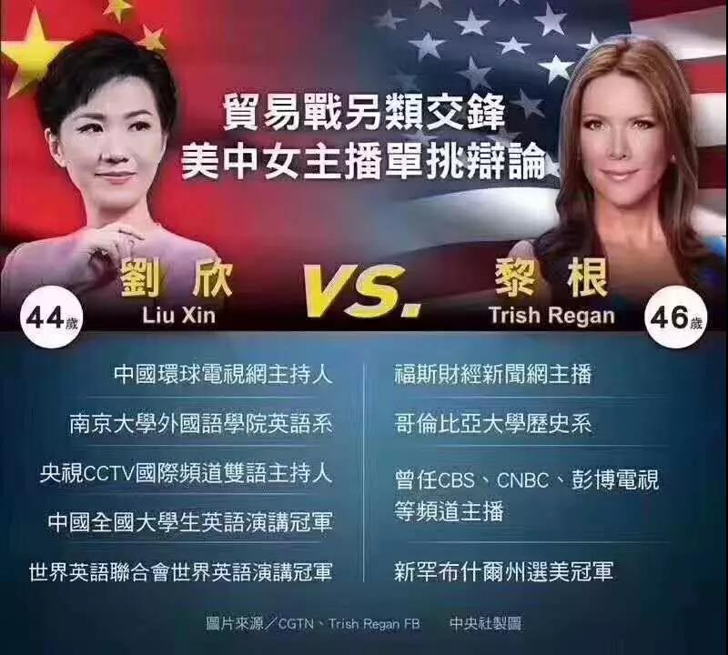
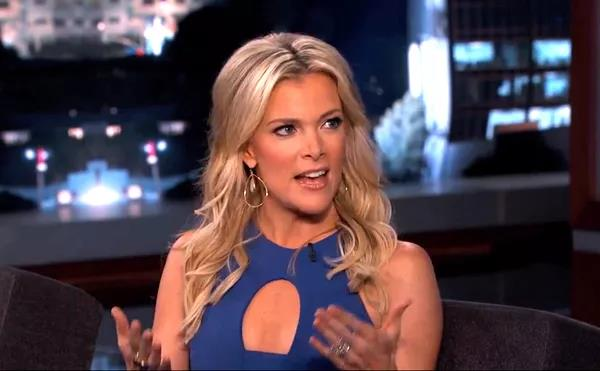
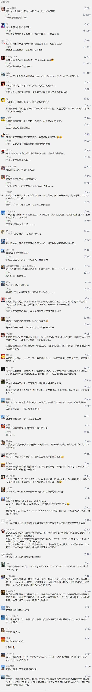

##正文

今天早上8点26分，中国国际电视台知名主持人刘欣，应美国福克斯商业频道(Fox Business)女主播Trish Regan邀请，就中美摩擦等相关议题，展开了一场中美两国美女主播的“跨洋激辩”。

 

很多政事堂的朋友一早上看完之后，都纷纷表示原本以为的一场的“约架”，竟然变得如此平平无奇。

不过政事堂看完央视的转播后，却觉得非常欣慰，于是，今晚的文章，跟大家聊一下这场平淡辩论背后的惊心动魄。

首先，此次与我们约战的福克斯新闻并不简单。

福克斯新闻虽然是一家上世纪90年代才创建的新媒体，但他的创始人艾尔斯，被外界誉为共和党的“三朝元老”，他从上世纪60年代开始，先后通过舆论助力，将尼克松、里根和老布什三个人捧上了美国总统的宝座。

甚至在2016年，已经70多岁的艾尔斯任仍以非正式的形式，充当特朗普的竞选幕僚，为其竞选出谋划策。

 

在所有主流媒体几乎都一边倒的站在希拉里那边之际，艾尔斯控制的FOX愣是以一己之力，单挑ABC、CBS、NBC美国三大电视网，最终帮助特朗普逆袭当选美国总统。

当然，福克斯这一笔政治投资获得了极大的收益，在特朗普的坚定支持下，福克斯也实现了从“在野党”向“执政党”的转变，成为了美国政坛最炙手可热的电视频道。

甚至特朗普当上总统后，每天早上起来的习惯，就是一边喝着可乐吃着鸡蛋汉堡看着福克斯的新闻，一边根据新闻在推特上发布自己的观点。

这使得共和党的政客们为了能被特朗普关注，不仅也会跟着一起看新闻，还会主动上福克斯接受采访，甚至美国的利益团体们也把过去的游说精力大幅削减，改为跑到福克斯上面游说。

所以呢，对标一下新闻联播，我们就会明白，**这场中美的美女主播关于贸易谈判的对决，不仅仅是给民众看的，更是给特朗普以及特朗普阵营里面的政客们看的，双方都在通过通过这一场“辩论”，向外释放某种消息。**

其次，此次福克斯方面的态度，值得玩味。

在特朗普上台后，福克斯内部迅速进行了大规模的换血，2017年1月，特朗普刚刚上台，福克斯一姐，曾被特朗普放话“有凯利就没我”的摩根·凯莉离开了福克斯，导致福克斯黄金档一度歇菜。

 

而且，在特朗普的青睐之下，福克斯与特朗普政府甚至形成了“旋转门”，譬如白宫通讯办主任辞职后就跑到福克斯出任高管，而福克斯的新闻总裁涉性骚扰离职后又跑到白宫担任通讯办主任。

甚至，连福克斯新闻的女主播们普遍都是特朗普的“大熟人”，譬如2017年特朗普一上任，就任命福克斯新闻频道女主播担任白宫新闻发言人，甚至中期选举期间，特朗普还直接邀请福克斯的主持人们上台给自己助选。

而与此同步的是，福克斯的口号也从奥巴马时期抨击政府的“公正”，变成了特朗普政府时期维护政府的“真新闻”，毕竟，特朗普整天叫嚣的可都其他媒体都是“假新闻”。

因此，在“自己人”的帮衬下，整个福克斯新闻成为了特朗普的发生筒，譬如移民问题、边境墙问题、通俄门问题上面，福克斯都成为了特朗普的急先锋，替特朗普摇旗呐喊。

而这也使得福克斯成为了特朗普基本盘必追和值得信赖的媒体，特朗普的支持者们不再看左翼媒体的“假新闻”，而只盯着福克斯的“真新闻”。

因此，**作为特朗普对其选民的一个发声筒和代言人，福克斯新闻中女主播们的态度，会对特朗普的选民们产生直接的影响。**

说完福克斯的覆盖群体，最后，再说说这位Trish大美女。

Trish在上次美国大选前期加入福克斯，迅速成为辩论评审小组成员，伴随着特朗普从初选到大选。伴随着特朗普的成长，Trish也迅速成的金牌女主播，在福克斯商业频道黄金时段拥有自己的主打电视栏目。

在节目中，Trish具有明显的政治倾向，她是特朗普的忠实支持者，经常会毫不掩饰地表达对特朗普的支持和喜爱。无论是“通俄门”还是“修墙”，Trish都全力地、义愤填膺为特朗普辩争。

 

因此，频频为特朗普冲在第一线的“选美冠军”Trish，自然也让酷爱选美的特朗普对其喜爱有加，甚至多次发布推特表示，“感谢Trish！”，甚至给了Trish大量专访的机会。

 

而在特朗普的鼓励下，Trish也是火力全开，在电视节目中怼天怼地对空气，**凡是特朗普要怼的，Trish总会加倍的来怼，尤其是针对中国占了美国便宜这方面，福克斯财经领域一姐Trish，在过去几年可谓之火力全开，是福克斯频道里面“中国威胁论”的主要鼓吹者。**

**嗯，这既是中美两位美女主播“约架”的起因，也是为什么很多媒体以为今天会有一场激烈互怼。**

但是，Trish怼中国的背后，是有着特朗普及其团队的利益诉求。

在这个信息爆炸的时代，随着获取信息变得快捷，大家都进入了一个去中心化的状态，每个人都拥有自己获取信息的途径。因此媒体也都变成了只服务于一些特定人群。

而随着特朗普的上台，福克斯迅速成为了服务特朗普追随者的媒体，而这部分受众的共同点是：白人、男性、蓝领、高龄、低收入、低学历。

因此，男人多使得福克斯的主播们女性越来越多，蓝领多也使得福克斯说话也越来越粗暴，尤其是蓝领们下班后的黄金档晚间节目中，福克斯频道时时刻刻充斥着谩骂和争吵，并把美国国内的一切问题，都归结于外国和外国人。

而主持黄金时段的Trish，自然而然就要符合蓝领们的喜好与特朗普的利益，这让一个学习历史出身，喊着“愿世界和平”的选美小姐，变成了到处惹事儿的“战争贩子”。

但是，当一个“战争贩子”，突然又变得“热爱和平”的时候，这种变化我们一定要留意，常年在各个方面怼中国的Trish，此次一反常态变得特别的温和，过去激烈的抨击中国的话这次都没说。

甚至Trish习惯性的“暴力插话”，也仅仅局限于中方刘欣开场的自我介绍阶段，后面几乎就是让刘欣进行她的表演。

很显然，**是经过了也是同样热衷于“战争”福克斯高层的“窗口指导”，否则Trish没必要大改人设，让自己的铁杆观众们突然觉得自己变怂了。**

而Trish的变怂，对着应前面说的福克斯频道的受众，在贸易谈判和关税大棒即将落下之际，这场辩论不仅会吸引华盛顿的共和党政客们关注，大量对贸易谈判关注的特朗普粉丝们，在晚上下班回家后也会观看。

因此，一贯鼓吹中国威胁的Trish一反常态的表示温和，意味着特朗普的支持者们会得到一个信号。

这从中方“辩手”刘欣，这个拿过全球英语演讲比赛冠军的妹子全程都是不吭不卑不挑事，也能看出来，我们也收到这个信号。

 

更不要说，刘欣在结束语中欢迎Trish来中国看看。

而Trish也在随后自己的推特中，表示了对刘欣的感谢。并对观众们因为辩论不激烈的愤怒，表示“**但我坚信，就贸易问题展开的这种相互尊重的对话对各方都有利。**”

 

这么明确的信号，相信大家都能看得懂......

如果大家对中美破冰历有了解的话，应该记得1971年世乒赛后，中国的庄则栋邀请美国队友科恩的那场“乒乓外交”，为接下来尼克松访华和中美联合公告打了头阵。

而值此贸易谈判陷入僵局，在人民日报已在三版喊出“勿谓言之不预”之际。考虑到下个月G20会议即将召开，中美的两个美女主持人，也许不自觉的，正在将她们自己写入历史。

##留言区
 

