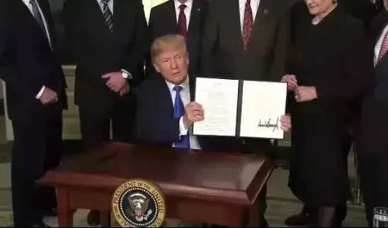
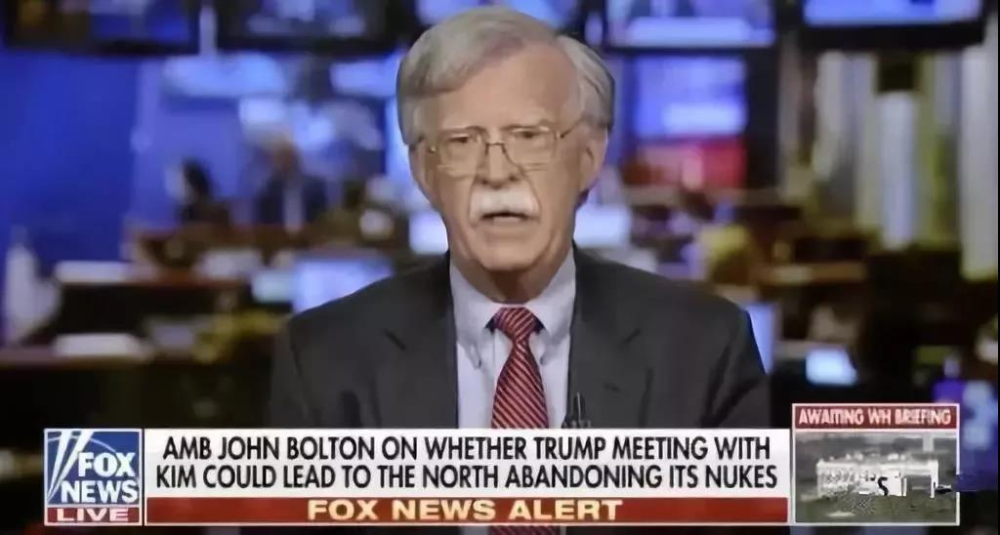
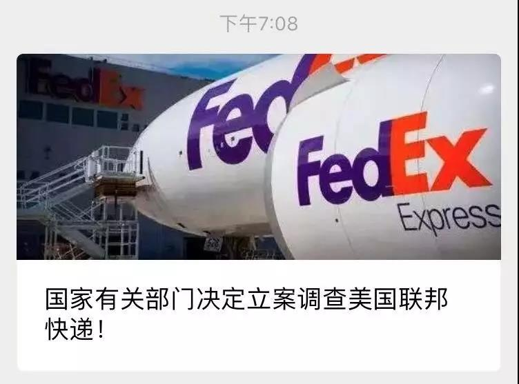
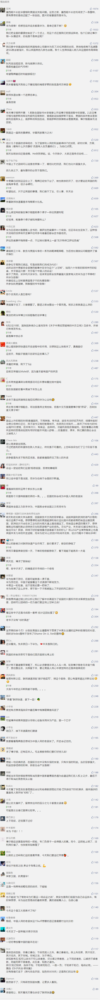

##正文

“5G终于来了”，这两天英国各大媒体集体爆发这样的感慨。

5月30日，英国6个城市正式推出了5G，BBC直播中更是将镜头给了帮助英国实现5G商用的重要力量，一台白色的华为网络设备。

 

在现场直播中，由于5G的速度实在太快，这台华为设备愣是一度将SIM卡流量耗尽而停下来“充流量”，不过，这场意外的“事故”，反而令英国民众对5G的“极速体验”更加期待。

就在中英两国人民沉浸喜悦之际，也有不和谐的声音发了出来，美国国家安全事务助理博尔顿表示，“**英国可能尚未就允许华为有限制地参与其5G网络建设做出最终决定**”。

 

说起来，国家安全事务助理作为美国总统最主要的外交政策顾问，每天要向总统做国际和安全形势的简报，并接受总统的委托，负责美国安全事务的跨领域协调。

由于直接对总统负责，因此该职务的权力极大，甚至有时候凌驾于国务卿和国防部长。

譬如，当年基辛格搞的中美破冰，连分管美国外交工作的国务卿都不知道，布热津斯基更是越过了国务卿和国防部长直接操盘伊朗人质危机。

因此，此次博尔顿的讲话我们不得不重视，尤其要注意的是去年3月22日，特朗普在推特上宣布，博尔顿将接替麦克马斯特出任国家安全顾问。

而这一天，众所周知，就是特朗普挑起华发起贸易战的那一天。

 

嗯，这一年多来博尔顿究竟扮演了一个什么样的角色，相信大家也就清楚了。

作为“超级鹰派”，博尔顿是美国强硬主张的代表，是美国推翻伊拉克政权的推手，极力主张打击伊朗、朝鲜和委内瑞拉，并曾批评美国对中俄的态度不够强硬。

因此，虽然在对华问题上，特朗普与博尔顿有着共同的合作基础，但一心战略收缩的特朗普与一心对外扩张的博尔顿之间，这一年多来的矛盾自然也在累积，而且最重要的是，博尔顿一年来的诸多建议，让特朗普吃了不少的瘪。

譬如俄罗斯问题，特朗普一直心心念与普京亲切友好的会面，而仇视俄罗斯的博尔顿则在一直进行阻挠。

譬如朝鲜问题，博尔顿认为在河内进行的特金会上，特朗普临时加价进行极限施压，朝鲜方面一定会让步，可是最后双方不欢而散，特朗普丢了他梦寐以求的诺贝尔和平奖。

譬如伊朗问题，特朗普一心想跟伊朗高层进行面对面的交涉（交易），多次主动对外放话，但是博尔顿一直坚称伊朗现政府应该下台，搞的试图撤离中东的特朗普伊核交易迟迟搞不定，而伊核问题搞不定，特朗普心目中最重要的“巴以和解”世纪协议就更无从谈起。

譬如委内瑞拉问题，博尔顿上台后就开始布局，试图通过反对派和南美国家来赶走马杜罗，并信誓旦旦的向特朗普打了包票。但是今年五月反对派的政变迅速被扑灭，让曾经信赖博尔顿的特朗普极为失望。

 

更不要说大家最关注的华为问题，去年阿根廷G20的时候，博尔顿没有通知特朗普，就秘密推动加拿大扣押了孟晚舟。而在近期，博尔顿也甩出了制裁华为的筹码，向特朗普夸下的海口，认为能够逼迫中方让步。

而如果明白了以上这些国际安全博弈的背后，就会明白为什么央视电影频道天天播放上甘岭了。

因为一旦我们或者我们的小伙伴对博尔顿的极限施压让步，就会让这位“超级鹰”在特朗普那里树立信用并继续受宠，那么我们未来势必会出现：今日割五城，明日割十城，得一夕安寝，然起视四境，博尔顿又至矣.......

所以呢，如果我们将视野提升至纵览全球政局，才会明白我国负责经济和外事工作负责人有多优秀，也才会明白我们的体制优势，能够迅速调集一切资源对美形成反制。

随着中国一系列的反制措施，我们能够看到美国那边在起变化。

且不说特朗普总统挑选的五角大楼掌门人今天在香格里拉对话上，发表了软化贸易谈判的言论。

关注中美美女主播论战新闻的朋友会发现，之前频频支持博尔顿发表鹰派言论的福克斯频道，不仅近期大幅缩减了博尔顿的出境频率，并在近期公开建议推动贸易谈判。

 

甚至福克斯还主动搞起了“美女主播外交”，连续邀请中国主持人在节目中以极其温和的姿态，探讨中美贸易问题。

 

如果对财经新闻关注的话，我们还会发现：

随着特朗普对博尔顿的不满加剧，这两天特朗普不仅对博尔顿正在拉拢对付委内瑞拉的墨西哥加征了关税，还对在近期印巴冲突中博尔顿支持的印度，取消了发展中国家待遇。

可以说，随着博尔顿极限施压的频频失败，他的“失宠”已经表露无遗了。

因此，博尔顿也在做最后一搏。

譬如，近期联邦快递傻逼兮兮的从华为那里扣邮件，做出了CIA或者FBI们都不会做出的“不专业”的手段，以及英国的华为5G网络建设都生米煮成熟饭了，博尔顿还跳出来，试图做着最后的努力。

因此，对于博尔顿来说，打击华为，这是他在俄罗斯、朝鲜、伊朗、委内瑞拉等一系列“外交犯错”之后，最后的翻盘机会。

那么，这个机会在哪里？

美国总统特朗普将于两天后，也就是6月3日对英国进行访问。

不出意外，博尔顿这位特朗普外交上“国王之手”，将建议特朗普就英国华为5G问题，向掌控着伦敦城的梅姨亲自提出交涉。

 

“国王之手”博尔顿如此自信，是因为他认为伦敦城和梅姨，会因为特朗普即将到来的怒火而敲响“投降”的钟声，开门投降。

 

不过，政事堂看来，对于即将要失去铁王座而泪流满面的梅姨来说，跟特朗普的怒火死磕，反而成了这位铁娘子理所应当的事情。

 

嘿嘿，这样的话，博尔顿这位“国王之手”可就要凉了......

因为一方面，自从英国5G与华为合作以来，博尔顿就想尽一切办法，调动各种资源来阻挠，向特朗普吹下了无数的牛逼和打了无数的包票。

而另一方面，英国是美国西方主要盟友中的第一铁杆，就像之前的叙利亚问题上，美俄在战场上打得不可开交，中英在联合国上吵得不可开交。

因此，一旦连美国的第一铁杆盟友都在围剿华为的问题上拒绝美国，在这个带头效应之下，博尔顿利用围剿华为打击中国的伎俩将全面泡汤。

这就会让特朗普明白，利用华为做贸易谈判的极限施压不可行，因此，他势必会主动释放善意，并好好利用大阪G20修复中美关系。

而且，早已对博尔顿失望的特朗普，此次将更加失望，这位对华强硬的“超级鹰”势必会淡出特朗普的核心决策圈，而早就不爽博尔顿的蓬佩奥肯定也会踩上一脚。

因此，可以预见的是，以博尔顿上台为标志的贸易战，也将随着博尔顿的淡出为标志而告一段落。

而两天后，就是博尔顿与华为的一个赛点。

写到这里，我想大家就会明白，为何我国政府能以极高的效率，于昨天宣布将建立“不可靠实体清单”，在今天宣布调查美国联邦快递。

 

可以说，为了帮助华为打赢这一场命运之战，我们整个国家机器都全面发动了起来，仿佛又回到了60多年前的那一场保家卫国之战。

写到这里，被感动的我已经不知道接下来该怎么写了。

为伟大的祖国点赞！

为谈判连夜奋战的同志们点赞！

为奋战在上甘岭上的华为员工们点赞！

为源源不断向上甘岭送苹果的志愿军们点赞！

近期关联文章：

别看你现在闹得欢，小心上“不可靠实体清单”！

华为！华为！呼叫联邦快递

松下“断供”华为？背后的博弈没那么简单！

华为，背水一战！

##留言区
 

