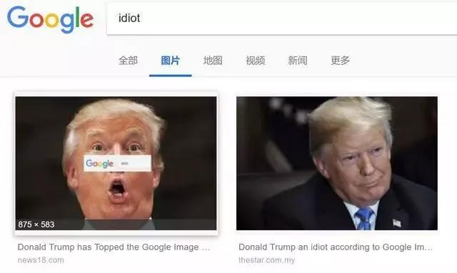

##正文

前些天，就在特朗普对华为颁布禁令之后，美国的谷歌公司一马当先，率先宣布不再对华为提供服务，由于安卓系统的统治地位，搞得国内一度风声鹤唳草木皆兵。

可是就在昨天，刚刚替特朗普封锁华为立下汗马功劳的谷歌却傻眼了，在特朗普的授意下，美国司法部对谷歌展开反垄断调查。嗯，如果被确定为垄断，那么这家全球互联网巨头将面临被分拆的风险。

嗯，不由得让人脑补，那位刚刚替特朗普围剿华为而惹得一身骚的谷歌老板，正在大声呐喊，“我为党国立过功，我为委座流过血，我要见委座，我要见委座”........

 

无独有偶，紧随着谷歌率先封锁华为，在特朗普加征关税压力之下，很多国际化企业也承受不住了。

就像联想公众号说的：一则联想CFO宣布"若美国提高中国关税，联想就将生产线撤出中国"的“所谓新闻”，又成功地吸引了吃瓜群众的目光。

 

对此，联想专门发布辟谣文章，称“把生产能力在全球工厂做调配，让产品不受零部件价格波动和各地区关税影响，是几乎每个大型生产制造型企业的日常运营工作”。

的确，联想作为一家全球化公司，“有三个位于海外，分布在印度、墨西哥和巴西”，由于联想巴西工厂90%以上的产能都是在巴西本土销售，联想认为应对美国此次的关税调整，让印度和墨西哥的员工们加加班就能够解决。

不过，继谷歌傻眼之后，联想也傻眼了。

先是联想被美国Nerdron公司指控，并向美国政府申请调查。

 

后来，就在联想CFO表示自家的印度和墨西哥工厂，能够成功抵御特朗普的关税大棒后没几天，5月31日，特朗普宣布结束印度的发展中国家贸易待遇并征收相应关税，并对墨西哥全部进口产品增收5%至25%的关税......

嗯，又遭遇了赤裸裸的打脸.....

 

大概，对于一心想做成国际化企业，把总部都迁到美国的联想来说，这就是传说中的“我本将心向明月，奈何明月照沟渠”.......

 

再牛逼哄哄的联想，在特朗普面前也没有办法，毕竟“官大一级压死人”，恐怕明天港股开盘，联想的股价又得承受一点压力了。

 

哎，作为咱们中国曾经民族品牌的旗帜和骄傲，别光顾着公众号上面打嘴炮的，也该好好反思一下，值此危机之际，能为国家和民族做点什么，籍此重新振作起来。

 

最近，随着特朗普对印度和墨西哥的制裁，算了一下，加上美国正制裁着的俄罗斯、伊朗、委内瑞拉、朝鲜，以及跟德国、法国、中国、日本同时进行激烈的贸易谈判。

嗯，这种“一个打十个”的精神，几乎让全球的智库们集体懵逼了......

 

不由得慨叹，也许对于正在谈判的对手们，特朗普内心是这么想的：

 

不过，特朗普这种“灭霸式”一视同仁的关税大棒政策，对我们来说，还真算是一种利好。

 

毕竟，接下来的大阪G20之上，酷的没朋友的特朗普，很可能要孤家寡人的面对一群被关税折腾够呛的“复仇者联盟”了。

那么，特朗普为什么这几天，不顾“各个击破”的原则，非要把各个主要经济体到跨国巨头一起得罪呢？

其实，根本原因还是在美国国内。

就在刚刚结束的“通俄门”调查中，虽然调查官穆勒表示没有找到特朗普通俄的证据，但是他在最后的调查报告中表示，调查的过程中发现了特朗普的犯罪，但是根据宪法不能对在任总统发起刑事诉讼。

换句话说，只要特朗普卸任总统，那么这些穆勒已经调查出来的证据，将足以直接起诉已经不是总统的特朗普。

所以，从这个角度就会明白，明年的大选对于特朗普来说，是他一切KPI考核的最重要标准，一旦考核失败，自己将可能面临牢狱之灾。

所以，不要以为特朗普对谷歌的调查是心血来潮，在今年5月，特朗普就在白宫官网上线了槽科技巨头的渠道，以接收美国网民在社交网站上遭遇的不公平对待。

毕竟，这帮跨国科技巨头们，天然就喜欢支持全球化的民主党候选人，譬如在谷歌搜索“白痴”这个词，就会出现特朗普的照片。

 

甚至谷歌董事长施密特当年就为特朗普的对头希拉里提供了竞选资金、网络技术以及人员招募等多方面的援助，并毛遂自荐希望成为希拉里竞选阵营的外部总顾问。

所以呢，特朗普利用美国民众和议员们对跨国资本的天然恐惧，在大选前趁机敲打敲打这些跨国互联网巨头，就成为了必然的选择。可以预见的是，谷歌绝不会是最后一个。

同样，对于墨西哥与施压，实际上背后也是对跨国资本的施压，很多跨国公司跟联想一样，把工厂设置在墨西哥，利用当地的廉价的劳动力和对美国的低进口关税，赚取超额的利润，这导致了美国的就业下滑。

而此时，对于特朗普来说，**由于大选的临近，他的KPI考核也在从务虚变成务实，毕竟，一个高贵的资本家和农场主，并不比一个蓝领能为特朗普提供更多的选票。**

要知道，蓝领们看重的并不是签订了那些数百页苦涩难懂的贸易协定，而是那些实实在在的就业岗位。

而且，蓝领们不仅重视就业，更对抢占了自己工作的移民深恶痛绝，因此，美国第一大贸易伙伴兼第一移民输出国的墨西哥，自然而然就成为了要“保命”的特朗普，所重点的打击对象。

要知道，由于去年特朗普在中期选举之中丢了众议院，因此他跟墨西哥签署的有利于共和党但不利于民主党的贸易协定，很有可能会被民主党控制的众议院否决。

因此，在大选前追求KPI考核的特朗普，索性直接推翻了自己去年谈好的美墨贸易协议，与墨西哥的新一届政府重新谈判，将主要诉求从贸易协定，变更为边境管制和工作回流。

所以呢，网上那些墨西哥愤而开放边境的消息，大家就当个段子听就好，毕竟新一届的墨西哥政府也有新的诉求，希望重新谈判拿到一个对执政党相对有利的协议。

至于特朗普为何会选择这个时机，实际上墨西哥有就业回流美国价值的，只有汽车产业。前几天特朗普访日的时候，就特别召见了以丰田为代表的跨国巨头，要求他们把工厂搬回美国。

只不过，特朗普拿了日本新天皇登基的第一次，自然也就不好意思在拜访前太过于失礼，只能在访日结束之后，再对墨西哥和日本采取措施。

同理，特朗普早就准备对印度下手，不过介于他和莫迪的私交，还是把加征关税这事儿，放到了莫迪竞选之后，避免影响到莫迪的支持率。

因此，可以预见的是，虽然特朗普对墨西哥和印度搞了“突然袭击”，实际上这些袭击也都是事先早已有默契的，为了在接下来的选举中，完成自己的KPI考核。

因为没有退路的特朗普，势必要迫使印度和墨西哥这两个美国的外包重镇以及全球化巨头们，将部分就业回流美国，以实现就业率的增长。

同理，同为国际化巨头的联想，很有可能也会面对特朗普政府的压力，要求其将生产线从墨西哥搬回美国，为美国制造就业。

写到这里，我突然觉得这还真是一个不错的想法：

随着未来联想美国工厂的建立和对中国的销售，不仅让中国民众享受价格低廉的美国制造，还替特朗普解决了心心念的就业和选票，更重要的是，往中国销售的联想产品还可以缩小中美贸易逆差，降低中美结构性矛盾......

嗯，搞不好联想还将洗刷污名，成为加速终结贸易战的英雄之一......

只不过，如此一举数得的办法，怎么之前没想到呢？

##留言区
 

