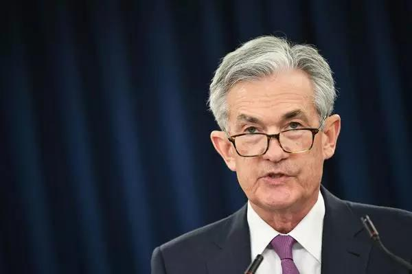

##正文

作者按：今天文章是针对于特朗普与美联储之间的博弈进行的一篇脑洞，未必是真实的情况，但也许文章中的时间点上，会对投资有一些启发。

这几天，一向不嫌事儿大的特朗普，似乎开启了全面出击模式，在各条战线上不断的树立对手。

他先后取消了印度的优惠贸易待遇，对已经达成协议的墨西哥重新开征关税，对古巴实施旅行禁令，今天还表示对伊朗会继续施压。

甚至如果不是美国军方这个特朗普不得不考虑的势力强烈反对，特朗普这几天也已经对自家的“走狗”澳大利亚征收关税了。

而且，特朗普连自己人都不放过，互联网四巨头亚马逊、苹果、脸书和谷歌四巨头也在前天被曝出将接受反垄断调查。

再加上正在跟欧洲诸国、东亚诸国开启的多条贸易战线，此番特朗普的到处点火，使得全球资本市场都被这位“大空头”搞成了重伤。

不过，就在对抗特朗普的全球“复仇者联盟”汇聚之际，美国国内却有个“胆小鬼”率先“投降”了。

昨夜，在芝加哥举行为期两天的系列会议上，美联储出席鲍威尔表示，受贸易战影响，会采取适当的措施来维持经济扩张。

 

此言论被市场理解为美联储将进入降息周期，在加上美联储副主席也随后发表相似言论，随即引发昨夜美股大涨，带动全球资本市场今天开盘报复性上涨。

虽然股票上涨大家都开心，不过政事堂认为，这对于上任以来就不断对美联储施压，但没有取得任何进展的特朗普来说，此次获得了美联储的妥协，将会给特朗普释放一个信号：**他的关税大棒和地缘挑衅越是狂热，那么美联储就越有可能提前进入降息周期。**

这就像鲁迅先生说的：“人性情是总喜欢调和、折中的。譬如你说，这屋子太暗，须在这里开一个窗，大家一定不允许的。但如果你主张拆掉屋顶，他们就会来调和，愿意开窗了。”

因此，政事堂判断，在美联储“主动认怂”的配合之下，尝到甜头的特朗普，接下来有可能会通过“养寇自重”的模式，**继续四处出击惹事儿来向美联储极限施压，令鲍威尔等美联储高管们在经济压力之下，不得不在2020大选之前，进入降息周期。**

而从这个角度也就能够理解，为什么特朗普能够丝毫不顾自己的信誉，“撕毁”已经签署新的美墨贸易协定。

要知道，**这么无信用的一撕，会使得特朗普短期内跟其他国家签署贸易协定的可能性趋近于零。**因此，如此任性这意味着**降息对于特朗普来说，要远远重要于目前他正在挑起的“全球贸易全面战争”。**

那么，降息对于美国总统重要在哪里呢？

政事堂认为在于美联储与美国总统宝座之间的直接关系，历史上的相关记录有很多，这里政事堂挑选两个最近的案例。

2001年年初，民主党执政期，在当年的大选之前互联网泡沫破灭，无数投资人倾家荡产，大量员工失业，使得原本取总统宝座如探囊取物的民主党候选人戈尔，竟然被各方都不看好的共和党小布什逆袭。

2007年年初，共和党执政期，在当年的大选之前次贷危机爆发，无数家庭失去了自己的住房，民众手握的债券和股票大幅缩水，在强烈的愤怒之下，当时如日中天、作为议会两党之外第三极的麦凯恩，竟然被一个黑人小子奥巴马逆袭。

而美联储在2001年1月和2007年9月后才开始的降息，这种等到股市大幅下跌之后，才亡羊补牢式的动作，**虽然的确拯救了美国的经济，但是并没有拯救愤怒的美国群众，更没有拯救美国的执政党以及总统。**

因此，对于“2020大选任务大于天”的特朗普来说，就像他对墨西哥那样，**在实现美联储进入降息周期之前，任何已经达成的贸易协议，都可以轻易的撕毁和不认账，他需要避免经济问题明年对他的影响。**

而如果这个假设成立的话，那么**特朗普给出的墨西哥时间表，很可能同时也是他给美联储降息的时间表。**

根据特朗普宣布，6月10日将对墨西哥征收5%的关税，如果墨西哥政府“管不住”非法移民问题，美国将继续逐月上调关税，直至10月1日将其提高到25%。

由于墨西哥是美国第一大贸易伙伴，对于美国的国内通胀有着非常直接的影响，而根据这个时间表，**意味着特朗普计划今年年底之前，美联储将在自己的贸易大棒压力之下，进入降息周期。**

而对于特朗普来说这个时机很合适，现阶段美国大选刚开始，民主党还处于党内初角逐候选人阶段，各个候选人还不至于把矛头直接指向自己。

因此，特朗普很可能将趁着明年开始的大选决战之前，继续煽风点火（墨西哥要倒霉），以唯恐天下不乱之势，以加速美联储的降息。

而如果上面的这一连串假设成立的话，未来会得出两个主要结论：

一、随着美联储将原定于明年的降息周期提前至今年，**全球各主要经济体也将不得不加快自己的降息步伐**，这将是今年下半年之后全球资本市场的一个亮点和变数。

二、随着全球进入降息周期以及2020年大选的临近，**特朗普也会在降息周期之后，跟各主要经济体达成贸易协定**，推动资本市场向上，在自己的竞选年拿到一个资本市场与外交战场的双丰收。

而这两个结论作为基础，也会推演出大量的相关结论，嗯，今天就不继续推演了......

结语：本文是政事堂首次站在外部角度分析外部事物，结论未必正确，仅作为一个脑洞和对其的推演。

##留言区
 

