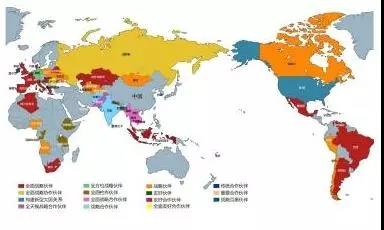
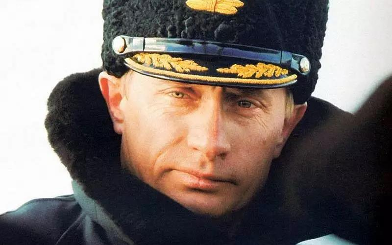
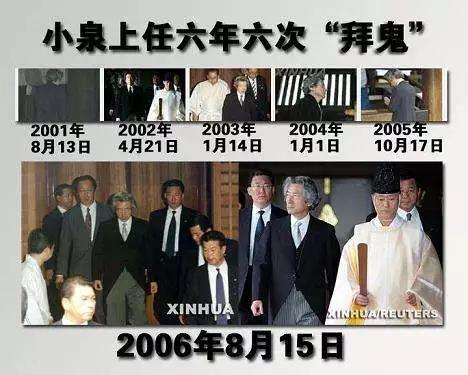

##正文

2019年6月5日下午，在大克里姆林宫，中俄元首决定将两国关系提升为“**新时代****中俄全面战略协作伙伴关系**”。

这是继1994年中俄建立“**建设性伙伴关系**”，1996年提升为“**战略协作****伙伴关系**”，2011年提升为“**全面****战略协作伙伴关系**”以来，中俄伙伴关系的再一次突破。

说到中国眼花缭乱的各种“伙伴关系”，很多朋友可能看起来都是一头雾水，今天政事堂就来科普一下，中国的伙伴关系都包含着什么意义。

 

说到“伙伴关系”，这玩意其实并非中国原创，而是由美国搞出来。

1991年，苏联解体华约解散，宣告了冷战的结束，在北约大哥美国的建议下，于1994年的北约布鲁塞尔首脑会议上通过了“和平伙伴关系计划”。

在这个伙伴计划中，加入的伙伴国可以向北约总部派出联络员，双方在地缘问题上建立政治互信，于伙伴计划的框架内进行政治磋商。

因此，随着华约的解体，而超强军事实力的北约形成独霸之势，大家为了安全，原华约国家甚至欧洲的中立国们，都纷纷加入到北约的“伙伴计划”行列。

如果说的通俗一点，从美国的角度来看，北约盟友之间是“婚姻关系”，相互之间有着神圣的契约，而伙伴关系则是“情侣关系”。

因此，美国眼中的“伙伴关系”，更类似于一种“婚前行为”，大家先尝试着同居一起生活，觉得三观一致，合适了就结束同居步入婚姻，譬如波匈捷三国在加入北约后就退出了伙伴计划。

嗯，当年一心想融入西方社会的俄罗斯，甚至也加入了伙伴计划。可是俄罗斯民众在“休克疗法”之后却发现，人家只是跟你“玩玩”而已，连“嫖资”都不付，于是深感被西方欺骗了感情的老百姓，用脚投票把硬汉普京选上了台。

 

当然，对于坚持“不结盟政策”的中国来说，美国发明的“伙伴关系”，在我们这里就有了中国特色的新含义，既然咱不能“结婚”，那么就只能“多交朋友”了......

 

因此自冷战结束以来，“有朋自远方来不亦说乎”的中国，凭借着外交系统的不懈努力和国际地位的不断提升，十几年的时间，愣是把“伙伴”数量提升至如今的80个左右。

不过，随着“朋友”数量的不断提升，奔波于这么多的风格迥异的伙伴之间，自然也就得分出个远近亲疏，因此也就有了我们看到的不同称号的“伙伴”。

譬如，我们与俄罗斯达成的“**新时代全面战略**协作**伙伴关系**”，是所有伙伴关系中唯一的“协作”，也是我们最重要的伙伴关系。

这背后是作为联合国安理会的常任理事国，双方在重大问题上要“同进退”，携手维护全球战略稳定。

同样，我们与巴基斯坦独一无二的“**全天候战略****合作伙伴关系**”，听名字就知道这个“巴铁”有多铁。

 

反之，我们与有着巨大经济利益的日本的关系，因为巨大的外交分歧和历史遗留问题，仅仅是“战略**互惠**关系”，双方的伙伴关系中连个“伙伴”都没有。

 

这种文字的差异背后，是因为伙伴关系是一种国与国之间的互信关系，就像男女朋友之间怎么吵架都可以，但是不能像当年搞钓鱼岛事件中那样背后捅刀子。

那么，中国的伙伴关系，究竟是怎么分级的呢？

整体来说，有两个主要分支，一个是“合作”，一个是“战略”，通常来说，“合作”伙伴集中于经济贸易，而 “战略”伙伴则在地缘外交以及安全领域有着密切的合作。

譬如我们跟非洲的埃塞俄比亚、坦桑尼亚、肯尼亚的关系再好投资再多，甚至坦桑尼亚国防军都被称为“非洲解放军”，可是在启动“新丝绸之路”之前，我们也仅仅是“合作伙伴关系”，只不过加了前缀来证明我们之间足够铁。

反之，一旦交往之中，涉及到国家安全问题，上到被禁运的军工科技，下到基础原材料的石油，都就会被上升到战略地位。

譬如阿联酋、卡塔尔、安哥拉、苏丹、伊拉克等涉及到的能源安全命脉的国家，虽然只是石油交易，但我们还是建立了“战略伙伴”关系。

而明白了“合作”与“战略”两大分支之后，对于“全方位、全面、友好、重要”等层级递减的形容词，大家就会自动进行排序和归类了。

譬如，全方面友好合作的比利时>全方面合作的新加坡>全面友好合作的罗马尼亚>全面合作的荷兰>重要合作的斐济.......

同样，我们的能源投资与进口大户的沙特、伊朗和委内瑞拉，相比于阿联酋和卡塔尔们，则会在“战略伙伴”前面加上“全面”二字以视重要。

至于同时满足“战略”与“合作”的，往往都是那些经济合作为主，但是地缘位置又非常关键的国家，譬如湄公河流域的越缅泰柬老五国，以及能让我们能绕开印度链接西亚的巴基斯坦。

 

嗯，理解了这些伙伴关系背后的区别，我们就能看到中国这十余年的时间里，外交是怎么一步一步向前迈进的。

且不说随着“新丝绸之路”的开启，大量的“合伙伙伴”变成了“战略伙伴”，随着国力的发展和市场的作大，美国的传统盟友们对我们也在发生变化。

譬如拥有传统友谊的中法两国，在1997年建立了“面向21世纪**全面伙伴关系**”，在2004年提升为“**全面**战略**伙伴关系**”，在2014年时提出“**始终****视对方为****优先级****战略伙伴**”。

而近年来突飞猛进的中英伙伴关系中也是如此，1998年紧随法国建立了“**全面伙伴关系**”，2004年提升为“**全面**战略**伙伴关系**”，2015年晋升为“面相21世纪**全球****全面战略伙伴关系**”。

虽然中德伙伴关系相较于英法起步慢了一些，但近年来发展也很快，在2004年建立“具有**全球责任的伙伴关系**”，2012年提升至“**战略****伙伴关系**”，2014年升级为“**全方位****战略伙伴关系**”。

可以说，英法德三国在这十几年的时间里，已经迅速成为了对我们来说，仅次于俄罗斯与巴基斯坦的合作伙伴。（这里漏算了某国家，但不是bug）

所以呢，我们能够看到，在最近几天的时间里，面对美国的巨大压力，英国的梅姨，法国的马克龙以及德国的默克尔三个战略小伙伴们，都非常坚定的站在我们这一边来支持我们。

这并不是短期内的利益交换，也不是墙头草，而是中国长期以来外交努力与自身发展的结果。

从历史的角度来看，中国革命的成功，就是“把朋友搞得多多的，把敌人搞得少少的”，而如今我们“谈恋爱”式的广交朋友，也必然比某些人“揩油”式的四处树敌要受欢迎。

得道者多助，失道者寡助，“交朋友”一定胜过“树敌人”，相信本月的G20之上，怕是一出好戏即将上演。

##留言区
 

