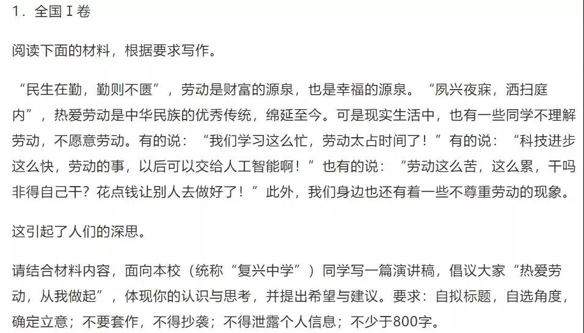

##正文

随着2019年高考作文题目的公开，今天微博上瞬间掀起了人民日报和共青团“押中”高考作文的热门话题。

 

 

起因，是就在高考前一天，共青团与人民日报的微信公众号，先后发布了一则“老师说，你们再看看卷子，我再看看你们”的推文。

 

嗯，与全国3号卷同一标题的作文题目完全一致。

 

而且，考虑到人民日报在考试前一天“520”这个时间点，转发了共青团“泄露”出来的高考题目......

大概，这就是传说中的“心中有党，成绩理想，心中有团，考试不难”。

当然，除了人民日报和共青团之外，此次压中的央媒也着实不少，央视新闻和科技日报等媒体，也先后翻出来自己在考前的“疯狂暗示”。

 

 

不过呢，虽然这么多官媒“压中”了作文题目，但内容却与标题几乎毫无关系，所以呢，真要是跟着公众号的视频来写，怕是要按照跑题处理了。

而且，全国3卷是给信息相对闭塞的西南五省准备的，与1、2号卷的全国20省相比还稍显非主流。

所以呢，如果真想找谁“押中”了高考作文，还是要看谁写的文章，能被全国1、2号卷的考生来套用和“借鉴”。

嗯，先看一下澎湃新闻提供的全国考卷：

 

 

看完题目觉得难么？

粗一看的确不难，无论1号卷还是2号卷，作文的关键词甚至都非常一致，一个是“奋斗”，一个是“复兴”，只要做到“家事国事天下，事事事关心”，相信作文的素材都是一大把。

但是仔细一看，今年作文的难度相对于以往大幅提升，因为写作形式并不是常见的叙述文或者议论文，而是演讲稿和写信，估计这种考生们不熟悉的写作模式，能让无数学子提笔时泪流满面，很难把素材捏合起来。

而且，此次演讲稿和写信都是有明确的任务驱动，要把自己的想法传递给其他人。因此，不仅需要写出家国情怀，还要把自身的命运与时代的进程写到一起，立意必须要足够高，要从个人的奋斗上升到国家民族的复兴。

所以呢，还真就不是网上文章看得多就能写出好文章，就像前段时间那些网上漫天遍野的“996ICU”的文章，搁在高考估计都是零分作文。

没办法，毕竟高考自古以来就是“为国取士”，很多考试命题的背后，都与当年重要的时事有着密切的关系。

譬如今年北京卷命题，一个是2019年的颜色，一个是中华文明历经风雨，绵延至今的“韧性”，相信我的读者看完之后第一反应就是“抻”；而天津卷的三段命题合起来则是“个人为推动中国光明的前途而奋斗”；国际化的上海卷，更是要让大家写“中国心”，在接触到“异域音调”之后，对“中国味”有了更深的感受。

说白了，三大直辖市的作文，只要盯着今年的贸易摩擦入手，不仅不会跑题，还有着海量版的素材可供使用，并让你取得高分。

同样，针对全国20省市的1、2卷内核也是一样的，不过考虑到大量乡村的孩子可能信息涉及量受限，则把这个内核上升到了精神层面。

譬如，随着中国逐步实现伟大复兴，必然会受到领先者的打压和围剿，因此民众们艰苦奋斗的精神就需要重提。

但是，如今经济发展水平已经如此之高，再提艰苦奋斗就会显得突兀，因此在全国1卷中，将热爱“艰苦奋斗”一词换成了热爱“劳动”，不仅能够被广泛的考生所接受，也给了大家更多的发挥空间。

同样，在全国2卷中，所给出的题材，都是中国的几次历史性的转折点，而这些转折点的背后，都是一大批人为之不懈奋斗的结果。

所以，无论是全国1卷还是2卷，只要考生们有一颗红心，虽然此次作文难度颇高，但是不会跑题，分数就低不了。

而从这个角度能够看出，今年高考语文1、2卷作文的出题者，绝对是大神级人物，不仅能够将国家意志写入高考作文，还能够非常接地气的把作文题目设计出来。

所以呢，别看一群人吹牛说命中了全国3卷的命题，但是没有任何一个人敢说自己命中了全国1、2卷的命题。毕竟，这真能命中人的水平之高，怕是也不屑于出来吹嘘了。

那么，今年有没有人意外押中了高考作文，能够为大家所借鉴的呢？

其实还真有，就在几个月前“996”的大辩论之中，那个“向奋斗者致敬”的乡村教师马云，还真就“押中”了今年的全国1、2卷，并为大家写出了漂亮的范文。

 

今年的作文说起来想取得高分很难，因为一方面人都有惰性，奋斗本身是“反人性”的，单纯说为祖国贡献说服力有限，而另一方面，本次作文要求大家以演讲稿和写信的方式，就是要让文章的情绪和理智还能感染其他人。

所以，不跑题虽然轻易，但是写出一篇好文章却非常的难。

但是，作为中国超级演讲家的马云，却很巧妙的把这些问题解决了，我从马云讲话里面随便摘取几段，大家看看是不是可以把“996”改成“奋斗”，能否直接放到作文里面：

>当一个人找到了自己热爱的事情，何止是996？吃饭睡觉都在思考、琢磨。他们为什么不去干点别的更轻松的？不是因为没得选，而是愿意干这个，这事的意义超越了金钱利益，干别的再轻松都不乐意，干这个再苦再累都感觉快乐。

>那些能坚持996的人一定是找到了自己的热情之处，找到了金钱以外的快乐之处，他们享受自己在八小时以外的学习、思考，探索的路径上，找到自己工作快乐点的人是幸福的，有福报的。

>我有什么，要什么，放弃什么，这是我常常问自己的。人生就是不公平的，有的人生下来就很钱，有的人生下来就很会读书，但是有一样是公平的，就是我们每个人每一天都是24小时，选怎么过这24小时，决定了我们会成为什么样的人。

>这样的人其实不少，也正因为有这样一群人的996，997，才让上世纪我们有了“两弹一星”，才让我们的国家在过去短短的四十年取得了举世瞩目的成就，才会有“神五”“神六”，才让我们对未来有了信心.....

怎么样？马云既能够顺着人性，把个人的奋斗与快乐融合在一起，又能够抒发感情，把个人的奋斗背后延展出国家取得了举世瞩目的成就。

而且，最重要的是，马云不是在写记叙文或者议论文，更是全程以本次高考作文中要求的，以书信的方式，发表了一次演讲，以强大的排比和语气，来说服更多的人加入到他的奋斗当中去。

所以说呢，别看最近马云的人设崩塌，被一群人“围剿”，如果今年高考作文真有押中的人，恐怕肯定少不了他。

说起来，马云“押中”不难理解，高考作文的背后都是国家意志，而马云作为中国最成功的商人，这些年一路走来，又怎么可能“押”不中呢？ 

 

近期关联文章：马云和刘强东的“996”

##留言区
 

