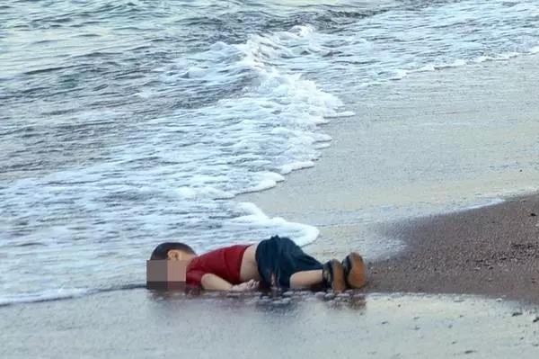

##正文

今天早上，“推特治国”的特朗普宣布，已与墨西哥达成协议，原定于下周一对其加征关税的计划，被”无限期暂停“（indefinitely suspended）。

这一场震撼全球经济的贸易冲突，终于被遏制住了。

 

根据随后白宫提供的协议内容，墨西哥将加强执法力度，美国将对越过边境寻求庇护的人送回墨西哥，由墨西哥提供就业、医疗和教育。

嗯，从协议的字面上来看，特朗普取得了一个巨大的胜利。

因为他上一次竞选口号中最知名的，就是由墨西哥负责出钱建一个墙（build a wall），但是他上台后的几年，墨西哥既没有出钱，美国自己掏钱的计划也被议会否决，这也成为了他2020大选的一个心病。

 

而此次达成的美墨边境协议，由于墨西哥政府承诺将自掏腰包加强执法力度，这意味着特朗普“间接”兑现了自己的竞选承诺，让墨西哥自掏腰包建一个“墙”。

只不过，这个所谓的“墙”不是钢筋混凝土，而是由警力组成的。

 

虽然市场对此次协议的签署比较乐观，不过，大家也不能高兴的过早，此次美墨签署并非是一份和平协议，而是一纸停战协定。

因为一方面，无论是墨西哥加强执法强度，还是接受遣返以庇护人，都是美墨两国很早之前就原有的合作机制，此次不过是老调重弹，所谓的协议不过让两方各表，都能回去给选民交代。

而另一方面，对于“出门不捡着东西就算丢”的特朗普来说，当时挥舞关税大棒时，他说的可是要让墨西哥购买美国的高价农产品，并控制毒品入境，而这次的协议甚至推特中，特朗普都对此缄默不言。

要知道，与时常挥舞的关税大棒不同，农产品销售和禁毒都是特朗普的竞选承诺，作为一直兑现竞选承诺的特朗普来说，此次忍着而达成一份模糊的协议，多半还是受限于压力。

因为一方面，本周末正在日本召开G20的央行与财长会议，美方需要在此次的最终公报中显示“全球经济的稳定以及贸易风险的下降”，将G20各方的聚焦点，从集体对美国的贸易大棒声讨中转移。

而另一方面，特朗普本人两周后在大阪G20峰会上与各国领导人会面，习惯于一对一交易的他，此次将同时面对所有他正在展开贸易摩擦的对手。

 

若那时特朗普背信弃义对墨西哥加征的关税仍在继续，那么将这场重要的表演极为不利。毕竟，特朗普要向G20各方以墨西哥做示范，单边的谈判是可以达成协议的。

因此，我们可以知道，这一份协议并不能满足特朗普的需求，这也意味着G20之前达成的这一场“城下之盟”，对于墨西哥来说并不能一劳永逸。

可以预见的是，**如果墨西哥在今年"十一"之前，未能兑现移民协议中特朗普的预期，以及特朗普对墨西哥禁毒、农业进口等方面的诉求，那么特朗普随时可以再一次撕毁协议，重新开启对墨西哥加征的关税来进行施压。**

那么，墨西哥有能力满足特朗普，控制难民以及毒品向美国的流入么？

其实，墨西哥也想控制难民，就像叙利亚的难民目的地是富庶的西欧，但依然把途经的巴尔干搞得一片狼藉，作为中转站的墨西哥也不想被难民困扰。

但是想做到，不并代表能做到。

 

墨西哥的难民流入问题与毒品流入问题，这两个特朗普最头疼的问题，逻辑实际上是一致的。

墨西哥毒品泛滥的根源，是在于有着美国这个消耗了全球2/3毒品的巨大市场，而墨西哥的农民却被美国的大农场在没有关税保护之下倾销挤破产，只能种植毒品，才能维持的了生活这样子。

 

同样，中美洲民众坐着大篷车拼命偷渡美国的背后，也是因为美国的倾销使得中美洲各国无法建立工业体系，大量的失业人口自然就会用脚投票，不当“切格瓦拉”的话，就去美国领取远比自己国家高的多的救济金。

所以呢，墨西哥无论是对毒品还是难民，都是心有余悸而力不足，尤其是难民的管理难度甚至比对抗贩毒还高，毕竟政府对抗毒枭还能用枪，但是面对难民，就只能用爱发电了......

而墨西哥都没有办法的事情，美国更是没有办法，因为移民与禁毒策略，面对的最大问题，是“气球效应(balloon effect)”，就像给几个连通的气球之一施压，空气就会从一个气球流到另一个气球。

因此，只要美国这个庞大的市场（空气总量）没有变化，市场经济就决定了，对某地的打击力度越大，会导致其他渠道的利润和市场激增而迅速作大，而这个逻辑移民和贩毒都是通用的。

譬如美国毒品的进口，在禁毒署的打击之下，一直在哥伦比亚、墨西哥、秘鲁和玻利维亚等国之间轮流转。

同样，就算花费巨额资金封锁了美墨之间的边境，建了高高的边境墙，但是美国广阔的海岸线，根本无法阻止中美洲人民对于自由的向往。

甚至假如未来美墨把两国入境门槛提升，很多人开始绕行海陆，搞不好还能像当年利比亚那样搞出一个大新闻，搞得特朗普下不来台。

 

而且，这种简单粗暴的政府行为根本挡不住有着民间智慧的老百姓。

譬如当年美国为了禁毒，甚至都派飞机入侵墨西哥领空播撒剧毒除草剂“百草枯”，能够让大麻直接枯萎。

但是墨西哥农民，发现百草枯起效依赖于日照，于是他们迅速收割并用黑布包裹偷运到美国继续卖.......丝毫不顾美国烟民们的死活......

后来，在美国民众和国会的强力压力之下，不仅美国放弃了越境空投百草枯，还严禁墨西哥政府用百草枯来禁毒......

最终，斗了几十年的美国政府基本也就放弃根治毒品，转为以此为理由来平衡和操纵中美洲各国的政权，甚至搞出了禁毒局卧底与毒枭接头，却发现对方是CIA的官员这种搞笑的案例。
 
 

所以呢，那些特朗普心心念美墨边境的难民、禁毒以及农产品采购等历史问题，对于墨西哥来说都是有心无力，给特朗普短期做作秀可以，但都只能做到治标不治本，甚至一时的压制还可能遭受到巨大的反噬。

而且考虑到，特朗普未来在2020竞选中，还需要继续打移民派和禁毒派，并为最近因为贸易摩擦给损失惨重的农场主们争取利益。

因此，可以预见的是，此次的美墨停火，不过是特朗普在G20之前的一场不得已的临时停战，在扛过G20的“围剿”之后，特朗普还会再一次的撕毁“停战协定”，继续盯着墨西哥来找茬。

这也没办法，就像墨西哥俚语说的，该国最大的悲哀，就是距离天堂太远，距离美国太近。

关于美墨贸易战从降息解读的解读：

特朗普挥的关税大棒与美联储的今年降息

##留言区
 

