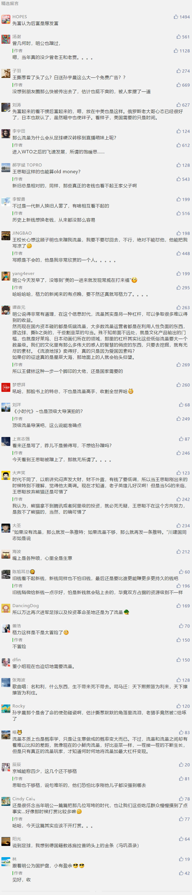

##正文

流量是一门生意。

记得在90年代那个娱乐闭塞的时代，不同于现在的小鲜肉当道，那时的流量明星，是郝海东、范志毅、高峰、李明这些绿茵场上的硬汉。甚至90年代的春晚上，他们都成为了相声小品中不可或缺的元素。

而这庞大流量的背后的生意经，自然不会被人错过。

随着90年代中国的计划经济体制飞速被打破，大量的机会开始涌现，各路需要流量来扩张事业的老板们，自然而然就把目光聚集在万众瞩目的足球之上。

而为了这些流量，那些在改革开放过程中跑马圈地迅速崛起的大老板们，自然愿意一掷千金，倾尽全力。

譬如，创下了中国足球无数难以超越的王健林，就经常拎着装有上百万现金的皮箱到比赛场，“打赢了就拿全额，平了拿一半，输了没钱。进一个球追加10万”。

也许，在这位未来中国首富的眼里，没有什么是钱不能解决的，如果有，那就再加钱。

 

而且除了现金之外，王健林还给球员们发过300克的黄金足球，以及大豪宅和奔驰豪车，而且，这些奖励兑现的非常快，球员们踢完比赛休息一天归队后，房子或者车钥匙就送到了他们的手上。

在那个足球巨星就是超级流量的时代，这位未来的中国首富愣是通过不计成本砸钱“买流量”，组成了一只豪华的梦之队。嗯，当年名帅塔瓦雷斯有句名言最能代表当时万达的强大：“我丈母娘带大连都是冠军”。

而王健林巨额投资的流量巨星们，自然也给王健林带来了巨大的流量，凭借着万达的超级明星和国内国际赛场上的无敌战绩，王健林也成为了当时最知名的商人。

要知道，在那个互联网还没有兴起，信誉还没法调查的时代，知名度就是一种强力的信用背书。

哪怕最近那个烧水就能驱动汽车的项目，全国骗了一圈之后，还能在南阳拿到政府的土地和配套资金。可想而知20年前，拥有甲A无冕之王品牌的王健林，这位全国最知名的商人在二三线城市扩张时，地方政府在土地和银行贷款问题上，会如何的积极配合。

所以呢，就像俗话说的，没人能随随便便成功，大家都是赶上了历史的进程。

 

而就在王健林正式退出中国足球，将球队改名为实德的2000年，中国的流量生意也在悄然的转型。

这一年，默默无名的台湾演员徐熙媛（大S）出演了青春偶像剧《流星花园》，在剧中饰演“杉菜”一角，却不曾想这部台湾偶像剧迅速席卷整个华语圈。

 

而且这部开创了偶像剧先河的作品，所取得的巨大成功和利益，也使得华语娱乐圈正式进入了“偶像时代”。

随后，在造星利益的驱动之下，年轻人的偶像也从《灌篮高手》、绿茵场上的硬汉们，变成了俊美容颜的奶油小生。

 

甚至，北京的少年们，还根据1991年的台湾电视剧《京城四少》，将汪小菲、汪雨、王烁、王珂列为了当时的“京城四少”。

不过，如果你以为“京城四少”真的是什么年轻才俊，恐怕就要瞎了眼。其实这些京城四少，本质玩的也是流量的生意，他们的出名并不是因为自己有多厉害。

汪小菲娶了大S，王珂娶了刘涛，王烁跟周迅拍拖，汪雨身边则有赵薇，所谓的“四少”，不过是在新的流量时代，被演艺圈的“四大花旦”推起来罢了。

尤其是像汪小菲和王珂这样的，把婚礼搞的极尽奢华，明星云集，媒体疯狂报道，本质也是尽可能的利用老婆的流量，来给自己加流量，以期在资本市场上加杠杆，这个套路和脸盲的刘强东在京东上市募资前，大肆炒作奶茶的恋情有着异曲同工之妙。

所以呢，像王思聪这样，靠着早年流量生意发家的“老钱”，自然是看不起这些同样用流量发家的“新钱”，先是把汪小菲怼的颜面皆无，甚至还给奶茶章泽天起了个新外号“抹茶”.......

 

没办法，所谓的同行是冤家，大家都在心照不宣的玩流量生意，汪小菲借用大S炒作自己好切入商业地产，刘强东借用奶茶炒作自己好作大零售，本质是都是王思聪他爸做类似的生意，甚至投入还远比王健林当年要低，王少爷看不惯也是正常。

而这位天才的流量专家王思聪，对比其父亲，可以说是青出于蓝而胜于蓝，自从怼了“京城四少”之首的汪小菲，让自己从默默无名变成妇孺皆知后，在这个明星流量的时代，王思聪开启了疯狂怼明星来获取流量的模式

譬如，无论是对歌坛一姐的王菲的“无知迷信封建丢脸”，还是怼小品界泰山赵本山的“不值一提的农民”，甚至直指娱乐圈一姐范冰冰“没有演技的花瓶”......

细数王思聪的怼人历史，怼的都是各个领域的超级流量，这种不怕乱子大的行为，也让王思聪有了“娱乐圈纪检委员”的称号。

而且，当年《赵氏孤儿》、《金陵十三钗》、《画皮》、《一代宗师》、《小时代》、《一步之遥》，这些国内顶级大导演的制作上映时，王思聪总会把他们贬的一无是处，凭借着巨大的争议给自己赚取流量。

甚至中国田径一哥刘翔结婚时，怼葛天“整容改变命运”，在阿里锦鲤之后就搞抽奖，以及王健林当选首富之后回复“哦”，可以说，王思聪蹭热点的水平，堪称自媒体和娱乐圈的祖师爷。

而这每一次和明星的撕逼、掐架，炮轰热门电影，甚至不停变换的女朋友，都为王思聪的网络知名度提示带来了很大的帮助，可以说王思聪几乎不砸钱，就取得了他老爹当年疯狂砸钱才获得的全国知名度。

因此说起来，王思聪跟自己当年骂的汪小菲区别并不大，都是利用明星来赚取流量，只不过汪小菲做的是高端零售，王思聪搞的是菜市场批发。

 

而通过不断炒作自己，拿到流量的王思聪，自然也会和其他募集流量的大佬一样，利用流量汇聚资本，给自己加杠杆去投资项目。

只不过，随着时代的变化，王家父子从在足球硬汉们身上不惜重金，变成了对直播软妹子和游戏选手身上挥金如土，但本质上，生意的方向都没有错，都是瞅准了大家肾上腺素。

 

而流量的生意背后的一本万利，这也使得王思聪这种老玩家，对于所有入场的新玩家，都有着本能排斥。

譬如，最近那位花天价拍下巴菲特午餐，试图炒作自己和虚拟货币来割韭菜的孙宇晨，就被王思聪骂“这不就是个傻”。

 

但是王思聪似乎忘记了，当年自己就是靠碰瓷儿出名的。

花了几百万美金买一顿饭就为了出名的孙宇晨，自然不会放过王思聪“送人头”的机会，频频在微博上“碰瓷儿”微博第一流量的王思聪，拼老命抓住了这免费的流量来炒作自己。
 
 

嗯，搞的一贯恩怨分明的王思聪有苦说出不，只能强忍着不说话，以避免继续给对方送流量。

其实呢，从当年的王健林到汪小菲，都是依靠流量，能够从地方政府拿到更好的政策；从王思聪到孙宇晨，都是依靠流量，能够从资本市场募集更多的资本。

两代人的区别，不过是适应了时代的变化，而大家背后的逻辑都没变，就是利用流量来加杠杆，做一本万利的生意。

所以呢，王思聪怒喷割韭菜的孙宇晨，或许并不是什么正义感，而是自古以来，"先富起来”的人往往都看不起那些"后富起来”的人罢了......

##留言区
 

