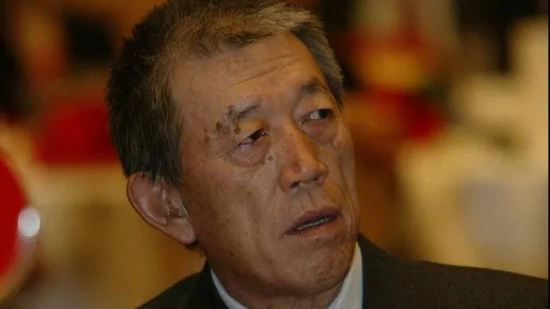

##正文

6月10日22时56分，前国家副主席、开国上将王震之子，原中信集团董事长王军去世，享年78岁。

 

 
一

1979年1月17日，随着一场大雪，那一天的北京被皑皑的白雪所覆盖，而此时，人民大会堂福建厅里却春意浓浓，小平同志以一锅白水熟羊肉，款待五位他的商界老朋友。

这五位在新中国建立之前就名震天下的老人家，在中国商界的地位，大概就相当于几年后风靡大街小巷的《射雕英雄传》中，华山上论剑的“天下五绝”。

他们分别是88岁的“水泥大王”周叔弢、84岁的“机械大王”胡厥文、82岁的“钢铁大王”胡子昂、74岁的“猪鬃大王”古耕虞，以及其中最年轻的，年仅63岁的“纺织大王”荣毅仁。

 

小平同志开门见山，向这些企业家们介绍了20多天前刚刚结束的十一届三中全会上，党中央决定把工作重心转移到社会主义现代化建设。

而现代化建设不仅需要大量的资金，也需要现金的技术，更需要提升人民生活来堵住那些以阶级斗争为纲官员的嘴。因此，开放和吸引外资，就成为了三中全会之后的必然选择。

而以荣毅仁为代表这些能够跟西方接轨的资本家们，自然也就赶上了历史的进程。

在那场热气腾腾的白水羊肉宴半年后，7月8日，全国人大通过改开后的第一部法律《中外合资经营企业法》，而就在同一天，新华社发布：“中国国务院批准中国国际信托投资公司成立。”

嗯，中信的牵头人，就是羊肉宴上“五绝”中少壮派的荣毅仁。

这并非巧合，就像小平同志事后解释的，这是要向全世界“明确表示我们要坚定不移地执行这个（改革开放）方针”。

 
二

作为中美破冰的操盘者，美国前国务卿基辛格谈到那个自己一手埋葬的苏联时，说过一句话：“苏联（改革）面临的最大困难之一，是他们找不到一位像荣毅仁这样的企业家。”

 

虽然这句话有夸奖自己老朋友的成分，但侧面来说也是一个事实，搞了半个多世纪计划经济的苏维埃政权，早已把企业家们消灭的渣都不剩。面对西方突然开放的市场，计划了大半辈子的官僚们根本不懂应该如何对接西方。

但是在中国，以荣毅仁等“五绝”为代表的企业家们，却在周总理和小平同志们的保护下延续了下来，而这也让中国也在改革开放初期，能够走出一条不同于苏联式改革的道路。

改革开放的背后，是生产力和技术的提升，过去，新中国曾有过两次大规模引进消化技术的浪潮。

一次是凭借着抗美援朝的鲜血，在“一五时期”从苏联引进了156个大型项目，让中国迅速从农业国变成了工业国；一次是凭借着尼克松访华的破冰恢复与西方的关系，利用70年代初的全球经济危机，以“四三方案”迅速建立了西方工业技术的基础。

但是，随着70年代后期“左”的影响，“既无内债又无外债”的理念深入人心，负债经营在中国被视为禁区，虽然1979年的中美建交迅速推动了我们与西方的关系，但是连军费都开支不出来的中央政府，却拿不出钱来引进技术。

而此时，红色资本家的荣毅仁们的价值就体现了出来，他父亲荣德生，这位纺织与面粉的垄断者，几乎就是民国时代的马云，号称一度提供了中国一半人吃穿。

而且，荣氏家族400多个早年移居海外的亲属们，不仅拥有着大量企业和资产，更在华人商界拥有数不清的朋友，因此中信的第一届董事会上，也出现了霍英东、马万祺、李嘉诚等港澳商界巨擘。

甚至对美国共和党的创建者之一的哈默家族，荣毅仁也能跟他们找到共同语言：“你是资本家，见过列宁；我也曾是资本家，干社会主义。我们两个都是资本家，可以谈得拢”.......后来，哈默家族的西方石油，成为了第一家取得中国近海勘探权的美国公司。

更不要说能够影响世界格局的戴维·洛克菲勒，在描述其好友荣毅仁时说到：“他是具备必要的知识、在西方拥有关系的为数不多的中国人之一。”

因此，在上世纪80年代的那个特殊的历史时期，荣毅仁和他的中信利用着其国内国际上的特殊关系，成为了改革开放的第一扇窗口。

在这一点上荣毅仁可能还真不用谦虚，在中信成立的大半年之后，1980年5月，深圳等四个城市才被正式确定为“经济特区”。

 
三

1949年的全国政协一届二次会议，企业家们作为特邀人士一起去中南海颐年堂吃饭，周总理看到同桌年仅34岁的荣毅仁时，不仅诙谐地说：“噢，少壮派！”，从此这个少壮派这个称号就流传了开来。

而十年后，毛主席让时任书记处的小平同志推荐几个党外人士当部长时，邓就推荐了荣毅仁，这也让荣毅仁也成为了新中国最年轻的副部长之一。

可以说，年轻少壮这个词儿，一直都是紧随着荣毅仁，而荣毅仁创办的中信里面，也充斥着大量的年轻血液。

譬如中信筹备期间，荣毅仁便请了一批年轻的旧相识加入到中信，其中有38岁的王军，以及39岁的叶选基。

后来，这群年轻人也在浪潮中迅速的成长，王军成为了中信的董事长，叶选基成为了中信香港的总经理。

不过，正是凭借着这群能冲敢闯的年轻人，让中信拿到了改革开放中无数的第一........第一家开展租赁业务、第一家发行海外债券、第一家对海外直接投资、第一家在海外收购商业银行、第一家拥有商业银行业务......

可以说，在80年代的体制围堵中，年轻气盛的中信“七进七出”式高歌猛进，以敢为天下先的态度，一点点地打破原有的经济格局，不断建立新的市场规则。

因此，凡事都能搞定的中信，也成为了中国资本市场上的奇迹。

甚至2006年7月，北京的一场中信内部的晚宴上，连接班王军的孔丹都不由感慨——“中信，是个谜啊！”

而孔丹这位长期在光大和中信工作过的少壮派，还专门撰文比较过这两大“官办”企业的不同，“这两家当时都是按部级建制建立的。不过中信的印章上有国徽，尺寸是正部级的。光大想要国徽没要到，只给了个五角星，但印章尺寸与中信一样。”

嗯，孔丹口中说的这个正部级国徽的印章，就是另一位少壮派的叶选基搞定的。

当年中信筹备初期，当时国务院定下了中信是“国务院直属机构，比照中国银行”的基调，彼时中国银行刚从央行独立，与外管局两个牌子一套班子。

在那个时候，印章的大小以及是否带国徽，直接代表着公司的实力，中信意识到如果能够使用参照中国银行的印章，那么以后在体制内以及海外办事儿都会非常方便。

因此筹备组的叶选基，先跑到中国银行盖了三个大印，然后找到副总理谷牧批准中信参照制作，愣是搞成了既成事实。虽然此事闹得沸沸扬扬反对意见极大，但最后，这个带国徽的公章，还是成为了那个时代中信特殊身份的标志。

 
四

 进入到90年代，随着中国取消价格双轨制的价格放开，以及政府指令性的大幅减少，使得大量的国有企业被推向市场。

而过度依靠于国企合作的中信，遭遇到了最严重的危机，当1993年荣毅仁卸任中信去当国家副主席，安排父亲刚刚去世的王军出任总经理来接班时，王军发现这家中国最牛逼的公司，账面上的现金只有200万元，只能维持总公司一个半月的工资发放。

那段时间，“吃不下，睡不着了”的王军，“主要靠安眠药”支撑，在巨大的压力之下，就像王军自己说的，“大概世界上能找到的安眠药我都吃过。”

甚至王军在向国务院汇报，希望获得援助的时候，铁面的朱副总理回应，国家不会给中信一分钱，直接断了王军的念想。

于是，王军开始了大刀阔斧对中信的改革以及清理资产，其中最著名的，就是售卖中信泰富。

1986年，北京方面邀请荣智健出任中信香港的总经理，嗯，荣智健就是荣毅仁家中唯一的儿子

当时，中信香港的资产规模很小，荣智健从国务院借到8亿港元后，在父亲老友李嘉诚的点拨之下，以中信泰富为壳，以中信为信用背书，在香港发起一系列令人眼花缭乱的大收购，并购的经典案例之多，足可写成一部MBA教科书，迅速成为中资航母的中信泰富甚至成为恒生指数33只成分股之一。

但是，毕竟荣智健用的是国务院和中信的本金做的杠杆和扩张，因此试图获得公司控制权的荣智健与急于解决中信危机的王军一拍即合。

1996年12月26日，王军签字同意以25%的折让价，即每股33元，配售3.3亿股中信泰富，给予以荣氏为首的管理层，其中2.91亿股由荣智健独得，荣的持股上升至18%（3.8亿股），成为公司第二大股东。

但是由于几天之后，中信泰富的股价就从33突破了40，到春节以后，股票又涨到了58元钱，因此，当时坊间纷纷认为王军有贱卖国有资产的嫌疑，甚至中央安排朱副总理朱基和王军谈话，个性倔强的王军坚持自己没有错。

而最终，市场证明了王军的确没有错，这笔股权出让使得王军和他的中信手握充裕的现金，成功的躲过了次年的东南亚金融危机，并利用卖中信泰富的现金流在危机之中进行大规模的扩张，让一度下滑的中信又重新振作起来，甚至后来还买回了中信泰富，让千夫所指的管理层MBO重归理性。

也许，这就是市场经济的魅力，从当年小平同志点将荣毅仁利用中信倒逼市场化的改革，到荣毅仁点将王军做推动管理层MBO及随后的国企改制，“永远争第一”的中信一直都是中国改革开放的一个缩影。

而如今，看看已经移师香港的中信，越来越像新加坡管理资本的淡马锡，也许，我们也能看到未来中国那些大型央企的改革方向.......

##留言区
 

