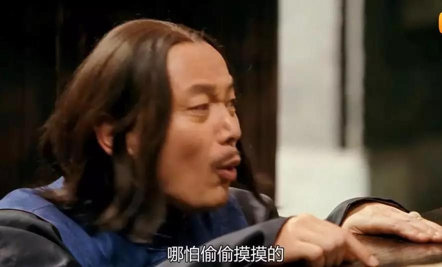
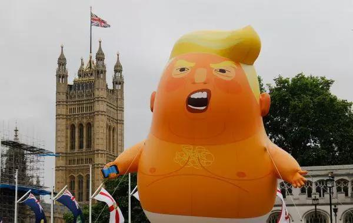
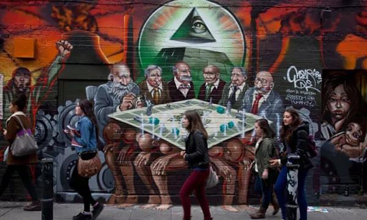
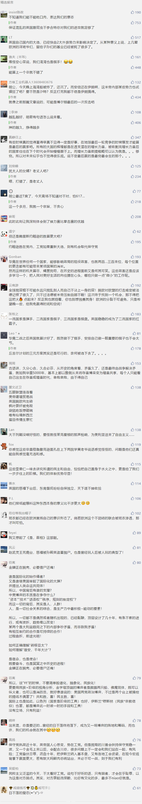

##正文

随着英国首相梅姨的离任，大英帝国的“铁王座”争夺战正式开始了，执政的保守党10名候选人开始了摩拳擦掌，台下的工党更是准备随时推翻保守党的统治。

而就在此时，美国《华盛顿邮报》爆出，国务卿蓬佩奥正试图插手英国大选，阻止工党领袖科尔宾成为新的首相。

蓬佩奥此番言论，是在对一群犹太裔领袖的非公开会议上发表的，不过，该录音不幸被泄露出来，使得蓬佩奥成为继特朗普之后，第二位对英国内政公开指手划脚的美国高级官员。

这下可让世界灯塔，口口声声坚决反对干涉他国内政的美国丢了个大脸，更让一群高傲的英国绅士们羞愧的抬不起头。虽然这事儿大家都是心知肚明，但是摆在台面上实在是难看，因此谁也不提。

甚至一向被指责“干扰美国大选”的俄罗斯，更是看眼不嫌乱子大，媒体们纷纷花式表示，现在世界上已经可以“明目张胆”的干预他国选举了吗？

 

 

说起来，《华盛顿邮报》此次披露，不仅打击英美两个铁杆盟友之间关系，也不利于美国世界灯塔的形象，那么，为什么美国人会自己给自己挖坑呢？

说起来，主要原因之一，是意识形态可以跨越国界。

美国执政的共和党和英国执政的保守党，同为右翼的保守党国际成员，而美国在野的民主党和英国在野的工党，都都是老牌的左翼政党。

意识形态的接近，会使得不同国家的政党产生共同的利益。

譬如数天之前，在维护欧盟方面有着共同利益的德国中右翼基民盟，就选择帮助奥地利中右翼的人民党，通过一盘录音带一举击溃奥地利极右翼的自由党。

同样，走极右翼路线的特朗普，则无条件支持以色列极右翼的内塔尼亚胡集团竞选，并力排众议支持以色列定都耶路撒冷和强占戈兰高地。

所以呢，美国右翼的共和党国务卿蓬佩奥跟着右翼的犹太大佬们，密谋支持英国右翼的保守党是理所应当；而美国左翼的民主党媒体《华盛顿邮报》把“共和党阴谋”公之于众，自然也能帮助英国工党这个大洋彼岸的战友，好方便一起狙击共同的敌人特朗普。

毕竟，刚刚访问英国的以色列老丈人特朗普，竟然遭到了工党领袖科尔宾拒绝参加国宴的打脸。

而工党悍将，伦敦市长萨迪克·汗更是表示，特朗普不配在即将对英国的访问中，享受国事访问的礼遇。并还批准了“特朗普宝宝”在伦敦升起，来刺激这位愤怒的总统。

 

当然，除了跨国界的意识形态和战略联盟之外，更重要的是，英美两国都出现了移民问题为代表的以色列和伊斯兰的剧烈对抗。

随着奥巴马上台后推动的接收难民，以及全球化带来的贫富差距拉大，使得原本只是中左和中右之间的建制派博弈，迅速民粹化，美国的极右翼选民选出了特朗普，英国的极右翼选民则推动了英国的脱欧。

因此，英美两国两党之间的竞争，也从最初的大政府与小政府的经济路线之争，慢慢变成了意识形态路线之争。

譬如特朗普这几年盯着奥巴马的移民政策打，不顾一切的建墙甚至不惜撕毁与墨西哥已经达成的和平条约来遏制移民。

甚至在美国共和党以及美国以色列行动委员会的支持下和资助下，英国执政的保守党内部，通过一个“以色列之友”(Friends of Israel)的强大党团组织来维护在英以色列以及犹太人的利益。

有钱能使鬼推磨，在英国保守党议员们的支持下，聚居于伦敦的犹太组织竟可以开着警车穿着警服代替政府来巡逻。

在这种意识形态的一致之下，哪怕在特朗普上台前，美国民主党政府时期的国务卿克里，指责以色列政府的时候，保守党领袖的梅姨还出面替以色列辩护，不顾英美在外交上的一致。

而且，硬顶着奥巴马逼着欧洲各国的开放移民，保守党执政的英国则是欧洲接纳难民最少的大国。

而正是随着整个西方意识形态的分裂，英国两党的分裂也愈演愈烈，十年前英国的犹太选民们多数支持英国的工党，而如今则大多站在了保守党这边。

譬如原本只是反对犹太复国主义的英国工党，近年来更是越来越倾向于讨好国内穆斯林群体以换取选票。

尤其是工党的领袖科尔宾，一直都是“反犹”的急先锋，之前就曾因他支持脸书上支持涂鸦艺术家的“反犹”创作，陷入到巨大的争议当中。

 

 
一群西装革履的资本家和犹太人，坐在一起玩棋牌游戏，上方悬挂共济会标志，脚下是一群底层的民支撑着桌子。

 甚至2018年9月，利物浦举办的工党大会会场上，科尔宾升起了巴勒斯坦国旗，并承诺若工党执政，将承认巴勒斯坦建国，协调落实联合国的“两国方案”。

所以呢，作为以色列人的好女婿，特朗普无法接受一个反犹的英国工党领袖上台，因此不仅自己强烈支持英国保守党的强硬人物鲍里斯·约翰逊，更授意国务卿蓬佩奥联合犹太寡头们，阻止工党领袖科尔宾的上台。

毕竟，这位被特朗普一手提拔起来的前CIA谍报头子，拥有足够多的隐秘手段，可以对那些政客们下黑手，来配合特朗普的战略意志。

而对于英国的工党来说，和美国的民主党类似，随着外籍人口的加速增长，长远必然会击败保守党。

就像2016年英国伦敦的市长选举，工党推出的候选人是巴基斯坦裔穆斯林的萨迪克·汗，而保守党推出的是犹太裔的高德史密斯。最终，萨迪克·汗凭借着数十万同胞的支持，战胜了超级富豪高德史密斯。

但是短期来说，下次英国大选需要等到2022年，恐怕一心想上位、还拥有民意基础的工党没有耐心等那么久。

因此，工党最有可能的选择，就是利用保守党主持的脱欧问题进行攻击，提出对当前政府的不信任动议，获得半数支持后，可迫使保守党解散议会提前进行大选。

但是，工党想要在脱欧的过程中实现这个结果，就需要获得欧盟的支持，来配合打压英国的保守党。

而此时，无论是德国的默克尔还是法国的马克龙，都是国内面对极右翼政党的威胁，国际上应付极右翼的特朗普的咄咄逼人。

因此，这两位欧盟的大佬很有可能会选择在英国脱欧的问题上，暗地里支持英国的左翼工党，好跟跟右翼保守党死磕，以期为自身获得更多的筹码。

所以呢，一场在英国的土地上，由美国和欧盟主导，犹太和穆斯林势力参与的大国博弈即将拉开序幕。

不过可惜的是，曾经被把全球当做棋盘的日不落帝国，在一场脱欧闹剧之后，竟把自身变成了大国博弈之中的棋子。

可悲，可叹.......
 

##留言区
 

