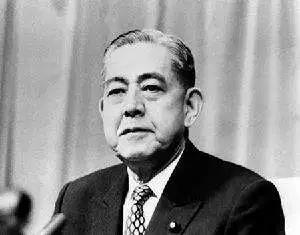
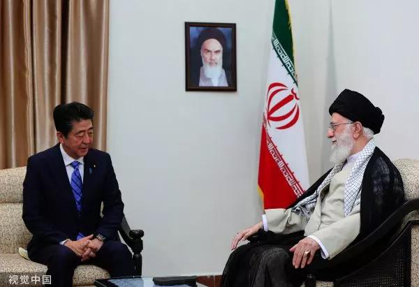
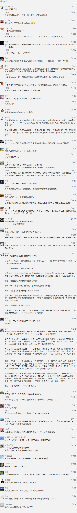

##正文

 
一

1945年8月15日，日本昭和天皇向全国广播，接受波茨坦公告、无条件投降。

1945年9月11日，在日本的同盟国占领军司令部，对那些罪恶滔天的刽子手们，拟定了第一批甲级战犯的40人逮捕名单。

这份名单中，大部分的狂热分子最后被起诉被判处绞刑或者终身监禁，但是，其中也有一部分识时务的俊杰，与美国中情局等机构达成秘密交易后被无罪释放。

其中，就有一个叫做岸信介的人。

他是和东条英机一起操纵伪满洲国的“五人帮”之一，他利用中国东北的钢铁煤炭和粮食资源，为日本法西斯提供了无数的杀人军火。

而且，他出任东条英机内阁的商工大臣时，还曾在东条英机的对美宣战诏书上副署，以至于连他自己都觉得没被处死是“不可思议”。

当然，在太平洋战争中伤亡惨重的美国人，并不会那么随意给予仁慈和宽恕，因为留着这些掌握着日本经济命脉的大佬，日后还有别的用途。

 
二

二战结束之后，亚洲重新走向了团结和繁荣。1958年5月24日，第三届亚运会在日本东京盛大召开。

而此时，凭借着美国中情局的支持夺取了伊朗政权的巴列维国王，应日本政府邀请，带着他那庞大的代表团访问东京。

嗯，这场九天的东京亚运会，愣是让这位伊朗的新国王在日本待了两周。

原因很简单，一方面，在美国的授意下，好让这位中东最重要的盟友巴列维，能够利用奥运会各国云集的机会重塑与亚洲各国的关系；

而另一方面，在美国的推动下，日伊两国政府在这两周的时间内，签订了一系列的合作协议，将两个由美国扶植起来的国家紧紧的绑在了一起。

而邀请巴列维访日，并为伊朗在亚运会上帮助他修复亚洲各国关系关系的日本首相，就是那位十三年前从甲级战犯名单中，愣是逃过一劫的岸信介。

 

 
三

在岸信介的推动下，自民党执政期间原本经贸上没啥往来的日本与伊朗迅速升温，不仅让日本成为伊朗最大的贸易伙伴，伊朗也成为日本石油最主要的供应国，依赖度一度高达70%。

甚至在1971年10月，伊朗还针对国内最大的油田，跟日本签署了一份30年的合作协议，成立了伊朗日本石化公司，这个日本有史以来最大的海外投资项目。

而出面与伊朗国家石油签订合同的公司，则是岸信介当年在中国东北最大的合作伙伴，三井财团。嗯，据说三井麾下丰田生产的第一辆汽车，就是从击败张学良的战利品中改装来的。

当然，跟伊朗签合同的时候，岸信介已经七十多了，并已退出日本政坛多年，继承岸信介推动日伊两国合作的，是他的亲兄弟佐藤荣作，这位在走马灯式更换的日本首相位置上，竟能做上七年零八个月之久的神奇大佬。

 

 
四

历史总是喜欢开玩笑的，岸信介和佐藤荣作这对亲兄弟也被历史坑了一把。

1979年，伊朗宗教领袖霍梅尼发动伊斯兰革命，美国中情局一手扶持起来的巴列维王朝覆亡。

不过由于日本的石油生命线握在伊朗手里，伊朗的外汇生命线握在日本手里，因此在巨大的利益和生存面前，日伊两国并没有因为政权更迭而中断。

甚至虽然伊朗新一届政府推动国有化，从西方国家收回石油的开采权，但是伊朗新总理还是专门向日本保证，伊日石化不在国有化名单之中，死保日伊友谊。

但是，随着德黑兰人质危机爆发，美国宣布对伊朗实施经济制裁，同时对日本外务省和通产省下令，一起对伊朗实施经济制裁，并协助冻结伊朗的相关账户。

不过，这次日本却没有按照剧本听爸爸的话，反而阳奉阴违，三井的伊日石化继续推进，伊朗石油继续进口，金融业务依然开后门。

嗯，虽然此时岸信介和佐藤荣作这对首相兄弟早就退位了，可是时任日本通产省大臣，是岸信介的女婿.......

 
五

当然，能够做到顶住美国爸爸的压力，这位女婿的个人奋斗背后，也有着历史的进程。

1979年是亚洲地缘格局大变化的一年，除了西亚的伊斯兰革命之外，在东南亚爆发了一场自卫反击战，在中亚更是搞出了苏联铁骑入侵了阿富汗。

因此，伊朗的伊斯兰革命不再是区域问题，更成为了美苏全球争霸的一部分，布热津斯基和基辛格们不得不重新考虑自身的中东战略，从维护巴列维政权，变成了遏制苏联的扩张。

而此时，岸信介的女婿告诉美国，日本与伊朗的经济合作，在是维护美伊关系，防止伊朗倒向苏联最关键的筹码。

毕竟当时，美国为首的西方国家集体封锁伊朗，使得伊朗国内掌握经济权利的亲美派遭受到致命的打击，一旦日本这个伊朗跟西方最后的通道断绝，那么伊朗国内就会只剩下反美派。

而当时苏联已经占据了阿富汗，如果美国控制的伊朗再继续丢掉，可能会导致多米诺骨牌的连锁反应，导致整个中东地区梯次沦入苏联的手中。

因此，美国政商两界权衡之后，同意了日本通产省的这个建议，默许了日本在伊朗的生意，以及保留伊日石化项目。

而此外，日本还获得了一个新的使命，在西方世界封锁伊朗的时候，充当美国在伊朗的代理人。

对照当前的局势，这个剧本是否觉得熟悉呢？

没错，那位岸信介的女婿，名字叫做安倍晋太郎，就是刚刚访问伊朗的日本首相安倍晋三的父亲。

 

 
绝对亲生的.....

安倍晋太郎在40年前的伊朗伊斯兰革命中，借用大国博弈的杠杆，不仅为家族和日本保住了巨大的经济利益，还一度成为了美国外交上的代理人，深度介入到国际的博弈当中。

这也让安倍晋太郎成为了日本国内炙手可热的政治人物，随后成为日本的外相，并成为内定的首相。

只不过，1991年，安倍晋太郎在即将出任首相的前夕突然病逝，让家族一门三首相的荣誉，一直等到十年之后安倍晋三出任首相时，才得以实现。

 
六

虽然安倍晋太郎在伊斯兰革命中取得了耀眼的成绩，但是突然爆发的两伊战争持续之久，却打了他一个措手不及。

于是，安倍晋太郎履新外交大臣之后，旋即就开启了安倍外交旋风，试图凭借着日本近年来直逼美国的经济实力与国际影响力，来调节两伊战争战争，避免形成持久战。

嗯，出访的过程中，安倍晋太郎总是带着自己的秘书安倍晋三同行，让这位初出茅庐的年轻人，参与到大国博弈的赛场当中。

 

为了将拒绝谈判的伊朗拉上谈判桌，安倍晋太郎提出向伊朗排出一个农业建设团队，利用石油将伊朗的农业工业化，解决粮食供给，还提出了一整套的伊朗综合城市计划，帮助伊朗全面现代化。

而对伊拉克也是类似，晋太郎表示随着未来的停战，日本可以大量购买伊拉克更多的石油和债券，来解决伊拉克的战后建设问题。

为了保住石油的生命线，并试图借机通过投资控制中东的两大石油出口国，安倍晋太郎花了一张超级大的大饼，试图让两个对头早日停战。

但是，挥舞着日元的晋太郎并没有想到，全球五个最大的军火贩子在这场大发横财的战争中，没有任何一个愿意跟日本一样出面调停。

 

甚至他们还经常搞出把伊朗和伊拉克的代表叫到一间酒店来进行军火采购谈判之类的事情。

最终，晋太郎以为能够很快结束的两伊战争，打了整整八年。

在这场战争当中，日本在伊朗的巨额投资被伊拉克的火炮和导弹炸成了一片荒芜。

而丧失了伊朗石油日元，不得不从沙特采购石油美元的日本，在80年代末的广场协定上，被美国人狠狠的剪了一波羊毛。

甚至日本曾寄予希望能够追索到赔偿的萨达姆，也在随后的海湾战争当中，被美国率领的联军按在地上摩擦后“失联”了。

 
七

把镜头转回到现在。

这几天，日本首相安倍晋三学习他老爹，再一次利用大国博弈的机会，参合到伊朗核问题的博弈当中，试图增强其在海湾地区的影响力，并借机推动日本的国家正常化。

 

不过，堂堂大国首相的安倍努力了这么多，却被马上就要被解雇的博尔顿搞了一个小爆炸搞得一团糟。

其实，就像安倍他姥爷当年在东北华北横行无忌之时，老蒋和张学良光指望着大国的调停，而不思整军备战一样，缺乏硬实力的外交自古以来都是缘木求鱼。

如今全球各地纷乱不止，这个大国博弈的时代，靠天靠地靠祖宗，都靠不住的，如今能为我们赢得筹码的，还是得看大国重器@东风快递

 

##留言区
 

