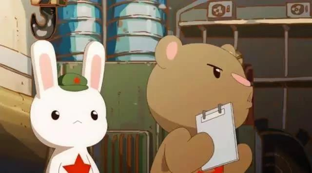
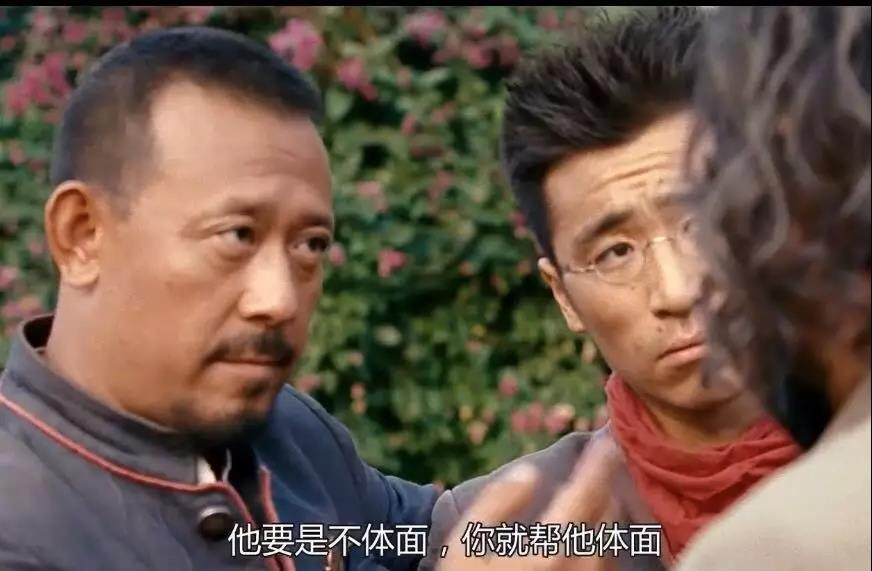
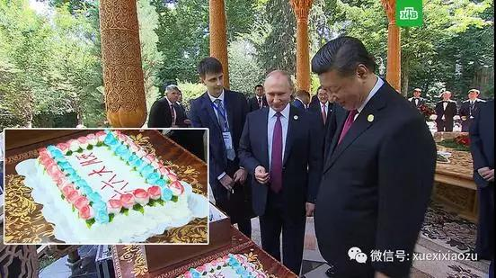
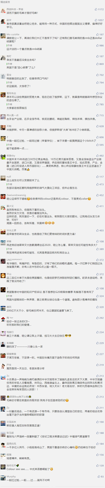

##正文

>我们这次来，签了200多亿美元的项目。我与普京总统小范围、大范围会谈，总感觉时间不够。感慨谈的事情越来越多了，谈的内容越来越深了。

在俄罗斯圣彼得堡国际经济大会上，中方领导人如是评价中俄贸易。

中俄贸易的大头是能源合作，尤其在美国挥舞贸易大棒以来的2018年，俄罗斯石油以同比增加20%的速度，成为中国能源最大的供应方。

而且，随着中国能源主动转向天然气，中俄东线天然气管道的投产以及北极航线的启动。可以预见的是，经济几乎完全依赖于能源出口的俄罗斯，未来几年将迎来更为迅猛的经济增长。

而随着“谈的内容越来越深”，经济合作越来越广，这个继承了沙俄荣光的古老帝国经济上一旦缓过一口气，也将有余力在全球博弈赛场中再一次秀出自己的肌肉。

 

2008年，那一年有盛大的北京奥运，那一年国际油价也曾一度突破140美金的高位。

也是那一年，斯大林的家乡格鲁吉亚，这个曾经的苏联加盟国在北约的支持下，对南奥塞梯自治政府采取军事行动，而俄罗斯为了保护自治政府，迅速越边界，用钢铁洪流碾压了格鲁吉亚军队。

此后，依赖着小布什时期高油价积攒下来的家底，俄罗斯与西方国家在各个方面开战，无论是乌克兰危机还是叙利亚战争，亲自下场与美国打了多场的代理人战争，也将美国的战略重心死死的拖在了中东和欧洲。

正是凭借着俄罗斯老大哥的战略掩护，中国那些年的经济得以高速发展，并随后启动了亚投行与一带一路，开始了人类命运共同体的建设。

 

不过，随着奥巴马上台后，国际油价的一路走跌，从140多美金的高位，一度跌破40美金，俄罗斯在小布什时代累积的油气红利资源渐渐被消耗殆尽。

而且，随着南奥塞梯和乌克兰危机后美国制裁的不断加码，财政几乎完全依靠能源的俄罗斯不仅在全球缺乏销售市场，更缺乏相应的投资来扩大开采规模。

因此，随着油气红利的消失，俄罗斯在国际格局也难以继续大秀拳头，这又使得依赖于对西方强硬获得民众支持的普京政府，在不能继续展示大国姿态的情况下，又面临巨大的执政危机。

而俄罗斯的危机，也传导至了中国，随着强势的老大哥俄罗斯在地缘上不得以的收缩，中国开始承受更大的压力。

尤其是对中国一带一路的“合纵”，重返亚太的奥巴马则以TPP的“连横”应对，通过英国、日本、韩国、菲律宾、新加坡等亚洲国家开始对中国围追堵截。

不过呢，中国并不是只会秀肌肉的俄罗斯，随着我们在老大哥的掩护下，成为了全球第二大经济体，对于周边挑衅的国家........

 

于是，给萨德提供场地的乐天集团滚出了中国，曾经风靡一时的韩剧和韩国代购也遭受了重创，台湾地区则发现遮羞布的“邦交国”一个个的开始断交，菲律宾农民突然发现大量的水果只能烂在地里，新加坡更是发现在巴基斯坦和缅甸开启了管道运输，将彻底绕过马六甲.......

甚至对于在大湾区暗中挑事儿的英国，我们也通过对其世仇阿根廷出售枭龙战斗机，给了老佛爷一点Colour see see.......

不同于俄罗斯只有军事威慑与能源供给两个大棒，“全方面发展”的中国手握着足够多的手牌，就像打扑克一样，可以利用不同的组合，有针对性的把对方“拍死”。

 

因此，虽然很多国家在重返亚太的美国的压力之下参与对中国的“围剿”，但是随着民众发现出口下滑，就业承压，大量的投资打水漂之后，国内累积的“怒”就会爆发，那些“亲美”的政府反而在美国的压力之下，被选民给换下台。

搞萨德的韩国朴槿惠保守派政府，搞仲裁的菲律宾阿诺基政府，以及未来台湾地区搞“反贸服”的蔡英文民进党政府都是如此。

嗯，那些对我们搞了不体面事情的执政党，自然有人会帮他们“体面”的下台。

 

当然，这些手牌，并不是我们一开场就抓到手上的。

1991年12月25日，苏联解体，俄罗斯成为了这个庞大帝国唯一的继承人，接手苏联海外一切的资产、外交机构以及国际资格。而这一年，俄罗斯的GDP与中国几乎相当。

而28年之后，中国的GDP几乎相当于俄罗斯的十倍，正是凭借着巨大的人口优势和制造业能力，成为了全球贸易重要一极后，我们才拥有的筹码。

遥想在改革开放之前，无论是在朝鲜半岛，在喜马拉雅南侧，在中南半岛，为了守护国家利益，我们只能自己出手，当时付出的巨大牺牲，是我们现在所无法想象的。

但是，这是这些牺牲为我们带来了国际地位，一整套的工业体系以及广阔的西方市场，使得我们能够在改革开放时候取得迅猛的经济增长，让我们从棋子，变成了下棋的人。

而如今，就像孙子兵法中说的，上兵伐谋，其次伐交，其次伐兵，其下攻城，我们已经不再需要亲自下场去搏杀了。

毕竟，战争不仅是“日费千金，然后十万之师举矣”，更重要是的一场搏杀会带来数十年都难以散去的仇恨，就像美国在中东不仅消耗了大量的国力，还搞出了一大批仇恨西方的恐怖分子。

但是，武力威慑永远是最有效的威慑，就像我们隔壁的日本与韩国，虽然拥有强劲的经济实力，但是在美国爸爸的狗链子之下，根本无法获取相应的国际地位来上桌使用筹码。

因此，虽然中国不能亲自下场动武，但是“上兵伐谋”，我们可以通过经贸关系构筑强大的朋友圈，在经贸的主战场之外开启另一个战场，由喜欢拉风老大哥来用相对暴力的方式来转移视线并承担我们的压力。

而老大哥为了满足国内民众的“大国情愫”，在国力恢复之后必然也会积极在欧洲和中东秀出自己的肌肉，来吸引西方国家的目光。

所以呢，我们在一起“做蛋糕”的时候，都不会忘记给对方分享，因为此时此刻，我们正在一起“扛着枪”。
 
 

最近准备在新开一个系列话题，有什么建议的可以后台留言

##留言区
 

