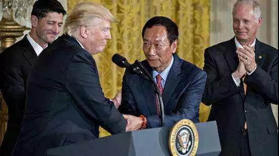

##正文

明天，也就是618，在中国人民喜迎电商购物节之际，特朗普也将在佛罗里达的集会上正式宣布竞选连任，正式开启他2020选战的序幕。

当然，不光特朗普重金组建了一直强大的竞选团队，甚至连很多依赖于特朗普政治生命的全球右翼政治人物们，也早已开启了对他的助选。

譬如指望着特朗普下一届能帮助以色列吞并巴勒斯坦的内塔尼亚胡将戈兰高地的一个新定居点以特朗普名字命名，并在犹太人群体中大肆吹嘘特朗普的功绩；

譬如指望着特朗普帮助帮助打破沙特兄终弟及传统，将王位传给儿子的萨勒曼，不仅对巴勒斯坦同胞们熟视无睹，甚至打破OPEC的默契大幅增产，来帮助特朗普稳定油价；

甚至准备在下届台湾地方选举中一展身手，“商而优则仕”的郭台铭，为了获得特朗普的支持击败左派的蔡英文，也专程飞抵美国，跟特朗普详谈他在摇摆州威斯康星的投资。

 

不过，刚刚吃完自己73岁生日蛋糕的特朗普，却没有“六六大顺”，据新华社消息，昨天，福克斯新闻公布的民调显示，竟然有五位民主党人候选人的支持率高于特朗。

在这份在抽样误差在正负3个百分点以内的报告当中，前副总统拜登和资深参议员桑德斯分别领先特朗普高达10%和9%。

 

虽然最近出来的大量的民意调查中，都显示特朗普被其他民主党人在支持率上丢得远远，但是福克斯新闻不仅是特朗普最信任的频道，也是所有特朗普支持者们获取信息源的重要渠道。

因此，前几天还在推特上怒斥那些是“假民调”的特朗普，这次是真的怒了，旋即中止了团队中五名民调专家中三位的合作关系。

其实，在政事堂看来，对于特朗普来说，选战前期的民调落后并不严重，上一次选举过程中，民调也认为希拉里对特朗普遥遥领先，甚至希拉里在选票计算过程中还一度提前庆祝。可是最终，那些沉默的大多数还是把特朗普送上了选台

而且，选战还有一年半的时间，在这段时间里，特朗普在美联储降息、贸易谈判、伊核、朝核以及美墨边境墙等一系列的问题上可以靠巨大的成功大幅追回支持率。

所以呢，目前支持率大幅落后这事儿并不可怕，但可怕的是大幅落后的事情被自家公开了。

因为以沙特萨勒曼和以色列内塔尼亚胡为代表，这样无条件支持特朗普的极右翼，在全球都是少数派。

而以宣布在威斯康星投资建厂的郭台铭为代表的偏中间路线的政治家和企业家们，这些人才是大多数。

对于这些大多数人来说，选边站队是要掏出真金白银的，理性选择都是“谁赢帮谁”。

 

因此，随着昨天右翼权威媒体福克斯新闻也报道了特朗普支持率大幅下滑，这对于很多原本准备对特朗普下注的“骑墙派”来说，就不得不“三思而后行”了。

可用的例子很多，我们拿伊朗来举例，如果未来民主党建制派上台，那么必然会重新恢复被特朗普撕毁的奥巴马伊核协议。

而对于伊朗来说，毕竟他们在美国也没有很强的情报来源，主要也是靠搜集公开新闻和打听内部消息，福克斯新闻基本代表了特朗普一方的真实情况。

因此，一旦伊朗认为特朗普无法连任，那么无论特朗普如何极限施压，伊朗都绝对不会签署特朗普版的伊核协议，否则等一年后美国的建制派们卷土重来之际，伊朗就相当于“45年加入伪军”了........

所以呢，从博弈的角度就会发现，目前特朗普陷入了“民众支持率”和“政治家支持率”这个先有鸡还是先有蛋的悖论当中，因此他想要赢，就需要把自己必胜的话，放出去。

 

如果全球的政治家们都相信特朗普能连任，那么都会抢在选举之前缴纳“投名状”，以较低的成本成为下届美国总统特朗普的“朋友”，那么特朗普也会利用这些这些政治家的支持，将其变成对选民的福利，以获取民众的支持率和选票最终上台。

反之，如果大家都觉得特朗普无法连任，那么谁也不会赶在这一年的时间里火急火燎的把那些逆全球化的协议签了，这就会使得特朗普大幅落后于民主党竞选者的“民调预言”成真了。

嗯，稍微有点啰嗦，通俗点说，特朗普现在就是让子弹飞里的“张麻子”，支持者是不够的，他需要让“武智冲”们相信他稳杀黄四郎，然后再利用他们带动底层群众去端民主党建制派的碉楼。

 

所以呢，其实特朗普早就知道自己的民调结果大幅落后于民主党的竞争对手，毕竟现在是总统手头不缺钱，有足够多的民调团队可供驱使。

但是，特朗普绝对不能让全球都觉得自己真的民调落后，尤其是被泄露出来的特朗普内部民调显示，2016选举中，特朗普在威斯康星、宾夕法尼亚、佛罗里达和密歇根这四个以极其微小差距击败希拉里的摇摆州，目前特朗普均已两位数的支持率落后于拜登。

一旦这四个州丢了，那么特朗普连任基本上就要完了了

而就在6月15日，特朗普生日的次日，美国120多个城市爆发了弹劾特朗普的游行集会，美国民众手持标语和横幅，向国会民主党人施压弹劾特朗普。

但是民主党拒绝弹劾特朗普的背后，是不想刺激特朗普的支持者，好在特朗普落败后对其起诉，毕竟，通俄门调查那么久，有的是把柄可以把不是总统的特朗普送进监狱。

所以，对于特朗普来说，在如今自己的支持率大幅落后被公开之后，则必须想办法能够逆转这个颓势，所谓解铃还须系铃人，特朗普还需要从这四个州找解决方案。

而这四个原本支持特朗普的州支持率大幅下滑的直接原因，就是因为特朗普挥舞的贸易大棒，不仅没有让高收入的制造业就业回到美国，甚至还让很多大豆滞销的农场主不得不转行种大麻.....

因此，对于特朗普来说，为了能够连任成功，避免自己的牢狱之灾，他急需在外交上获得一场看起来的胜利，在暑假之前拉回民众支持率，将其再变成筹码，好利用暑假的空闲时间拉拢更多的朋友，让自己的竞选从恶性循环及早进入良性循环。

所以，本月月底的大阪G20上，在这个特朗普所有“对手”汇聚一堂之际，一场台上觥筹交错，台下刀光剑影的“鸿门宴”，即将呈现在我们的面前。

 

##留言区
 

