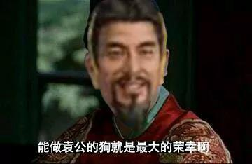

##正文

今天，应该是“公知”和“带路党”们哀嚎遍野的一天。

据路透社报道，那位天天指责中国“盗窃”美国“知识产权”、侮辱华为是“专利流氓”的共和党议员卢比奥，昨天居然向议会提出立法，要禁止华为通过美国法院向“盗窃”其专利的美国企业索要专利费。

这个提案的起因，是华为准备向美国电信商Verizon要求支付230多项专利的费用。这笔总计超过10亿美元的专利费，相当于这家美国最大电信商去年四季度净利润的一半。

虽然这笔专利费的确不少，但卢比奥这个提案一旦通过，也就意味着美国不是“偷”——而是要“明抢”中国企业的知识产权和专利技术了。

大概，此刻这位整天指责中国盗窃美国专利的反华议员仿佛孔乙己附体，面对众人的指责，理直气壮的大喊，读书人的事，能算偷么?

不过考虑到美国是国际警察，卢比奥这算是偷还是抢，咱也不敢说咱也不敢问，不过大家心里都是明镜的，美国在知识产权保护上正义形象至此崩塌。

而美国正义形象的崩塌让国内大量的“公知”和“带路党”更为崩溃，仿佛跪着当了十几年的“舔狗”，突然有一天发现，自己爱慕已久的女神不仅是“鸡”，还是名震天下誉满全球的那种......

 

这让政事堂不由得想到最近在西方大火的一款游戏《三国全面战争》。

由于HBO拍的大戏《权力的游戏》烂尾了，很多国外玩家玩这款游戏时被三国的文化所深深吸引，甚至很多人都表示权游的作者马丁是不是“借鉴”了《三国演义》。

譬如，挟天子以令诸侯多次以弱胜强的曹操颇似泰温·兰尼斯特，无人能敌但贪酒好色的吕布颇似魔山，而会魔法还能搞预言的张角颇似女巫梅丽珊卓，甚至刘备获得“卧龙”之后开始崛起并到处放火，也跟龙妈的三条火龙有着某种关联。

不过，就在国外玩家为此痴迷之际，这个游戏令国内很多玩惯了光荣的三国玩家们对于游戏中的大Boss，“狗王”袁绍非常的不理解。

游戏中，袁绍这位四世三公的联军盟主，但经常玩着玩着，就通过外交，将游戏中的其他诸侯收为“走狗”。

而一旦袁绍判定玩家对其产生威胁，就会率领着十来条走狗对玩家围剿，逼着玩家也给袁绍当“狗”，并对其上供。

 

由于游戏机制的问题，连玩家的盟友也能被袁绍收成狗，因很多玩家在面对袁绍“群狗扣门”的时候，根本无力抵抗，要不然弃档，要不然就得认怂，被袁绍收下当狗。
 
 

因此，很多国内玩家也纷纷吐槽游戏的机制，为啥把袁绍设置的这么强。

实际历史上的袁绍就是这么强，当时他带领着河北各路诸侯以及刘备、孙策、刘表、张绣、刘辟等一群走狗在围着曹操咬。

如果不是袁绍意外身故，几个儿子之间打起内战，导致袁绍旗下的“走狗”们开始自己咬自己，曹操就算打赢十次官渡之战，恐怕也过不了河北。

那么，政事堂为啥讲了这么一大段的历史和游戏呢？

实际上，联军盟主的袁绍，和北约盟主美国是很类似的，当年奥巴马重返亚太的时候，就是带着一群“狗”来咬我们。

譬如，日本挑起了钓鱼岛冲突，韩国搞起了萨德防空，台湾地区挑动了反贸服，泰国中止大米换高铁，越南在争议海域开采石油，缅甸的昂山素季在上台前发布大量的不友好言论，菲律宾把南海争议提交国际仲裁，新加坡和澳大利亚在南海问题上带头指责我们，甚至英法德也跟着一起指手画脚........

大概，那几年关心时政的朋友，会有玩游戏时被袁绍带着一群狗围剿时的无奈，袁绍主力还没看见，就已经被各路大军袭扰的左支右绌了。

不过，随着特朗普上台重新制定了战略，虽然依然视我们为威胁，但施压的时候不“带狗”了，而是直接进行外交施压。

当然，特朗普并非不想拉着狗一起撕咬，但“出门不捡钱就算丢”的特朗普此刻也同时对自家的狗友们进行同样的施压，要求他们也得交保护费......

不得不说，“公平、公平、还是tmd公平”这点，特朗普还真是说到做到。

当然，特朗普的全面出击，不仅使我们压力大减，甚至还我们跟英法德等美国的传统盟友建成了贸易联盟，很多原本推进乏力的合作迅速达成了协议，更不要说国内很多推动不下去的改革，也在倒逼的威胁之下顺利得以实施。

因此，虽然特朗普挥舞的贸易大棒对经济造成了一些影响，但也算是失之东隅收之桑榆。

而对比，此次参议员卢比奥搞得禁止华为索要专利费法案，简直就是继续帮我们的忙了。

就像当年袁绍对于曹操的巨大优势，不仅是“狗”多，而且曹操团队内部还有大量的“带路党”暗地里搞勾搭，因此卢比奥搞了这个法案，会把咱们国内很多以为“美国月亮就是圆”的带路党也会被浇得透心凉。

甚至晚上跟朋友聊的时候还调侃，按照目前双方一直搞对等，那些对中国国家安全造成威胁的美国企业（或者不可靠清单中的企业），其知识产权也不用受到中国法律保护了.......

嗯，这似乎会让国内那些擅长山寨的企业们爽的一塌糊涂......

当然，玩笑归玩笑，政事堂推测，假使卢比奥的法案真的通过，中国政府也不会公开支持对知识产权的侵犯。

因为历史上，袁绍能够大规模的“收狗”，不是因为袁绍的军力有多强，也不是因为袁绍的手腕有多高，而是他高举着政治正确的大旗，让各路诸侯在规则之下获取并维护自身的利益。

而随着中国科技和经济的不断发展，像华为这样在知识产权领域大规模投入的企业越来越多，在全球知识产权中的占比越来越高，我们也将成为维护知识产权最大的既得利益者。

因此，诚信和遵守规矩都是必须的，因为我们未来，也是要“带狗”的......

##留言区
 

