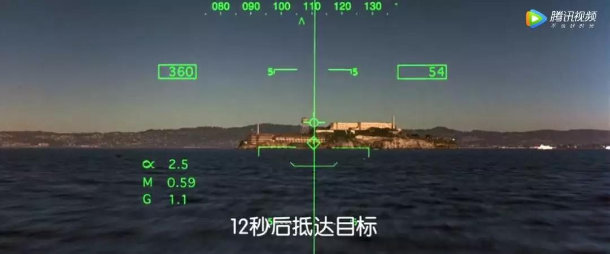
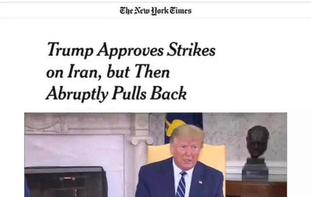

##正文

船只已就位，飞机已升空，拿到导弹发射许可的美军飞行编队，在按下发射按钮前，收到了放弃任务的通知.....

 

 

嗯，这不是电影《勇闯夺命岛》的片段，而是现实中的一次再现。

据纽约时报援引多名参与此次轰炸的高级官员，昨天夜里在白宫，特朗普的安全顾问们和国会领袖们围绕着是否对伊朗进行军事打击进行了激烈的辩论。

最终，特朗普批准了对伊朗多个雷达和导弹阵地的军事攻击，不过，就在五角大楼的将军们和白宫的外交官们都在严阵以待之际，美军的轰炸编队又被特朗普紧急叫停。

 

似乎像当年的古巴危机那样，世界又一次在战争的边缘擦身而过。

在特朗普的特使安倍刚刚结束访问伊朗，特朗普就批准轰炸的原因，是昨天一架美国无人机在霍尔木兹海峡被伊朗伊斯兰革命卫队击落。

>据伊朗伊斯兰革命卫队的声明，被击落的美军RQ-4“全球鹰”无人机当天从波斯湾南部的基地起飞，机上电子侦察设备处于开机状态，向伊朗方向飞行执行“侵略性”侦察任务。

>美国中央司令部在一份声明中说：“美国海军一架广域海上监视项目验证机（BAMS-D）在霍尔木兹海峡国际空域执行任务时，被伊朗地对空导弹系统击落。”

为啥一架无人机就能让两国大国差点擦枪走火？

说起来，这还真的不是一架普通的无人机，他是美国“全球鹰”家族中的一款最新的原型机RQ-4A BAMS-D，作为一架无人机，其机身比波音737还大。

一架波音737的价格是一亿美金，而根据去年澳大利亚采购该机型的合同来看，这这架无人机的整体售价大概在10亿美金左右。

这么贵的原因，是该飞机装备了目前全球最先进电子情报装置，甚至目前美国海军也只有这么两架。

譬如2011年，伊朗捕获了美国RQ-170型隐身无人机，随后伊朗、俄罗斯以及部分国家的无人机技术突飞猛进，因此，若真如伊朗所言，飞机残骸已被打捞，那么美国的损失恐怕就不是一架飞机那么简单了。

 

所以，接下来特朗普在大阪的G20上，又得临时加上一个伊朗问题，怕是有的忙了。

不过，这场看似意外的冲突背后，政事堂却嗅到了疑点阴谋的味道。

因为这架最新的原型机，是6月15日，从美国本土基地起飞，飞了一万多公里到了中东的美军基地，进行了几天的长途维护后，结果刚飞出来就被伊朗的防空导弹打下来了。

一方面，这种“千里送人头”的操作实在是太不符合常理了，所有的小国对大国的反击，类似于当年土耳其击落俄罗斯战机那样，是盯了好久抓住一个机会干掉你，哪有一开场就搞了一个大的。

另一方面，就在此次击落事件的几天前，美国的无人机就曾遭遇了伊朗海军的防空导弹袭击，虽然没有命中，但也给美军敲了一个警钟，最起码美军是知道入侵伊朗领空伊朗有打的决心。

 

所以，美军紧急调来的战略武器，却大摇大摆的被击落，非常的不符合常理。

而且，更不符合逻辑的是，现在的侦察机都是超高空侧视侦照模式，利用站得高看得远的道理，万米高空之下，在攻击范围外就能拍清楚，根本没必要跑去伊朗领空附近去执行任务。

 

因此，这家搭载了美国最先进技术的侦察机，属于美国的国家重器，明明可以远远的就把事儿办了，结果非得飞的那么近给人家击落的机会，这相当于“全图打击的法师竟然越塔强平A”，逻辑上就有问题。

更不要说，这架无人机跑到人家攻击范围内，还主动关闭了机上识别设备，就怕伊朗不打他，导致伊朗打下来之后，也没发现其信号是如此的先进。

而且，真要是被伊朗买的俄罗斯导弹打下来也就认了，根据伊朗公开的视频，这次击落美国无人机的导弹是伊朗国产，价格便宜量又足。

试想一家售价10亿美金级的无人机，卖这么贵就是因为“你打不到我吧，没有办法，我就是这么强大”，结果初次出山，却被一个“小短手”的远程小兵给拍死了，其搞笑程度不逊于当年朝鲜战场上的手枪打飞机。

因此，这让整个全球鹰产业链上下都哔了狗了，还有谁敢买这种“垃圾中的战斗机”？更不要说50亿美金重金购置六架该机型的澳大利亚，看到这个新闻再想想他要面对的东风快递，将是多么的绝望......

所以呢，这一切的不合理的背后，最合理的解释，可能就是有人在暗中布局了此事。

先是安倍作为特朗普特使访问伊朗期间，霍尔木兹海峡出现莫名其妙的日本油轮遇袭，美伊两方各执一词。

随后，为了调查情况霍尔木兹海峡的情况，美国安全部门要求军方派遣最先进的原型机去侦查情况。

而在此次侦查之前，当地美军就故意让其他的侦察机越境挑衅，刺激伊朗使用导弹。

再之后，这架无人机刚开始执行任务，便没有按照规则，深入到伊朗的导弹覆盖范围之内，大摇大摆的在伊朗领空的边缘进行挑衅。

 

在反复的挑衅之下，还有着如此大摇大摆的目标，沿着领海侦查搞侦查，伊朗人自然而然就笑纳了.....

 

 

于是，一场既洞悉美国政策也洞悉伊朗人性格的阳谋，就这么搞出来了。

因为这群对伊朗的鹰派们知道，如果对伊朗动武，民主党占据优势的议会肯定不可能通过，唯一的机会在于利用特朗普手头的权限，搞出理由对伊朗实施打击，然后在过程中把打击扩大化，引发伊朗的强烈报复，然后把事情推向不可控。

不过，这伙人可能唯一漏算的，反而是他们的总统特朗普，原本特朗普在得知自家最先进的无人机被伊朗打下来之后，第一反应是极其愤怒的，因此也纵容了那些鹰派们的进攻计划。

但是，特朗普有点类似于石破天惊里面的汉默将军，他手握的“导弹”，不过是他谈判时极限施压的筹码，他要的是钱，不是真的要炸人。

导弹不放的时候，他还拥有谈判的筹码，一旦真的放了出来，那么整个局势就会由其团队中的鹰派们掌控了。

 

所以，想明白这点的特朗普很快就软化了其态度，通过阿曼等国家向伊朗表示要谈判，将其转变为自身的谈判筹码。

而最让博尔顿等对伊朗鹰派们痛苦的事情，是特朗普此次有了足够正当的理由，在接下来的大阪G20之上会见他总想见但总见不到的普京。

大概，这就是传说中的搬起石头砸自己的脚。
 
 

同样，G20之前的谈判，也是这个道理。

##留言区
 

