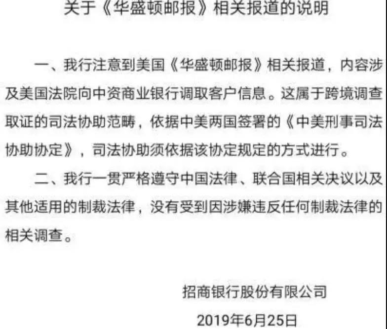

##正文

四年前，一张叙利亚小男孩伏尸海滩的照片，曾深深的刺痛了全球人民的神经，如今在美墨边境，移民陈尸河畔的悲剧再一次上演。

今天，CNN放出了一张震撼人心的照片，一个小女孩被蒙在父亲的衬衫里，一动不动浸泡在河水中，即使没有了呼吸，她的右臂依然紧紧搂着父亲的脖子。

 

据进步报报道，这位2岁小女孩的遗体在德克萨斯州的对面的马塔莫罗斯附近被发现。他们一家自萨尔瓦多，在向美国政府请求庇护未果后，试图沿着格兰德河进入美国。

父亲先带着女儿游过河，在回头去找妻子的时候，发现孩子落入水中，父亲拼尽全力往回游，虽然保住了孩子，但汹涌的河水最终还是将体力耗尽的父女冲走，也就诞生了这张令无数人为之伤心流泪的照片。

而这张令人心碎的照片所引发的舆论狂潮，将美国总统特朗普推到了暴风眼。

这位上任以来就不断缩紧移民政策的美国总统，在本月悍然撕毁美墨关税谈判，并以加征关税作为威胁，迫使墨西哥加强边境管制，很多原本走陆路入境的移民，不得不冒着生命危险去走水路。

因此，这场照片也成为攻击特朗普移民政策的最佳契机，不仅媒体们纷纷撰文纪念，民主党总统竞选人和国际组织领袖纷纷跳出来，将孩子的死亡责任直指特朗普。

 

 

甚至多家美国媒体趁机爆料，**特朗普原计划本周开始大规模驱逐非法移民，就在行动前的一个晚上，民主党国会领袖给特朗普打了12分钟的电话，才将计划紧急推迟。**

这下特朗普可就麻烦了，因为媒体热议引发的民意愤怒，不仅会进一步降低特朗普在中间选民的支持率，还将迫使特朗普放弃近期强行驱逐移民的计划。

而建墙的搁置和驱逐移民政策的遥遥无期，这些未兑现的承诺又将严重影响特朗普的红脖子支持者，这将非常不利于上周开始正式备战2020大选的特朗普。

所以呢，这也意味着，特朗普将不得不在其他领域寻求支持.......

聊完国际，再把镜头转制国内，昨天A股银行板块重挫，其原因，是华盛顿邮报搞了一个大新闻。

据官媒证券时报报道：

>华盛顿邮报于北京时间今早称招行、交行和浦发涉嫌在对朝鲜违反制裁的调查中拒绝遵守传票。根据美国司法部长或财政部长的要求，该事件可能触发将中国最大的银行从美国金融体系中切断。

对此，招商银行紧急做出了回应：

 

看着这两天A股的表现，政事堂不由得慨叹，资本市场的玩家们还是要加强对国际政治的学习。

要知道，三家银行配合调查一事，是今年三月开始的，这个时间有什么意思呢？三家银行和朝鲜的合作都是很多年了，这个时间点进行调查，自然是2月底河内会谈谈崩了之后，特朗普方面推动的“极限施压”。

但是，特朗普几天后就要在G20上“亲切友好”的会见我方领导人，因此，假设是特朗普要籍此进行“极限施压”，那要么是特朗普发推特，要么是白宫发文件，要么是亲共和党的福克斯新闻放料，绝无让民主党媒体捅出来的理由。
注：华盛顿邮报当年可是干掉了我们的老朋友，共和党总统尼克松。

所以，从爆出来的媒体是亲民主党的，能够得出两个结论，一个是在国内受阻的特朗普非常想在国际上出彩，不想极限施压把合作搞崩，另一个是民主党非常不希望特朗普谈成，所以在见面前搞事情。

而且，我们可以验证一下时间，本来三月份开始的涉朝鲜调查，愣是拖到6月25日才爆出来。

就在爆料的几天前，6月24日韩国青瓦台表示，特朗普将于6月底访韩，6月23日，金正恩称将郑重考虑特朗普亲笔信中的内容，6月20日至21日，中国对朝鲜进行了“成果丰硕 影响深远”的国事访问。

因此，稍有点政治敏感性，就会明白三家银行的事儿，实际上与“朝核六方会谈”有着直接的关系，只不过是有人在暗中作梗罢了。

这就跟就跟特朗普决定大规模驱逐非法移民，民主党利用政策实施前的机会，今天大幅爆炒非法移民父女溺亡一样，其实每年溺死在这条河上的偷渡者都有几十人，但民主党非要挑现在这个时间点曝光和炒作，背后满满都是精心的算计。

所以呢，**当我们明白了此次三家银行事件的主导者和爆料者，不仅不是一波人，而且还是死对头的时候**，我们就会明白还是得相信官媒，市面上的那些阴谋论大多是过度解读了，三家银行重挫的股价也不过是误伤。

因为深陷国内困局的特朗普，是带着诚意来破局的......

##留言区
 

