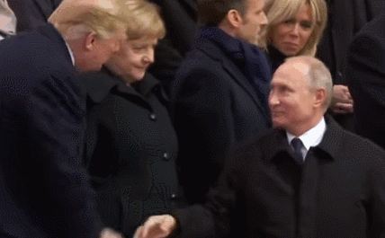

##正文

随着各国领导人今天纷纷抵达大阪，这个汇聚了全球90%GDP的豪门盛宴正式开始了。

特朗普在出行前，在接受福克斯商业频道节目采访时，声称“几乎所有国家”都“占了美国便宜”，如日本在美国遇袭时“在索尼电视上看戏”，欧洲“摆足了架势要占我们便宜”，并不出意外地“点名”中国，“长期以来令美国吃亏”，又将矛头指向越南，称其“比中国还能占美国便宜”......

大概，唯一没有被特朗普批评的，只有普京的俄罗斯了。

而据白宫最新发布的行程，明天在大阪，特朗普将与普京在下午14时至15时进行约一个小时的单独会晤。

考虑到上次在汉堡特朗普见普京的时候，就将原本半个小时的礼节性会晤，拖成了2小时20分钟。因此，特朗普搞不好就会把自己在汉堡创下的G20历史最长的双边会谈记录再次打破。

而可以佐证的是，特朗普明天密密麻麻的行程中，下午除了16时会见巴西总统外全部留空，看来，这对”好基友“真的准备非常深入的交换点什么。

 

说起来，作为全球安全领域最重要的两极，本应该是经常会面的，但自从涉嫌“通俄”的特朗普上台后，他每次与普京的会“双普会”，总会有“意外”发生。

就拿去年来说，年初的时候，全球著名搅屎棍的英国，先是指示白头盔组织伪造了叙利亚政府军使用毒气，后又在自家国内伪造了双面间谍被毒杀，虽然造假技术不咋地，但巨大的舆论压力搞的特朗普见普京都得绕着走。

到了年底，法国又接过了英国的重任，在11月巴黎二战胜利100周年庆典上，法国方面先是执意要求避免美俄两国总统的单独会面，导致哥俩决定在午餐时交流。

可是，在爱丽舍宫午餐会的最后一分钟主办方法国又进行了座位临时调整，再一次将哥俩分开，逼着他们只能暗树大拇指，等下个月的阿根廷G20再见。

 

可是，就在阿根廷G20召开前几天，3艘乌克兰舰船唱着梁静茹的勇气，视死如归的强闯俄罗斯向刻赤海峡，引发北约与俄罗斯的激烈冲突，直接导致特朗普再一次取消了与普京的会面，放了一个大鸽子。

直到今年6月博尔顿实在是搞砸了，炸了几艘邮轮，送了一架最先进的无人机都没有将美伊擦枪走火引发美俄冲突，反而送了特朗普一个跟普京见面的机会。

所以说呢，咱也不能说西方一直都是拳击赛，在阻止特朗普和普京这对基友搞基的问题上，他们真心是不惜代价不遗余力的。

那么，为什么西方各国如此不惜代价阻止美俄亲善呢？

当然是因为巨大的利益。

从马歇尔计划开始，北约围剿苏俄的机制，就成为了所有欧洲国家安全和经济的保障，欧洲的老爷们一旦吸惯了这种”毒品“，就戒不下来了。

和这个逻辑类似的是，奥巴马制定了重返亚太之策的背后，是通过TPP为代表的一系列机制，向环太平洋各国输血，建成利益共同体来围剿中国，于是很多苍蝇也就围了上来。

因此，在奥巴马亚太体系内收益的各地区，纷纷开始参与挑事儿来征求利益，从日本闹钓鱼岛，韩国闹萨德，台湾闹贸服，到菲律宾闹南海，越南闹采油，几乎组建了一个对华包围网。

甚至在特朗普上台后，像加拿大、澳大利亚这样的环太平洋的英联邦国家，不仅继承了搅屎棍的思维，也继承了喜欢躺着”吸毒“的习惯，自然也和想尽办法阻挠特朗普与普京会面的英法等欧洲国家一样，积极参与到破坏中美关系的历史进程当中。

于是，这才有了加拿大悍然逮捕我方人员，澳大利亚全面拆除华为设备等事件的爆发，可以说，这帮”伪军“动起手，来比皇军还积极。
 
 

加澳两国的动作，对比英法其实不难理解，特朗普上台之后，不仅在欧洲方面对俄罗斯实施了战略收缩，在亚太地区也是大幅收缩力量。

因此，就跟英法等欧洲国家只有破坏了美俄关系，才能在维系雅尔塔体系下获利那样，加澳等环太平国家只有破坏了中美关系，他们才能靠维系奥巴马亚太体系获利。

所以，加澳等国才会接力棒式的参与对中国的围剿。

但是，特朗普战略收缩的意志，远非各位所能想象，连英法这种千年搅屎棍都阻挡不了并先后放弃，可想而知，加澳这种大英帝国搅屎棍的徒子徒孙就更无可能了。

所以呢，随着明天开始，特朗普与普京等人的深谈，很可能意味着一个新的时代开始。

在各方发现无力阻止特朗普的战略收缩之后，为了自身的利益，明智的政治家们会迅速调整对外战略，寻求新的利益联盟，甚至构筑雅尔塔之后新的国际政治体系。

而这个体系，也许未来会被命名为人类命运共同体......

##留言区
 

