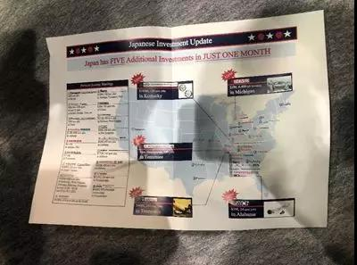
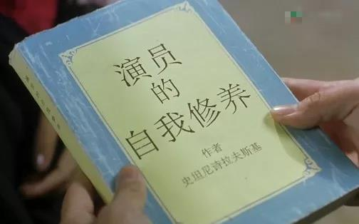
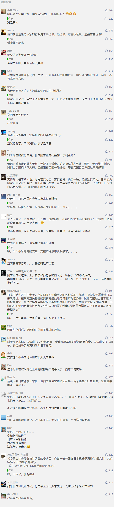

##正文

随着昨天绯闻女王范冰冰与李晨分手的新闻直接瘫痪了微博，今天早上，一则范冰冰疑似怀孕的视频以及南京某小区业主的聊天记录，充斥于几乎所有的微信群。

爆料者称范冰冰已经怀有身孕，但孩子爸爸不是李晨，而是某知名集团的老总，这种极具吸引力的大瓜，自然而然吸引了全国人民的瞩目并纷纷转发。

一时之间，关于范冰冰的所有花边新闻和黑历史纷纷被扒了出来，甚至无数的段子手也不断的编排各种段子。

对于普通女孩来说，这种谣言的打击是非常致命的。不过，对于范爷来说，这都不算什么。

因为此事一出，被崔永元炮轰后销声匿迹了一年多的话题女王，又通过这种超级话题的方式回来了。

没办法，这就演艺圈的代价，也是演员的自我修养。

 

而就在范冰冰成功的吸引了全国人民的目光之际，日本首相安倍正成为全球镁光灯的中心，在这场聚集了全球90%以上GDP大阪的G20峰会上，长袖善舞的安倍也在开始他的表演。

说起来，安倍为了这一场G20的亮相，可谓之费劲心血。

不仅帮特朗普促成与中俄两国领导人的会面，并积极充当特朗普伊核朝核问题的“特使”，而且，还试图联合其他国家恢复被特朗普破坏的全球贸易体系，不出意外，本次G20上将会把“自由贸易”写入大会宣言，一改去年阿根廷时的巨大分歧。

甚至现在大阪街头的黑社会都跟着安倍一起有了“政治意识”，很多可能会影响日本形象的娱乐场所都主动关闭.......

当然，安倍如此费劲心机想要办好G20，自然也是有所求的，因为下个月日本即将进行参议院选举，如果安倍的自民党及其盟友拿到了2/3的议员席位，那么安倍就能在自己的任期内修改宪法，解决日本的国家正常化问题。

因此，在选举前一个月的本次G20之上，安倍必须要向全体国民展现，日本国家正常化后的“国际范”，不仅能够在伊核朝核问题上以大国身份积极参与，还能在国际舞台上像“扫地僧”那样，一出手就能弥合各国之间的冲突。

 

当然，想要维持表面上的光鲜，背地里就得吐血了。

今天上午安倍在与特朗普的会谈后，交出一份美国在日本投资情况的A4纸文件，文件标题为“日本投资升级”（Japanese Investment Update），下方写着“日本在仅仅一个月内追加了五项投资”。

 

安倍不仅仅是用了特朗普最喜欢的一页纸说明，还在“仅一个月内”和“五”上，还用了大写字母并加下划线以突出强调。

不得不慨叹，在特朗普上个月访日“召见”天皇之后，日本的财阀们为了跟安倍一起赌国运，实现国家正常化，在一个月内就能推动境外投资落地的效率还真挺可怕。

当然，早就知道安倍肚子里小九九的特朗普，自然也在配合安倍的演出，在出访日本之前，就不断的表示的向身边人表示要退出《美日安保条约》，“因为其很不公平，其只规定了美国保护日本义务，而没有规定日本要协防美国的相应义务。”

甚至在出访前一天，26日接受福克斯经济新闻采访时特朗普还用了几近调侃的语气说：“日本如果收到袭击，就是第三次世界大战，美国将拼劲全力战斗。但是要是我们被袭击了，日本也不是必须帮我们，他们只会看着索尼电视了解战斗情况。”

 

 

政治家们说的话，如果都信的话，那就是脑子就进水了，更何况战略利益从来都不是金钱利益能来衡量的。

且不说驻日美军的地缘重要性，哪怕就在美国盟友当中，承担美军军费最高的就是日本，分摊比例高达75%。

要知道军工利润都是数倍，分摊50%就够得上成本，因此美国驻日军队不仅解决就业，而且还真的很赚钱。

更何况作为一个精明的大商人，哪怕不算政治帐，但从经济也知道撤回驻日美军是一笔亏本的买卖，更何况出门不捡钱就算丢的特朗普，怎么可能白送给日本而不要钱呢？

所以呢，特朗普很清楚面临“中期选举”的安倍以及日本财阀们想要的是什么，还没出访就开始了演戏，把“国家正常化”这个胡萝卜不断的秀出来挑逗日本人。

当然，安倍和日本的财阀们，此刻就像他们的国粹那样，明明心里想的是“不要停”，但是嘴上却说着”不要“，安排日本媒体纷纷站出来驳斥特朗普试图终结美日安保条约的做法。

嗯，我还真想看特朗普真的停下来之后，日本人会怎么喊”不要停“......

 

那么，这事儿最后的走向会是如何呢？

日本受限于和平宪法，军费支出占比非常低，特朗普的确有推动日本修宪的意图，因为这样，这个全球经济第三大国将大幅增加军费，也就能从美国采购更多的军火。

但是，国际地位并不是单纯的武器数量决定的，更何况特朗普的撤军只是勒索日本的手段，哪怕是特朗普真的想撤，五角大楼和美国的军工集团也不会答应。

所以，可以预见的是，顺利完成G20接待工作的安倍，在下个月的参议院选举中取得大胜，拥有可以修宪的权力之后，特朗普将重新挥舞贸易大棒，逼着日本大规模的吐血。

而走了一半路的安倍和日本财阀们也不可能退回去，只能咬着牙吐血。

当然，日本一个战败国想要正常化，仅仅有美国的支持是不够的，其他的几个安理会常任理事国也将狮子大开口，甚至朝鲜和韩国也将联合进行战争赔款的追缴。

因此，日本修宪过后并不会好过，将进入“谅大日本之物力，结与国之欢心”状态，说白了，就最近一年的范爷类似，得变卖资产换钱”交罚款“。

所以呢，别看安倍现在光鲜亮丽的游走于台前，成了一个”爷“，但是雅尔塔体系的几个巨头们，随时都可以卡住让你进退不得。

也许，安倍想要在自己任期内恢复日本国家正常化，恐怕就得跟今天试图复出的范爷一样，既豁得下脸皮，能狠心吐得出来血。

没办法，这都是一个成功演员的自我修养。

 

##留言区
 

