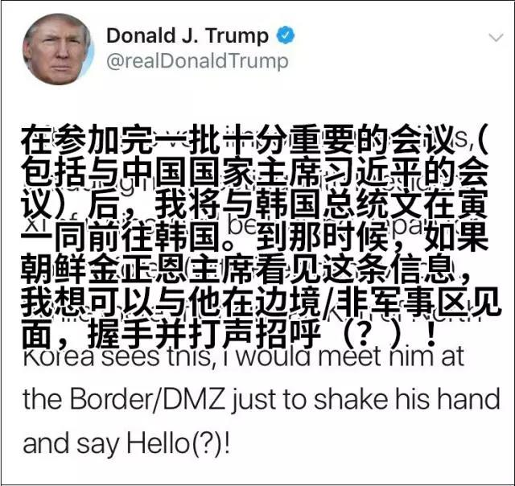
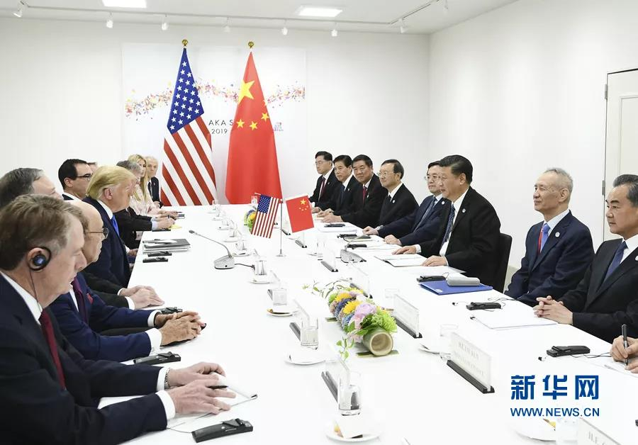
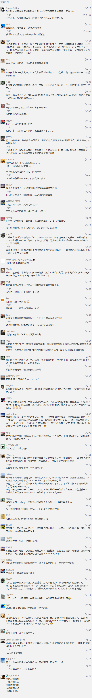

##正文

不出意外，特朗普将成为历史上首个踏上朝鲜领土的美国总统。

据路透社报道，特朗普在G20大阪峰会后的记者会上表示，如果他在朝韩边界非军事区与金正恩会面，他将跨过边界进入朝鲜。

这相比于今天早上，特朗普在推特上表示希望能够与金正恩握手并打个招呼，后来宣布的“踏上朝鲜的领土”，很明显更进了一步。

 

考虑到朝鲜并没有与特朗普的直接通话渠道，特朗普半天之内突然有“更进一步”的想法，除了韩国总统文在寅的力推外，恐怕大概率与今天上午的中美会谈有着一定的联系。

 

当然，创造机会可以靠别人，但把握机会还得靠自己。

就在今天上午特朗普刚发完推特没多久，朝鲜外相崔善姬回应：“我认为，如果按照特朗普总统所说的，在南北分裂线上实现朝美首脑会面，那么**两国首脑之间深厚的友谊将更进一步**，成为促进两国关系，具有意义的契机。”

并补充道：**提议“十分有趣”，但朝方尚未收到正式邀请。**

如此高效的反应，很显然知道特朗普明日访韩的朝方，也在一直注视着这位美国总统的一举一动。

而“尚未收到正式邀请”一词，更就像女孩子等约会那样，渴望中又不缺矜持。

大概，这就是传说中的，“怕他不来，又怕他乱来”。

当然，倘若特朗普明天真的“入境”朝鲜，成为首个达成此目标的美国总统，也意味着继今年河内会谈失败后，朝核谈判将再一次迎来曙光。

 

那么，为何特朗普在河内会谈失败，且国内反对声一片的情况下，还如此关注于朝鲜呢？

除了要拿到他的死对头奥巴马曾拿过的诺贝尔和平奖之外，对于特朗普来说，朝鲜问题对他来说是一个重要的“劫”，是一个打破现有国际体系的重要节点。

天龙八部里面有一个剧情，是各路英豪解珍珑棋局，很多高手都迷失在自己的心结里面而不可自拔，只有啥都不懂的虚竹往死地里面下了一字之后，死掉了自己的一条大龙之后，反而能够在段延庆等人的帮助下，在必败之局形成反杀。

 

而对于特朗普来说也是如此，就像虚竹的棋力远不如段誉段延庆慕容复等世家子弟，他这位毫无政治经验的素人，如果按照既定的规则来走，也肯定玩不过那些代代传承的政治世家。

所以呢，特朗普上台以来，常规的棋步很少落子，博尔顿在伊朗都快搞出花了，特朗普也一直“严防死守”。

反之，“死棋”的地方反而是特朗普落子的最爱，就像这次G20之上仿佛哼着甜蜜蜜跟普京会面，以及G20之后又将去见一位超级年轻的80后那样，可以说，特朗普总喜欢排除万难，去见那些美国政治家们都非常不愿意他去见的人，去办不愿意他去办的事儿。

而这个逻辑，用西方人的话说，就是Chaos is  a ladder。

在二战结束之际，美苏两大巨头建立了雅尔塔体系，在欧洲、在中东、在非洲、在南亚等各个地区划分势力范围，甚至将东西德国、南北朝鲜以及南北越南肢解，还一度支持国共搞划江而治。

说起来，虽然美苏看起来斗得厉害，实际上从斯大林和罗斯福开始，双方的最高领导层大都明白这是一种斗而不破的斗，双方利用美苏对峙的机会，这两个新型的超级大国在全球跑马圈地，从英法荷德比日意等国手中抢夺“殖民地”和“卫星国”。

而美苏的这个伎俩，被东方一位神奇的战略家打破了。

从朝鲜战争中后期开始，这位战略家就不断的制造美苏之间的冲突，如果把炮击金门，对印自卫反击，支援越南，以及珍宝岛事件升维观察就会发现，这些都是爆发在美苏领导层试图缓和关系之际。

因为，这位战略家知道，由于国力上的巨大差距，只有打破常规的混乱和对峙才能给他带来机会。

同样，某种程度上来说，特朗普走的也是这个路子，打破默契与平衡才能在从民主党和共和党建制派的围剿中崛杀出一条血路。

譬如他缓和对俄关系，并不是路边大爷瞎扯的什么联俄治啥，而是将西方世界在美苏对峙结束之后重塑的北约与俄罗斯的对峙全面打破，自己好浑水摸鱼。

同样，对于朝鲜也是如此。

就像李云龙打平安县城，一个小动作导致了日军伪军国军共军晋绥军乱成一锅粥那样，半岛问题是雅尔塔体系如今最后的堡垒，更不要说东亚中日韩三国GDP加起来都超过了美国，涉及到的利益实在是太大了。

而且，看看文在寅为了和谈几乎抱着鞠躬尽瘁死而后已的心态，看看安倍为了国家正常化掏出的真金白银，看看特朗普上次访华时被灌输的东北亚千年历史就会明白，只要特朗普在东北亚上开了一个口子，所有的玩家都会闻着血腥而来。

届时，掌握着主动权的特朗普，就可以把美俄中日韩朝各国的各股势力都卷入到一场大博弈之中，而特朗普自己就可以借力打力浑水摸鱼。

就像跟豪门不沾边的虚竹，想要在接下来的对弈之中获得逍遥派的真气和控制权，光把棋局打乱是不够的，真正支持他把棋下赢的，是打乱棋局中获益的段延庆等人。

同样，特朗普如果想要迈入全球政治的顶级家族，就必须在混乱之中建立足够广泛的个人友谊，而这些外部的友谊，才是他问鼎美国权力巅峰最有力的支持。 

##留言区
 

