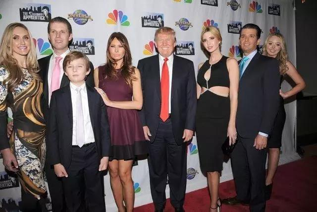
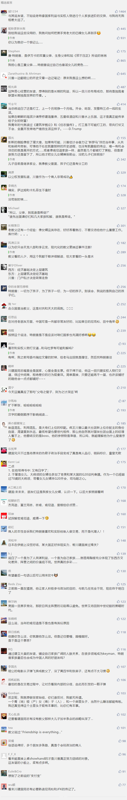

##正文

今天下午，特朗普又解锁了一个历史性的荣誉。

13时45分许，特朗普乘坐直升机抵达朝韩非军事区，在分割朝韩两国的“三八线”上，与金正恩进行了历史性的握手。

随后，特朗普更是跨过“三八线“走到朝鲜一侧，从而成为了历史上首位踏上朝鲜领土的现任美国总统。

 

然后，特朗普又拉着金正恩一起跨回“三八线”，像媒体表示，跨过“三八线”是他的荣幸，这是全世界伟大的一天 ，还表示**“立刻邀请”金正恩访问美国白宫。**

 

按照这个架势，政事堂看来在本届特朗普任期内，金正恩很有可能会实现访美这个历史性举措。

说起来，周围很多朋友对特朗普拉拢俄罗斯和朝鲜表示深深的担忧，认为这是特朗普围剿战略的一部分。

对此，政事堂认为大家多虑了，且不说复杂的地缘政治关系，其实，特朗普没大家想的那么复杂，他在俄罗斯以及朝鲜方面特别用心的愿意有两个，一个是昨天说的制造混乱和洗牌，另一个则是他喜欢跟”实权人物“做交易。

对比一下就能看出来，特朗普对于普京的好感远大于他的那群欧洲盟友，同样，特朗普对于金正恩的好感也远大于他的日韩盟友。

其根本原因，特朗普大多数的西方盟友们都是政治的代理人，不仅在内部说的不算，而且过几年就下台了。

反之，无论是俄罗斯还是朝鲜，在可预见的时间里面，普京和金正恩都可能在几十年的时间内保持非常高的控制力。

而这种控制力，则给喜欢交易的特朗普，带来了“寻租”的空间。

而这也是为什么特朗普对于死保记者谋杀案中的沙特王储，不惜以一己之力对抗整个西方社会。甚至对西方世界集体预谋除掉的土耳其总统埃尔多安，特朗普对他也是张口闭口的大谈友谊。

所以呢，不要对美朝关系的迅速升温表示吃惊，倘若萨达姆和卡扎菲能坚持到特朗普上台，大概率也能成为特朗普的好朋友。

而特朗普如此为所欲为并非无迹可寻，之前被特朗普解雇的FBI局长科米，就在写的书中把特朗普比喻为“黑社会老大”。

在他写得书中，以特朗普强制要求白宫雇员对自己“忠诚”为代表，通过换人将共和党逐步变为“黑手党”，以及特朗普不遗余力攻击敌人、说话信口开河并掩盖不利于自己的真相，这些做法都体现了黑手党老大的做派。

虽然书不能全信，但对于我们来说，如果沿着科米的思路，把特朗普视为一个喜欢做交易的“教父”，那么他的所作所为就会有另一种理解。

 

毕竟，坚决反对毒品，以及谈判时绝不漏底牌这几点上，两个人都有着巨大的共同点。

 

不同于俩人对内要求的”忠诚“，对外的要求就是“友谊”了。

就像特朗普外交时张口闭口说的”友谊“那样，老教父也说：友谊就是一切，它比天赋更重要，比政府更重要，和家人差不多同样重要。

因为他们不再是开发商和黑社会，这两位教父都在积极向可传承的政治家族转型。

而转型过程中，内部的忠诚之外，更需要建立大量可传承家族的”重磅友谊“。

譬如《教父》一开场的婚礼上，就在暗示教父在美国政坛拥有很多参议员这种级别朋友的友谊。

 

甚至花了大量的笔墨去描述教父是如何玩“交易的艺术”，替别人办事儿，不是为了获得金钱，而是为了获得友谊。

 

因为这种友谊是可以跨越时间的，在教父最危急的传承时刻，这些受过恩惠的“老朋友”都纷纷帮了老教父一把。

所以呢，从特朗普刚上台就把女儿女婿安排进了白宫成为一股重要的政治势力，到如今由其女婿全权代表他负责中东事务，跟中东的王爷们建立了深厚的友谊。

甚至在大阪G20的跟中方谈判的时候，特朗普还带着自己女儿坐到了谈判桌上，这些都能看出来特朗普并不是需要帮手，而是希望家族能在外交过程中继承友谊。
 
 

因为任何一个团体内大都处于一个微妙的平衡，想要打破平衡求发展，就需要借助外部的力量。

所以呢，特朗普主动向金正恩示好，并邀请他出访美国，不仅是想浑水摸鱼，也有着藉此为家族争取几个可传承友谊的想法。

这种手法在很多民主党精英眼里可能有点”下三滥“，但是从上世纪的柯里昂时代就非常有效，能够让一个黑手党分子在众多朋友们的帮助下，迅速崛起为美国的政治家族之一。

所以呢，如果接下来金正恩在某大国的支持下实现了访美的历史性突破，大家不要吃惊啥的，毕竟，只要某大国敢继续作保，伊朗方面访美并建立友谊也不是不可能的。

而在特朗普的带领下，美国这个”民主的灯塔“，恐将越来越”黑手党“化，甚至随着特朗普家族的扩不断张，美国跟原来对手们的关系也会越来越融洽。

只不过各方需要担心的，就是像老教父那样，挡了太多人赚钱，背后是有人要放黑枪的.....

##留言区
 

