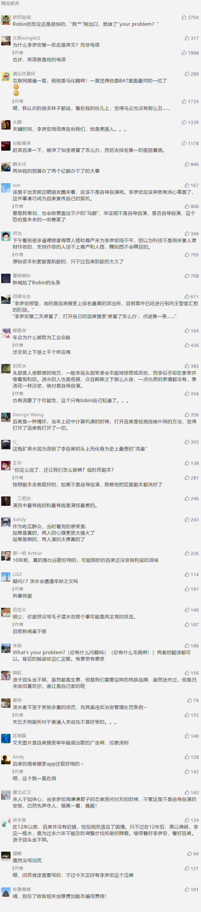

##正文

继范冰冰通过疑似怀孕搞垮了微博后，百度的李彦宏又通过一场“宏颜获水”霸占了热搜的榜单。

今早百度2019年AI开发者大会在北京国家会议中心举行，在大会开始10分钟左右，一名身穿黑色T恤的男子突然跑上演讲台，拿着手上的矿泉水瓶对着李彦宏的头淋了下去。

当时现场一片寂静，现场观众起初以为是主办方特意设置的一个环节，直到李彦宏说了一句：What’s your problem?（你有什么问题吗）才缓过神来。

而英俊的李彦宏在泼水之后的儒雅，征服了现场的观众，大家纷纷将掌声送给了台上继续演讲的李彦宏。

说起来，看到这一幕时，我是略有诧异的。

但凡超级大佬身边，总会有保镖的，出席公开场合保镖更是不可能距离自己太远，能有人上台给李彦宏头上浇一泼水，到台下被保安控制，在这接近一分钟的时间里，李彦宏的随身保镖都没有出现，这本身就有不合理的地方。

 

考虑到李彦宏被浇水的时候堪称完美的反应，因此不由得怀疑这场“宏颜获水”存在自导自演的可能性。

 

而此次泼水的时机也非常的有趣。

随着今年百度一季度巨亏，李彦宏以此为由将向海龙为代表的百度搜索条线几乎清洗一空，大批的副总裁级纷纷离职，大量的新鲜血液纷纷补上了位置。

而就在李彦宏完成了内部清洗之后，这一泼水适时的浇了下来。

而且，从利弊角度来看，这瓶矿泉水泼到李彦宏头上之后，说对于百度来说是一则价值连城的“投资”。

自从当年魏则西事件之后，儒雅的李彦宏从高高的神坛上坠落，百度和他几乎成为了人人喊打的过街老鼠，民众认为吃人血馒头的百度，不仅欠魏则西的，更欠中国人民的。

而这种愤怒使得很多民众对于凡是百度的新闻总是戴灰色眼镜来看，譬如一则多年前高校女生献歌李彦宏的视频被翻出来之后，全网就把李彦宏骂的狗血喷头。

而这种民意不仅严重影响了百度的商业活动和品牌信誉，更直接影响到了百度在政府领域的地位，就像之前李彦宏竞选院士，强大的民意直接把他干翻了。

而未来政府方面的工作，又恰恰是未来百度的重中之重。

随着4G时代移动互联网用户已经饱和，流量成本越来越高，ToC的生意已到头了，百度已经失去了一个时代。

而随着5G时代的来临，各个巨头们都将在ToG的领域从政府手上争夺订单和千金难求的“牌照”，政府方面的态度就变得尤为重要。

尤其是百度现在的重心无人驾驶方面必然要跟地方政府以及汽车合作，而汽车这个工业命脉的行业决定了，中国的大车企就算不是国企，也跟政府有着千丝万缕的关系。

而政府的习惯就是只认实质一把手，就算阿里的董事长已经是张勇了，腾讯主持工作的是总裁刘炽平，可很多地方政府和中央部委依然只认马云和马化腾。

因此，原本不喜欢公众场合出彩的李彦宏，必须要走出来替百度树立形象并游走于政府部门之间。

而就像逃税风波之后的范冰冰重新出山，需要一个广为传播的“怀孕视频”，李彦宏在魏则西事件多年后的公众亮相，也需要一个有足够传播力的事件。

而今天浇的这一泼水，恰恰给了李彦宏一次“洗心革面”的机会，就像历史书中无数次重演的剧情，“万恶的”竞价排名的主导者向海龙已经被拿下了，所有的罪责和民愤都让这位老臣来扛着，“被蒙蔽了"的李彦宏则将以一个全新的形象面对民众。

而且，就像民众纷纷转发范冰冰怀孕，而当事情被澄清之后，大家内心深处就会对范冰冰产生一丝的愧疚之心。

同样，李彦宏在公开场合被泼了一身的水，会使得很多没有遭受到百度医疗切身之痛的普通民众，认为李彦宏已经受到了惩罚，甚至收到了委屈.而李彦宏现场的反应堪称完美，将重新树立这位中国互联网颜值一哥的形象。

所以呢，无论这泼水是不是自导自演，百度接下来怎么做都是可以预测的，

首先，李彦宏并不会严惩这位泼水者，甚至还会向警方表示愿意和解来让他大幅降低牢狱之灾。

其次，这位泼水者也会在百度的善意感召之下“洗心革面”，甚至未来很可能会成为百度某个生态中的参与者。

第三，这场泼水也会成为百度的某一个纪念日，成为一个对企业的警醒。

所以呢，这泼水，大概率将是百度发起反击的一个集结号，未来我们很可能会看到一个在崭新的李彦宏的领导下，出现一个崭新的百度。

而按照这个逻辑，搞不好百度的股价也快到底了.....

最后，政事堂希望李彦宏能够真的“洗心革面”，把十多年前的那个曾经比谷歌好用的百度带回来。

 

##留言区
 

