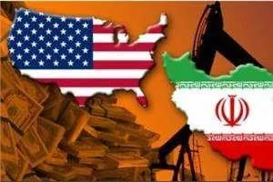
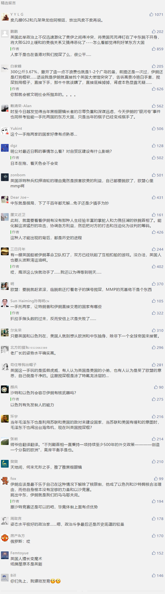

##正文

明天，也就是7月7日，是特朗普撕毁伊核协议之后，伊朗给美国“最后通牒”中的最后期限，在此日之后，伊朗也将解除伊核协议中的限制，大规模生产放射性元素钚。

由于钚相对于传统核弹中的铀更容易获取，且临界质量小于铀，适合用作战术核武器，因此伊朗此举也被视为对特朗普的极限施压的反制，毕竟一旦战术原子弹被大规模的量产，将对全球的安全造成不可估量的影响。

而就在美伊的相互极限施压到了一个关键赛点的时候，千余年来致力于“搅屎”的英国也没有忘记来凑热闹。

前天凌晨，在直布罗陀海峡，英国的海军直升机和几艘巡逻艇突袭并控制了一艘两百万桶级的伊朗油轮，瞬间引爆了英国和伊朗的外交火药桶，伊朗连夜召集英国大使，革命卫队和众多高层更是扬言要扣英国油轮作为报复。

可以说，一场赛点前的突发事件，直接多方试图缓和的美伊冲突再一次引爆。

 

说起啦，如果说特朗普将“交易的艺术”玩得炉火纯青，那么英国佬真心是将“搅屎的艺术”玩得登峰造极。

这半个月来，从香港到伊朗，英国佬几个小成本的动作，就将几个区域的热度瞬间沸腾，也把安理会的其他“四常”们搅得天翻地覆。

而且，作为一个优秀的搅屎棍，搅得乱不算啥，真正得高手是搅玩之后，还能让别人说一句“真香”。

 

英国此举政治上不仅迅速激化了美伊之间得冲突，将美国死死得钉在了中东脱不开身，将大阪G20上缓和的美俄关系又搞得恶化了，而且，经济上还可以将此作为筹码，在接下来的脱欧谈判以及未来的伊核谈判中抢占先机。

更重要的是地缘上，由于脱欧，英国和西班牙在直布罗陀主权问题突然激化，英国此举又可以借此向美国交一份投名状，利用美爹来反制欧盟，确保直布罗陀这个大西洋和地中海枢纽的控制权。

哎，这种能在国际上玩出“一石N鸟”布局的，没点悠久的历史真心不行。

 

所以呢，如果看懂了英国人的布局，那么我们就会知道，面对这个超级玩家，“新手村”出来的伊朗，大概率是要掉链子了。

因为伊朗的油轮被扣，类似于中国90年代被扣的银河号事件，这种国家主权被羞辱之后，除了那些姿势水平极高的政治家之外，很少有人能控制住国内的汹涌民意以及军方中的鹰派。

所以几乎可以确定，伊朗国内原本还在胶着中的国内政治，将以鹰派占据优势告终，明天伊朗将肯定兑现之前的“最后通牒”，解除伊核协议中铀浓缩的限制，甚至大概率动作将超出市场的预期，对沙特和以色列等美国盟友制造威胁。

可是，对沙特和以色列的威胁有用吗？

目前积极在背后刺激伊朗的人，其实就是美沙以三国中的“3B党”，美国的博尔顿、沙特的本.萨勒曼以及以及以色列的比比.内塔尼亚胡。

因此伊朗普通的威胁根本没啥意义，沙特和以色列的领导人就在坐等着伊朗的威胁，而看到了威胁的博尔顿，怕是要开心得仰天长啸了.......
 
 

而伊朗的鹰派占据优势，又将引发一系列的问题。

之前伊朗是鸽派占据优势，主打的牌，并不是沙特和以色列等中东国家，而是以法德为代表的欧盟国家。

因为奥巴马当年主导的伊核谈判中，欧洲各国从石油到产业拿了大量的利益，因此，特朗普上台之后的对伊施压中，欧洲人为了自身的利益，一直在努力维系着脆弱的伊核协议。

但是，伊朗实际上这几年应对特朗普，不过是国内的鸽派们一直试图通过利益均沾的欧盟各国来“调停”。颇似当年日本侵华之前，老蒋面对日本鹰派的极限施压，寄希望于在中国有着巨大利益的欧洲各国能够对日本施压。

但是，即将脱欧的英国人搞了这么一出，直接让伊朗的鹰派们把屎盆子都扣在了欧盟的头上，认为欧洲人不可信。

尤其是英国还找了一个很好的理由，这位搅屎棍是在“坚决落实”欧盟对叙制裁措施，依此扣押的伊朗油轮，更令法德两国都哑巴吃黄连，有苦说不出。

而且，随着伊朗的鹰派将逐渐占据主导权，以及英国率先“叛逃”，法德等欧洲国家面对伊朗的核武“极限施压”，大概率会转移压力把皮球踢给特朗普，并放弃成本巨大的游说美国，以避免在脱欧、美欧贸易谈判等一系列问题中，造成难以弥补的交易损失。

嗯，博尔顿之前又是油轮爆炸又是原型机千里送人头都没有搞定的事儿，被英国佬一个小动作，就超计划完成了.....

就像英剧《yes prime minister》里面，一心为民谋福利的首相总被官僚们利用那样，原本特朗普对伊朗的策略，只是想通过威胁，来换取点谈判筹码，可是他的极限施压，反而在大量高端政治玩家的交换之下，成为了这一场国际政治布局中的一环。

此刻，用手机正在推特上码字的特朗普，看着朝核问题越来越好，而伊核问题越来越棘手，说不定会觉得还是在东亚打交道比较舒服。

而同样，未来伊朗的命运，已经不能指望西方各国了，也许，唯一能够扭转局势的，只有那些能够做到一手托两家，让特朗普和伊朗直接交易的国家了。

不过，这个选择题，似乎并不太好做......

##留言区
 

