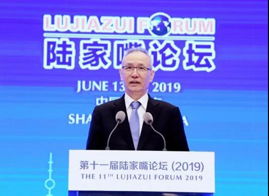
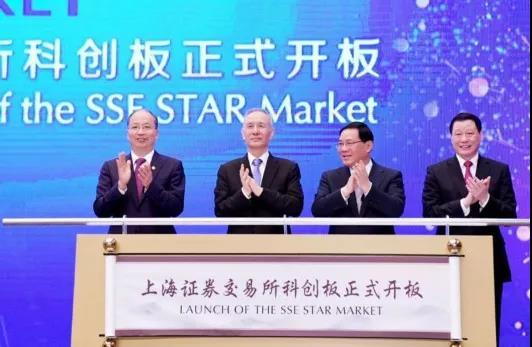

##正文

随着六月国际上的“中国外交月”结束，进入七月之后，国内的改革成为了新的重心。

根据昨天证券时报报道，针对近期部分房地产信托业务增量过大的信托公司，银保监会开展了约谈警示，要求今年房地产信托规模不得超过6月末的规模，含并购在内的未备案项目一律暂停。

这个窗口指导，意味着将最近两年逆势扩张的房企大都套上了紧箍咒，因为随着2017年开始，影子银行被监管打击打击，房地产信托规模急剧扩张，成为众多房地产企业融资新的生命线，尤其是目前主流的股权并购主流都是用信托。

而本次银保监会对信托公司又是要求大家要有”大局意识“，又是“房住不炒”的总要求，这种上纲上线式的要求，一时之间把很多房企和金融机构搞得一脸懵逼，不晓得监管层葫芦里面究竟卖的什么药。

说起来，大部分政策都是有迹可循的，因为此次约谈的信托大多数都是“地方武装”。而房地产信托总量下滑的拐点，实际上是在今年六月中旬，政治敏感度高的信托国家队在接受窗口指导之前就开始主动压缩规模，

因此，可以预见的是，六月上旬左右肯定出现了金融高层的统一认识，而翻一下新闻就知道，唯一符合条件的，就是6月14日召开的陆家嘴论坛。

而本次对信托窗口的银保监会，其一把手郭树清在论坛的主旨演讲中就表示，要防范房地产金融化和影子银行回潮，“房子是用来住的，不是用来炒的”，历史证明，凡是过度依赖房地产实现和维持经济繁荣的国家，最终都要付出沉重代价，凡是靠盲目投资投机房地产来理财的居民和企业，最终都会发现其实很不划算。

 

所以呢，对比昨天放出来的窗口指导，很显然跟郭主席的思路是一脉相承的，开完陆家嘴的会，回头就雷厉风行的控制房地产信托了。

但是，就像按死了影子银行，结果房地产信托起来了那样，总得给寻求高收益的资本找一个出口。

所以，在论坛上刘鹤副总理以新闻通稿的形式指出：中国经济已经由高速增长阶段转向高质量发展阶段，供给体系不断优化，需求体系持续升级，金融体系更加适配，形成相互作用的三角框架，支撑我国经济保持平稳健康发展的长期良好态势。要通过金融资源的高效合理配置，加大对经济高质量发展的支持。

翻译翻译就是，中国从08年开始以房地产为代表的高速增长，如今将向创新为代表的高质量增长转移，现在供给和需求两侧的框架改得差不多了，金融也得进行改革以支持高质量发展。

 

至于高质量发展是什么，的陆家嘴论坛上，同时也举行的科创板开板仪式，这态度已经是明确的不能再明确了。
 
 

毕竟，即将开板的科创板在各方面都是有着较高的门槛，能把A股大部分的散户挡在门外，因此，真正帮助证监会托盘的主力，还是国家队为主的金融机构。

而当金融机构的理财和信托这两个最主要的水龙头先后都暂停向房地产放水的时候，也就意味着有一只看不见的手，将把资本从原本的房地产市场引导至证券市场。

所以，房地产信托被银保监会叫停这事儿，反而是报道证监会为主的证券时报第一站出来......

关于科创板开板时必须要做的“千金买马股”，最近半年多来的文章已经说了无数次了，就不在复述了。

而看着监管层都准备从房地产领域抽水来浇灌科创板，可想而知，在监管层的眼中，科创板不仅是要打好开门炮，甚至未来也需要有源源不断的水，成建制的来保驾护航，这是一个长期的事儿。

而房地产在丧失影子银行的理财等水源之后，再一次将信托也被限制了，意味着未来的一段时间内，不仅市场化利率的提升将导致企业利率下滑，更重要的是有些中小开发商可能会出现借不到钱的情况。

因此，从今年下半年开始，中国的房地产市场的洗牌规模会提速，开发商的总量将迅速减少。

不过，这对于房地产行业来说并不是坏事儿，一方面，随着规模化房企的效率也在大幅提升，有利于增强竞争力，另一方面，科创板由于门槛，决定了他的造福效应在前期主要集中于一二线金融发展成熟的城市，而中国人的尿性也决定了大家会把赚到的钱再次投入到房地产当中。

因此，虽然房企在资本市场不好融资，但接下来一二线城市的优质地皮争夺战恐怕却也降不了多少温，最多就是玩家少了，几个巨头们一起打打默契球。

但再怎么默契，拿地和拿股份也需要真金白银，因此未来就是各家地产巨头们拼“含X量”的时候了，大家八仙过海各显神通，只要能倒腾来钱，就能拣取廉价的筹码。

而对于普通人来说，无论是股市还是房市，跟着政策走永远不吃亏。

##留言区
 

