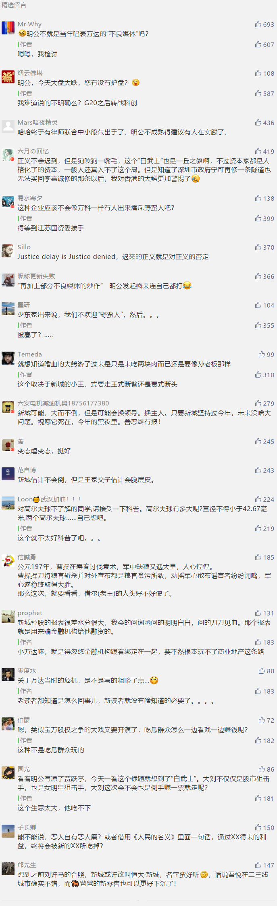

##正文

俗话说墙倒众人推，破鼓万人锤，新城控股王振华涉嫌性侵幼女的案件还在继续发酵。

昨天夜里，中国证券报爆出，7月7日两名律师向中国证监会实名举报新城控股涉嫌证券违规，已联合中小股东起诉。今天上午，上海市政协召开会议，撤销了王振华第十三届上海市政协委员资格。

而资本市场也施以颜色，今早A股新城控股的股价如期跌停，甚至连新城控股的公司债“19新城01”也瞬间暴跌19.95%。

虽然股价跌停符合市场预期，但是优先于股权的债权的暴跌，一下就使得众多金融机构坐不住了，大家纷纷研究这公司到底不会不因为一则性侵而凉凉。

对此，在政事堂看来，新城控股很难彻底凉凉，一方面作为全国十大开发商，自然可以“大而不倒”，而另一方面，新城的资产还是很不错的，而他的成功，是巧妙的踩上了历史的进程之上。

2016年，瞅准中国城市化提速的中国首富王健林进入高速扩张期，王老爷子将万达商业从港股退市试图重返A股，并试图控制大连银行百年人寿等金融机构为其宏伟蓝图供血。

结果不曾想，次年的万达却遭遇了有史以来最大的危机，A股迟迟不能上市，金融机构也没有控制下来，再加上部分不良媒体的炒作以及资金链断裂，导致这位国民老公公不得不“断臂求生”。

而此时的新城控股在资本市场不仅港股A股双丰收，甚至还参股了多家江苏本地银行，在2017年拥有了金融机构财力支持的新版王老爷子开始大规模从万达挖人，并复制万达模式建设新城的吾悦广场，甚至连口号都抄袭，喊出了2020年开业100个吾悦广场......

毕竟，成功是可以复制的，踩着历史进程的新城控股在2018年迅速崛起，愣是从默默无名强势挤进了中国地产10强之列，也与王健林成为了中国商业地产的“大小王”。

所以呢，从商业模式来看，新城控股本质是一个小万达，资产还是很不错的，毕竟拿着商业地产的旗号，很容易跟地方政府拿到极其廉价的土地。

甚至随着今年开始中国城市化的大规模提速，聚焦于二线新城建设的新城控股，还可能再一次成功的踩在历史的进程之上。

不过，禽兽不如的王老爷子，亲手葬送了这一切.....

就像昨天文章说的，整个房地产融资领域，在监管层的调控之下，今年下半年开始将进入到存量博弈，而2017年开始急速扩张的新城控股，正好赶上了这个周期，手头1500亿金融负债中，有1000亿是一年内到期......

就像昨天文章中的，在即将到来的融资存量博弈之中，不仅房地产公司的融资实际利率将上升，更比拼的是在座各位的含X量。

能够在江苏参股众多银行的赵老爷子的含X量自然不低，但新城控股这种典型的民营家族企业，重要的关系网几乎都集中在即将蹲监狱的老爷子的手里。

因此，从股权质押的券商到放贷的银行信托，很多关系一般的金融机构，在信贷展期的问题上，都会出现犹豫；而道德洁癖的地方政府，更是很难有主政官员去积极协调地方银行的融资。

欲戴皇冠必承其重，享受到万达模式飞速发展的新城控股，万达模式的弊病自然也缺不了，两者高周转的滚动开发商业模式，都非常依赖于金融机构，其负债率长期超过“80%”的行业安全红线，甚至去年还一度超过了100%。

因此，在融资领域走钢丝绳的新城控股，财报虽然很完美，但未来最担心的就是在性侵案爆发后，受惊的各种金融机构的践踏式停贷以及利用相应的条款提前解除股权质押，从而引发连锁反应。

而屋漏偏逢连夜雨，就在王老爷子性侵的十来天前，陆家嘴金融论坛上中国的金融监管层决定了从房地产金融抽血供给科创板，大家都将进入到存量博弈的环境之中。

因此，手握着“金山”的新城控股，未来要做的都围绕着一条，那就是“信心比黄金更重要”，所以拿地扩张什么的还不能停，捏着鼻子还得装作一切正常，希望有更多的机构来帮衬度过危机。

而危机之中的援军，有的时候也不一定那么靠谱。

7月4日，港股新城发展控股在开盘大跌逾15%之后，天发证券大幅买入，导致致新城发展控股股价迅速拉升，而接下来，这家券商并没有停手，以白武士一般的出现，接连几天都在大手笔吃进并挽救了摇摇欲坠的新城股价。

当然，见识过孙宏斌把贾跃亭吃得炸都不剩的“白武士”，政事堂的读者们都会明白，资本是逐利的，越是要逆势冒着风险，就越是要寻求超额的回报。

天发证券的背后是香港资本市场的大佬刘銮雄，可能国内朋友对他了解并不多，不过关之琳和两个高尔夫球的故事，相信很多人都知道，嗯，男主角就是他......

 

想想这个尺度上不逊于王老爷的家伙就会明白，拥有“港股狙击手”之称的他逆势入局，必然不是所谓的看好公司长期发展，而是资本大鳄闻到了血腥味迅速游了过来，看到了公司实际变更的可能性。

所以呢，天发证券连续买入的背后，虽然提振了股价，但对于新城控股的少东家来说，恐怕也是喜忧参半。

考虑到全国十强的新城控股之模式和体量，虽然肯定不会因为一则幼女强奸案而凉凉，但他接下来的控制权大戏，怕是将会非常的精彩，吃瓜群众们可以拭目以待。

正义也许会迟到，但绝不会缺席。

##留言区
 

