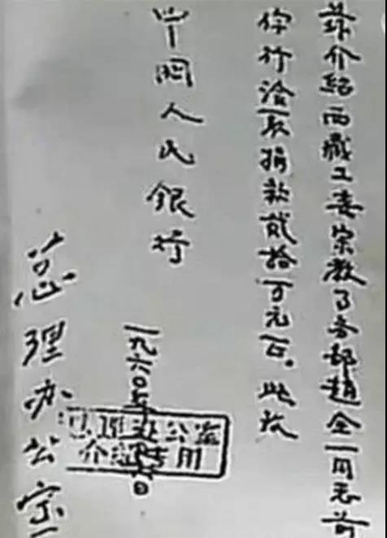
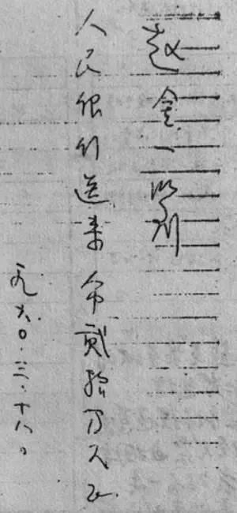

##正文

>近日，随着美女董事长罗静被上海警方刑拘，风暴的波及范围不断扩大，爆雷、诈骗、伪造合同，诸多匪夷所思的案情被陆续曝光，资本市场、第三方理财圈、电商金融供应迅速产生了强烈的共振，而涉案的苏宁京东等公司都在极力撇清关系。

>今天呢不聊案情，轻松轻松，讲60年前一场远比美女董事长精彩的金融诈骗案。

1960年的3月，随着人民大会堂的建成，全国人大全体会议首次在这里召开，来自全国各地的人民代表纷纷启程前往北京，四九城热闹的气氛一扫初春的那一丝寒意。

而此时，就在人民大会堂西侧的西交民巷，一位身穿灰色呢子大衣，气派非凡的干部，推开了人民银行总行的大门。

当时，已经是下午5时40分，人行的同志们正在像往常一样陆续的下班，却不曾想被这位不速之客打乱了一往的平静。

“我是国务院的，来给行长送急件。”

来人从公文包中拿出印有“中华人民共和国国务院”字样的信封，上面用毛笔正楷写着“速送中国人民银行行长亲启”。

在把牛皮纸信封交给办事员后，他又不紧不慢的打开一个紫色封皮的发文本，用手指着签收人的位置，淡淡的说了一句，“请签字”。

办事员签完字，来人面无表情的说了声“好”，便将发文本装回公文包，迈着从容的步履走出人民银行的大门。

不过，这位国务院来的“同志”离开西交民巷之后，并没有乘车返回当时国务院驻地的中南海，而是骑着他停在银行后身的自行车，奔向了不远处的民族饭店......

而此时刚刚下班的人民银行，却因为这一份来自国务院的急件炸了锅。

传达室的同志一看是周总理让行长亲启的信件，又在封面上写明“限5点40之前送到”，哪里敢耽搁，登记备案之后，立即送到了行长办公室。

 

而很巧的是，当年瑞金时代就协助毛主席筹建银行的曹菊如行长，此时正带领其他行领导在外地开会，并不在行里面，本应行长亲启的函件，由于时间实在是紧急，只能交给值班的行长秘书拆开。

不拆还则罢了，秘书打开信封下了一跳，里面是一份总理对主席办公室文件的批示。

 

内容如下：

>总理：主席办公室来电话告称，今晚九时，西藏活佛举行讲经会，有中外记者参加，拍纪录影片。主席嘱拨一些款子作修缮寺庙用，这样可以表明我们对少数民族和宗教自由的政策。根据以上情况，拟拨给15～20万元，可否，请批示。

这份文件由周总理圈阅后，并批示：

>请人民银行立即拨给现款20万元。

>为避免资本主义国家记者造谣：

>1、要市场流通的旧票；

>2、要拾元票，每捆要装得好看一点

>七时务必送民族饭店赵全一(西藏工委宗教事务部)。

>3月18日
 
当时，以某喇嘛为代表的极少数分裂分子在西藏策划了武装叛乱刚刚平定，但也让我们在国际上产生的非常大的压力，因此通过非常规通道拨款子给西藏活佛，这种极具想象力的统战工作，的确符合只能“行长亲启”。

由于人行是国务院下属机构，总理经常会给亲自下批示，看着那批示中熟悉的字迹，年轻的行长秘书虽然对这一违法规定的命令产生过怀疑，但这种疑虑很快就被光荣而艰巨的“秘密工作”所带来的兴奋而冲散。

尤其是当她看着手表，看到距离总理给的交款时间仅剩下不到一个钟头的时候，她立刻拿起电话拨通了发行局，并以不容置辩的口吻下达了命令：

“半个小时以内，你们务必准备好20万元现金，对，有一项重要的政治任务！什么，手续？你们先准备现钞吧，注意，要旧票，到时候计划研究局会正式下达送款通知。”

挂断了电话，秘书又急忙敲开了值班领导计划研究局王兰副局长的办公室。

她一脸严肃的将信函和总理的批示递给了王副局长，王副局长认真看过以后，疑惑地问道：“20万，不是个小数目，为什么不通过财政部？”

“时间来不及了，你看，还剩了不到一小时！”

在行长秘书的催促下，王副局长正想去核实时，桌上的电话铃却突然响起来，他抓起听筒：

“喂，我是总行计研局，是……我们正在准备！7点以前准时送到，请转告总理放心。”

电话挂断，王副局长也和行长秘书一样焦急了，他没有放下听筒，一边拨着号盘，一边对行长秘书说：“总理办公室又来电话催了，我马上通知发行局，让他们火速送款！”

在局长得催促下，发行局值班科长撂下电话，就带上科里的老吴，叫来小轿车飞奔中国人民银行北京分行。

听到总行领导说是总理的安排，北分的同志也不敢怠慢，按照公函的要求，到金库里提取旧的现钞，将一摞摞的十块钱纸币最终分装两个麻袋包装好。

此时，发行局当班的朱科长也奉命局长之命赶来催办，三人肩负秘密使命的同志们，把麻袋抬进小轿车，直奔距人行不到一公里远的民族饭店。

而此时，从人行骑着自行车飞奔而来的特派员同志，早已在饭店守株待兔许久了。

而人行的三位同志并不知道，他们紧赶慢赶，终于在七点之前来到了民富饭店的一楼前厅，径直走向服务台询问“西藏工委赵全一同志”。

这时，沙发上从一进门就注视着他们的一个人，走近服务台对三人说道：“我就是西藏工委的赵全一，你们是中国人民银行总行的吧？款子带来了吗？”

只可惜，传达室值班的同志没有过来，否则他就会发现，这个西藏工委的赵全一，和几个小时之前国务院来送急件的同志，竟是同一个人。

不过朱科长并没有见过，看了看眼前一身干部气派的赵全一，如释重负地问道：“我们没有误事吧?”

赵全一笑着摇摇头，一指墙上的挂钟：“很准时嘛！款子带齐了？”

朱科长点点头，用手一指，说“因为都要旧票，发行局的同志加班清点，你看，整整两麻袋呢！”

此时，赵全一拿出了一张盖有“总理办公室介绍信专用”图章的信函。

上面写着：

>兹介绍西藏工委宗教事务部赵全一同志前去你行领取拨款20万元整。

>此致

>中国人民银行

>一九六O年三月十八日

>总理办公室

 

朱科长看过信函确认了身份之后，便想让赵全一打个收条。

赵全一随即从兜里拿出笔记本，随手撕下一页，写了一张白条。

 

“是不是应该加盖个公章？”朱科长不大放心。毕竟这是巨款，一旦出了问题，他无法交代。

赵全一笑了：“这信函上不是已经有公章了吗？要不你们就把这封介绍信也带回去吧？”

朱科长拿了介绍信和收条，离开民族饭店。当他们迈出饭店大门时，不约而同长长出了一口气，“可算完成了总理的任务了！”

而此时，伪装成西藏工委的赵全一，也长长的出了一口气，那个打给王副局长关键的电话，就是他从人民银行离开后，骑着自行车一路飞奔到民族饭店，在用总服务台前，以总理办公室的口气打的。

而看到朱科长们的轿车便融进了西长安街的车流中后，赵全一也将两个麻袋的人民币装上自己的自行车，一路悠哉游哉的推回了家，消失在了人海之中......

当时正值三年困难时期，20万对于国家来说是一笔非常不小的开支，可是此事直到人民银行总行领导们回京，听到王副局长汇报，请示该如何下账时，才发现总理从未批过此款。

至此，这个新中国成立以来的第一诈骗案才得以浮出水平。

通过伪造各类信鉴，算准了时间差的王倬，竟以一己之力把众多体制内的精英玩弄于股掌之中。

当然，再聪明的犯罪也无法逃脱法律的制裁，周总理亲自给公安部下了死命令限期破案，甚至让被誉为“共和国之盾”，在万隆会议期间粉碎了国民党保密局特工暗杀的杨奇清副部长专门负责此案。

很快，案子就破了，由于罪犯太熟悉体制内的机制，并使用了大量的体制内的资源，警方很快就将范围锁定到了外经贸部，经过逐一排查，将犯罪分子王倬绳之以法。

虽然王倬上演了一出比《猫鼠游戏》还精彩的金融诈骗，但再聪明的人，如果不在体制内，根本没机会接触到总理的批复来临摹，也不懂得总理和主席办公室的行文方式，以及接触到一整套的印章信鉴来复制。

没有这些东西，他根本不可能骗不过从事相关工作多年的行长秘书。

当然，仅有这些也是不够的，而真正能够决定他的计划能够瞒天过海，则是他完全清楚西藏当时的情况，人行领导们的外出行程，值班负责的领导是谁，并在关键时刻打出那个电话。

故事讲完了，而这个60年前的故事也告诉了我们，大型的金融诈骗案背后，一定有非常熟悉机制的内鬼。

 

参考资料：

长者家园《天字一号大案》何立波

纵横杂志《亲历“伪造总理签名案”侦破记》 刘文 

##留言区
 

