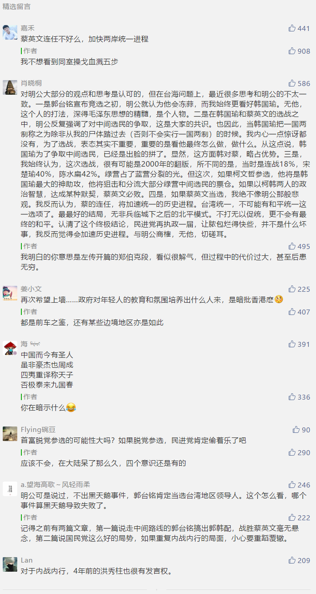

##正文

本想趁着两周的读者活动正好休息几天，可是不想却吃了大礼包，也就只能在这里开启新的征程了。

这几天时间有限，就聊些简单的话题，今天跟大家聊聊国民党的初选。

韩国瑜并无太大悬念的依靠铁杆粉丝的支持，赢得了党内的初选，将与蔡英文竞争台湾地区领导人。

很多朋友开始高兴，说“两国论”的郭台铭卷铺盖走人是活该。

不过，对于政治家来说，怎么说和怎么做可是两回事儿。

高举着中美友好大旗的奥巴马上台之后，在中国周边搞了一张超级包围网，带着十几个小弟来群殴；而上台前就说收拾中国的特朗普，则开启了多线程交火，中国不过是他十多个攻击目标的其中之一。

奥巴马时期的中国，在美国的威逼之下什么朋友都没有，连血盟的朝鲜都在偷偷的勾勾搭搭，而特朗普时期的中国，不仅到处结交朋友，连美国铁杆盟友中的西方G7集团都对我们“叛逃”了。

所以呢，无论是对人还是对政治，爱不是说出来的，是做出来的。

而对于韩国瑜和郭台铭，俩人基本盘都决定了不可能脱离大陆，因此看他们说什么并不重要，重要的是谁能击败蔡英文，推动台湾的中国意识而不是台湾意识。

所以韩国瑜的胜利并没有什么值得惊喜的。

因为看似人气极旺的韩国瑜，虽然在党内气势如虹力压郭台铭，但实际上对蔡英文并没有太多的优势，因为台湾地区的竞选是两党制的比拼，重要的是争取中间选民。

而党内初选往往参与的都是本党的铁杆选民，实际上会造成数据上的巨大偏差。

譬如16年在共和党党内取得压倒性胜利的特朗普，在总票数上输给了民主党的希拉里，靠选举人票才翻了身。

甚至可以说，如果不是希拉里不光彩的干掉了党内竞争对手桑德斯，导致大批的铁杆桑粉转而投票特朗普，导致赢得了中间群体的希拉里丢了民主党的基本盘，特总还真没机会为人民服务。

同样，走特立独行路线的韩国瑜，虽然在党内选举风头无二，但是在大选之中，会出现丢失中间选民尤其是年轻选民的危机，实际上未来的竞选之路将异常坎坷。

所以某种程度上来说，郭台铭口中民进党在国民党初选中，为了避战党派色彩薄弱的郭台铭，全力支持韩国瑜来投票，逻辑上也说得通。

而未来，韩国瑜想要打赢蔡英文，一方面必须尽快弥合国民党内部的纷乱，而另一方面，在接下来的半年，我们也会看到**为了争取中间和年轻选民，韩国瑜也会“郭台铭化”，在两岸问题上说一些摸棱两可的话。**

这是为了胜利而无法避免的。

因为短期来看选举会受各种外部因素影响，但真正的决定性因素，是政府对年轻人的教育和氛围，塑造出什么人来。

所以，虽然韩国瑜未来可能会很艰难，但还是希望一贯内战内行的国民党能够摒弃内部撕逼一致对外，干掉蔡英文......延续中华文明在宝岛上的传承。

##留言区
 

