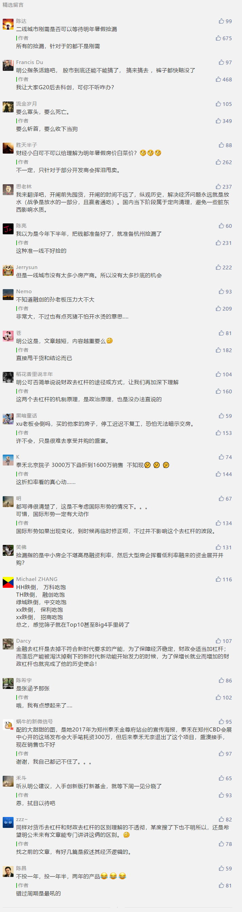

##正文

今天资本圈搞了一个大瓜。

中国平安旗下的陆金所，宣布退出P2P业务。有投资者感慨称，这是个标志性的事件，整个（P2P）行业，已经不是寒冬，简直是冰河时代了。

据路透社报道，陆金所放弃P2P业务的背后，是因为其一直难以满足监管机构的注册要求。

而这下问题就大了，陆金所不仅是国内最大的P2P机构，累计成交数千亿，其母公司中国平安更是国内金融牌照最齐全的金融巨头，很多P2P公司向储户和投资人描绘的，就是未来他们要成为新的陆金所。

如果陆金所都无法满足监管的注册要求，那就意味着目前现存的大部分P2P巨头们，都很难满足现行的规定。未来拿不到牌照的他们，要不学陆金所一样转型，要不恐怕就得关门大吉。

而P2P之王的陆金所转型背后，也意味着“货币去杠杆”进入扫尾工作，“财政去杠杆”即将如火如荼的展现在我们面前。

记得我17年的时候，反复说18年的6、7月，是P2P爆雷的季节，建议大家提前出手。

而18年的时候，说接下来两年是大量房企断臂求生的两年，既是民众低价买入的时机，也是资本家收割的好季节，甚至还专门配了一张图作为实例。

 

嗯，如今再来看看大甜甜作为代言人的泰禾，即使一连串断臂求生的甩卖之下，企业的融资成本依然突破天际，嗯，政事堂的死亡笔记上，又加了一个。

而近期，随着房地产信托的“一刀切”，能融资的地方越来越少，恐怕还有更多的中小房企参与到泰禾的断臂求生之中，进行挥泪大甩卖，没办法，大家不是王式断臂，就是贾式断头。

这是因为，财政去杠杆的政策，目前才刚刚过了一年。

对比货币去杠杆的第三个年头，P2P才发生爆雷，房地产融资政策性缩紧的巅峰，很可能是在明年的暑期，那个时候才是诸多房企的生死劫。

所以呢，政事堂给大家的建议，如果不考虑国际局势的变化，明年的暑期，将是一个针对于类似泰禾这样公司的捡漏时期，民众和企业都可能拿到“打骨折”级的价格。

同样，对于房企为代表，所有依赖于财政机制的企业，也要尽可能避免在明年暑期出现集中兑付，否则到时候即使是好企业，恐怕也会死得很惨。

##留言区
 

