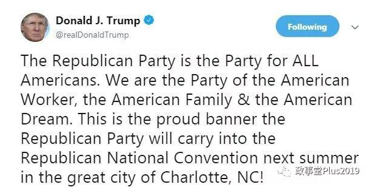

##正文

今天轻松一下，写了一个段子.......

社会主义如何实现，一直是马克思和恩格斯等老一辈革命家们研究过程中最重要的问题。

十九世纪中期，全球工人运动如火如荼，马克思和恩格斯两位导师在深刻分析资本主义后得出结论，工人阶级只有通过暴力革命，打碎资产阶级的国家机器，才能够获得社会主义的最终实现。

不过，随着十九世纪七十年代巴黎公社的失败，全球工人运动进入了低潮，资本主义迎来了蓬勃的发展，这个时候，马恩两位导师也与时俱进，科学的提出了工人阶级可以通过合法的手段来进行议会斗争，从而开启了实现社会主义的新途径。

而就在两位导师预言社会主义新途径的150年后，资本主义的美国，事情正在起变化。

昨晚，特朗普在北卡州的集会后发布推特，表示美国共和党，是所有美国人的政党，是代表美国工人阶级的政党，是代表美国家庭和代表美国梦的政党。

 

 

不得不说，这个画面实在是有点诡异，一位主张“川个代表”的美国总统，率领着工人阶级先锋队，以及代表美国广大人民最根本利益的共和党，准备拿下美国2020的美国大选，实现美利坚民族的伟大复兴.......

这几段话看后，甚至一度令不少人怀疑，特朗普是不是把共和党中间的那个“和”字取消了.......

而马恩两位导师不愧是伟大的理论家和预言家，他们预言的工人阶级通过议会选举夺取政权的方式，终于在资本主义发展到极致的美国出现.......

不过，这个幽灵，共和党的幽灵在欧美徘徊之际，为了对这个幽灵进行神圣的围剿，欧洲的一切旧势力，法国的总统，德国的总理，英国的首相，欧盟的主席以及美国的民主党都联合了起来。
 
 

可以预见的是，接下来一年半的时间，这位誓言代表着工人阶级和全美国人民的美国总统，势必将迎来整个资本主义世界的围剿，甚至还可能迎来精神病人的子弹。

但是，这位早已脱离了低级趣味的超级富翁，在革命先贤们的庇护下，必将带领着他的共和党取得一个又一个的胜利，最终成为一位有益于人民的人........

##留言区
 

