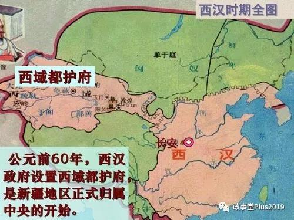
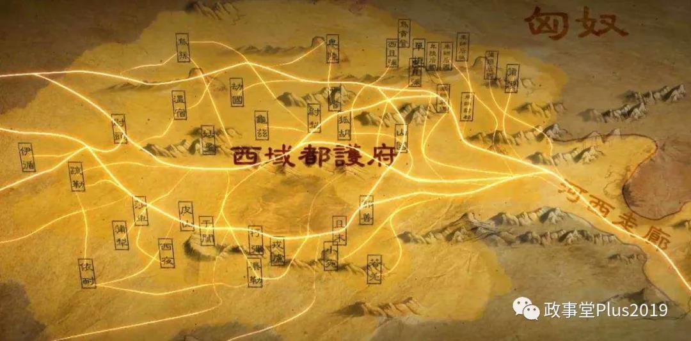

##正文

自汉代开始，随着张骞出使西域和丝绸之路的打通，西域诸国与中原开始迅速融合，以汉宣帝建立西域都护府为代表，西域各民族正式加入华夏民族的大家庭，新疆地区正式成为中国版图的一部分。

 

汉朝以后，历代中原王朝时强时弱，和西域的关系有疏有密，而两汉之间的天下大乱，让光武帝刘秀建立的东汉一度失去了西域的控制权，曾经大汉王朝的西域36国中，甚至不少选择依附于漠北的北匈奴，以左右夹击之态，对中原文明和丝绸之路造成巨大的威胁。

不过中国的历史上，每到中华民族遇到危机，总会有人挺身而出，此时一位奋笔疾书的读书人突然弃笔而起，仰天长啸，“大丈夫无它志略，当效傅介子、张骞立功异域，以取封侯，安能久事笔砚间乎！”

于是，这位书生弃笔从戎，毅然选了一条救国之路，带着朝廷配给他的36名随从，开启了中国历史上最精彩的一段传奇。

他的名字，叫做班超。

想要改变西域对匈奴的“一边倒”，就必须要找到突破口，当时，丝绸之路被沙漠分为南北两道，北道诸国几乎均已完全依附于匈奴，因此南道上最强的两个国家鄯善国和于阗国，则成为了班超撬开这块铁板的第一步。

首先，班超率领36人的使团来到了距离长安最近的鄯善国，鄯善之前被称作楼兰，主要是东周时期的中原人移民至此，因此风俗习惯与中原接近，也便于成为西域诸国多米诺骨牌中，第一个被“推倒”的国家。

起初，班超刚到的时候，鄯善国王对他奉为上宾，好酒好肉伺候着，可是几天之后却又突然冷淡了起来，大家伙吃的猪肉都变成青菜了。

此时，敏锐的班超马上推断出，鄯善国王的态度变化，肯定是匈奴使团也来了，因此，他马上叫来鄯善国王派来的侍者，诈问道：“匈奴使节来了好几天了，现在在哪儿呢？”

侍者被班超唬得一愣一愣的，直接把匈奴使团的人数和住址全部交代了出来。

这下，可把班超身边的三十多个随从吓坏了，为了威胁鄯善国，匈奴派来了上百人规模的武装使团，鄯善国王随时可能把他们交给匈奴，因此大家纷纷建议尽快逃跑。

而此时班超反而将兄弟们聚集在一起，与大家痛饮之后高呼，“不入虎穴，焉得虎子”，借着酒劲，这位初出茅庐的书生带着36名使团成员，以火攻夜袭的方式，将上百的匈奴猛士全歼。

当班超提着匈奴使团们的脑袋去找鄯善王时，看到匈奴使团在自己地盘上被灭，自知没有回头路的鄯善只能选择摆脱了匈奴的控制，重新归属汉朝。

而拿下鄯善的班超也旗开得胜，开启了他收复西域的第一步。

此后，班超便开启了他的第二站，南疆实力最强的于阗国，位于现在和田的位置。

不过此时，匈奴使团早已驻扎于此，正在通过胡萝卜加大棒的政策，诱导于阗国彻底倒向匈奴。

伊斯兰教既不是新疆人天天生信仰的宗教，也不是唯一信仰的宗教，此时的于阗国还不是后来的佛教国家，而是传统的萨满教，举国迷信巫医。匈奴使节便勾结大巫医，诱使谎骗国王，说汉使骑的黄马可以祭神得到神明的庇佑，希望刺激汉使班超与国王撕破脸。

对此，班超假装应允，叫巫师亲来取马。巫师信以为真，果然前来，班超挥剑立斩其头，提其见于阗国王。信仰萨满教的国王看到大巫医都没有汉朝的使者厉害，便对班超奉若神明，马上倒戈诛杀匈奴使者作为投名状彻底倒向汉朝。

拿下了南疆最强大的鄯善、于阗两国之后，多米诺的骨牌开始梯次倒下，班超麾下之前被匈奴人吓得瑟瑟发抖的随从们，也都一个个成长为男子汉，甚至还有人“一人一骑定一国”，整个南疆在班超的威名之下传檄而定，汉庭重设西域都护府，恢复了对西域的控制权。

可惜，随着后来汉明帝驾崩汉章帝即位，北匈奴趁机反攻，焉耆、龟兹等西域国家趁汉朝国丧之际突然叛乱，引兵攻打西域都护府，刚刚继位的汉章帝为避免将士们的牺牲，诏令各部返回洛阳。

而此时，原本奉命返回洛阳的班超，却被南疆各国上下挡住了，班超当年以投名状的方式将他们绑上了大汉朝的战车，使得他们已经没有退路，一旦匈奴人杀来，必将以血报血。

看着遍地跪拜的大汉西域子民，看着一个个充满期望的眼神，班超愤然怒吼，老子不走了！

随即班超上表汉章帝，准备就用当初带来的这三十六人的使团，集结归附于汉朝的西域各国，不用汉庭一兵一卒，就带着这36人替我大汉王朝收复西域36国！

随后，在十余年之间，班超在汉庭一度放弃的情况下，率领着那些大汉的西域子民，面对匈奴和叛乱的西域诸国，俾倪捭阖分化瓦解，以一直各色皮肤的“联合国军”，自带干粮自备军饷，通过无数次以少胜多的战役，黄沙百战穿金甲，最终将西域各国再一次收归中华文明的怀抱。
 
 

而且，班超的收复西域的方式，绝不是当年和亲式的绥靖，当时佛教第一强贵霜王朝尽其大军，要求汉室以女子和亲，班超果断拒绝后，愣是率领联军将其击败，让整个西域民族彻底相信“犯我大汉天威者，虽远必诛”。

甚至即使朝代更迭，在班超的传奇影响下，很多西域民族依然对于中原都有着深深的热爱。

就像班超一己之力收复的于阗国，后来面对亚洲伊斯兰第一强国的萨曼王朝，竟然自行组织了一个“中国皇帝使团”，要求萨曼王朝给中国皇帝补交拖欠多年的贡品.........更不要说在安史之乱中，西域的于阗国竟成为了大唐平叛的绝对主力。

万里之外觅封侯，三十六人平定三十六国，班超真英雄也！

西域各国虽然民族各异，信仰不同，但在一代代投笔从戎的班超们的努力之下，最终融入到了中华文明的大家庭之中。

而陈汤、傅介子、班超这些一代代的中华英雄们，更是早已用实际行动昭告全世界，所有企图分裂中国的伎俩都不会得逞！

明犯强汉者，虽远必诛！

##留言区
 

