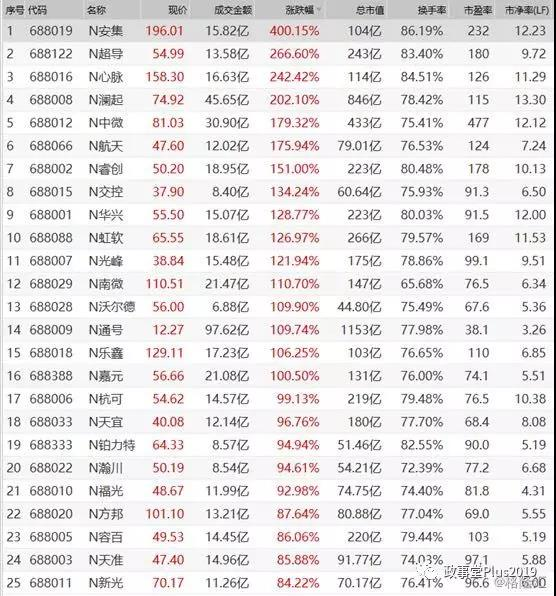
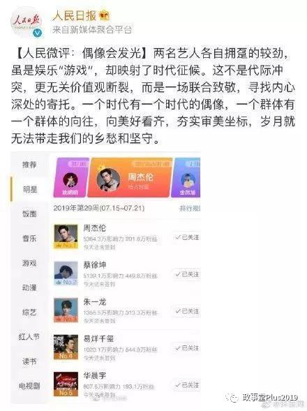
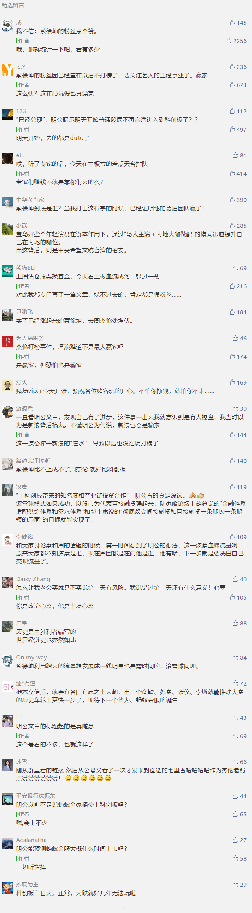

##正文

历时两周的政事堂线下活动终于结束了，随着我“胡汉三”的回归，政事堂也将开始正常的更新。

说起来这一波的会面中，虽然我准备聊的都是一些“不可描述”内容，但群众们最热情的问题依然是怎么看科创板......

由于主流财经圈大多看空而我却在看涨，所以每到一处，我几乎都不得不再一次把科创板“千金马骨”和“滚动开发”这两个逻辑稍微加点料再不停的做复读机。

说起来，从去年年底开始，我就成为了除官媒之外，“科创板行情”逻辑的最大自干五，为此写了十来篇论述的文章，甚至百度搜一下“千金马骨+科创板”，我也取代了药品广告，成了百度的优先推荐。

 

而今天开板的科创板也算是给了面子，没有让我被打脸......跟着政事堂一起走的兄弟们今天也都赚得盆满钵满。

 

马克思说过，如果有100%的利润，资本家们会挺而走险，如果有200%的利润，资本家们会无视法律，如果有300%的利润，那么资本家们便会践踏世间的一切......

25只股票，16只涨幅超过100%，领头羊甚至超过了400%......估计马克思同志现在醒过来也得被再次吓晕。

其实从历史的进程来看，这也是一种必然。逻辑说了那么多，今天也就不重复了，毕竟再过去的几年内，从互联网彩票、非法集资、P2P甚至数字货币ICO，所有传统金融一夜暴富的手段都变成了违法，因此仅剩的科创板也成为了一种“窗口指导”下的产物。

那么，科创板接下来会怎么走呢？

我今天倒不想讨论经济，用最近火热的周杰伦和蔡徐坤的打榜战来做一个横向对比。

上周我朋友圈一早上醒来，发现一色都是周杰伦，搞的我一脸懵逼，研究了一下才发现，引发周董粉丝们去微博上打榜的原因，就是有人在豆瓣上放了一个极其弱智又附带侮辱性的话题。

 

看完后，我就明白是有人在操盘。

就像我可以随便骂蔡徐坤，因为我的读者里面几乎不可能有他的粉丝，同样，豆瓣这个文艺群体里面也不可能有多少人不认识周杰伦。更不要说这则截图以极短的时间内充斥于网络，很显然是有幕后推手的。

而周杰伦根本不可能去玩这么low的路线，因此几乎可以肯定，这事儿就是蔡徐坤公司背后搞得一次“碰瓷儿”，通过蹭周杰伦的知名度迅速让自己从一个小圈子晋级迈入大众娱乐圈。

而从人民日报官微迅速为他“撑腰”，也能够看出来蔡徐坤公司玩得那是组合拳，临时抱佛脚是根本不可能提前联系上央媒做出如此动作。
 
 

想一想人家一个小屁孩的政治觉悟都有这么高，所以呢，大家还真的别骂蔡徐坤了，论经济和政治头脑，这哥们（或者其背后的团队）真心是碾压目前国内绝大部分的艺人了。

没有人能随随便便成功，成功的背后，都凝结着无数的汗水和智慧。

那么，科创板和蔡徐坤这俩八竿子打不到关系的人，政事堂为啥要把他俩凑到一起呢？

其实说起来，两者之间还真是有点逻辑上的相似。

说句难听的，微博打榜上面注的水，都能把天蓬元帅猪八戒给淹死，那些微博上给蔡徐坤打榜送的钱，恐怕都不够给周杰伦开一场演唱会。但是这种极其可怖的数据，能够利用微博放大，吸引群众们和资本的眼睛。

毕竟，蔡徐坤目前有的只是一张脸和极小的一群铁杆粉丝，他想要成为巨星，不仅需要扩大自己的受众群体，更需要吸引大量的投资人进来。

同样，别以为科创板仅仅是为了从市场上融资，其实上科创板过程中带来的知名度和产业链投资合作，实际上给予这些科创企业的红利远超于资本市场上融的那点钱。

而且，别看科创板涨得那么高，实际上前头那几个公司的流通市值非常低，资金只要一汇聚，很容易就能够拉出这种200%以上的涨幅，挑起全国人民的热情。而这些钱如果放在A股，根本拉不动那些家大业大的大蓝筹。

而蔡徐坤选择在微博上面利用打榜注水来碰瓷儿周杰伦，本质也是一种以小博大，用很少的钱来迅速扩大自己的知名度，这个行当的祖师爷，实际上是当年疯狂碰瓷儿娱乐明星的王思聪。

而无论是王思聪还是蔡徐坤，制造这种超级热度的碰瓷儿模式来炒作自己，也都是意味着他们已经将自己谋求转型的路子设计好了，因此政事堂推测，蔡徐坤即将正式进军演艺界，从一个卖脸的小朋友，向着周杰伦的方向前进，开拓更大的市场。

慢慢的，科创板会逐步回归他的价值，蔡徐坤也会逐步放弃继续在微博上面注水。

所以呢，蔡徐坤挑衅周杰伦和科创板抢主板风头，逻辑上实际上都有巨大的相似，就像监管系统不断替科创吹风，人民日报也帮蔡徐坤正身，大家各自奋斗的背后，也都有历史的进程背后推着。

科创板此番虽然一度将主板的流动性抽走，但是随着整个资本市场的热度起来，科创板赚得盆满钵满的投资者们，又会将科创板中创造出来的财富投入到主板之中，最终以小博大，带动中国整个资本市场的良性发展。

嗯，政事堂去年预测的科创板千金马骨模式已经兑现了，那么接下来就要看以小带大的滚雪球模式，能否继续实现了。

##留言区
 

