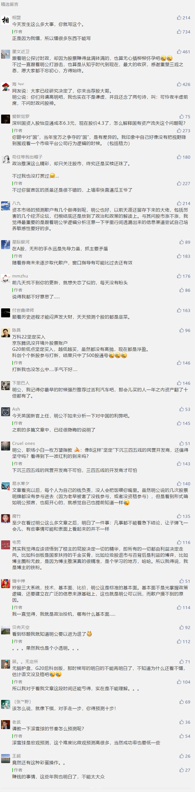

##正文

昨天写了一篇资本市场的文章，果不其然，评论区又被沦陷了，众多读者询问我应该怎么买股票，持有多久，搞得我都不好挑留言了。

而其中还有一位最可爱的，说他这几天赔了几百万，让我江湖救急指点迷津.......

看到如此大损失，本想安慰他一下的我，鼠标飘向他的头像，却发现他从来都没有过打赏，嗯，反而令我自己陷入了沉思.......

我觉得，有些东西还是要说明白，不要让读者对我有什么误解。

随着最近几年文章的转型，似乎很多新的读者并不知道我原来是写什么的，还真有不少人把我当成是炒股专家的。

但就像俗话说的，闻道有先后术业有专攻，任何在某一方面牛逼的人，背后都是多年以来的积累，在财经领域预言成功率极高的我，看起来是“十窍通了九窍”，但实际上，极度匮乏专业只是我真的是“一窍不通”。

大概，在很多专业人士眼中，很多基础知识都能搞错的我，跟下图的俩智障差别并不大.......

 

那么，为什么我能够预测那么多专家们无法预测的资本市场呢？

因为我预测的根本就不是我不懂的资本市场，而是做我最擅长的政治推演。

22块钱以下买万科哪有什么商业逻辑，大股东的国资是以22块钱买入的，跌了那叫“国有资产流失”，反之，能逼着“中华润之”这个超级央企以22块钱割肉，散户哪有这个本事？

所以，22块钱一下，随便买就是了，这里面有资本逻辑嘛？一点都没有，全都是政治的逻辑。

同样，去年600多块钱时候鼓吹茅台也是类似，并不是因为我研究了茅台的财报，更不是平时滴酒不沾的我对茅台有什么执著，而是我看到了对茅台的反腐，判断洗牌之后自然就会回归市场化。

所以呢，这些资本市场领域的预测，都是我在研究我自己擅长的领域过程中，搂草打兔子顺便得出的心得罢了。

如果把政治从宏观调向微观，预测“差一个季报”的腾讯和京东时，逻辑也有相似之处。

虽然两者的商业逻辑是要交给市场来评判的，但是两家公司的行为却是可以预测的。政事堂虽然无法判断这俩公司以后的市值，但是却能够预测两家公司什么时候出手“操纵市值”。

所以，我预测的从来都并不是股价，而是预测这些公司什么时候，会为了提振股价而会粉饰出一张非常漂亮财报的行为。

嗯，未来的百度也是同理。

所以呢，如果看懂我文章背后的政治逻辑，就能够很清楚的知道怎么操作，给了价格线的万科和茅台就是低买高卖，给了时间点的腾讯和京东就是提前一天埋伏进去。

只要遵循着这些原则的操盘，相信虽然最近一年多这行情不好，但大家也能保证获得一个不错的收益。

同样，最近两个月我给大家的操盘策略也说得很明确，反复说了多次了，G20之前就跟着国家队为国护盘。

某种程度来看，为国护盘的逻辑就是一个放大版的“22元万科”，大家可以复盘一下这一个多月的时间里，凡是大跌的收盘前买入，第二天国家队肯定带着一根大阳线来相见，反复做T这段时间能爽到死。

而G20之后，我则是让大家转战科创，这个逻辑就是放大版的“腾讯京东就差一个季报”，最大的庄家都明确了什么时候要拉，不跟才是傻瓜，相信所有跟着我提前打新和第一天开盘就买入的读者，都收获了翻倍的收益。

我在资本市场上，赚取的从来都是政策红利，结果一大群读者却在问我资本市场的问题，对此我只能说，市场会怎么样？随便街边找个大爷都能吊打我......我对自己几斤几两是很清楚的，资本市场的涨跌，根本不是我能够预测的。

当然，虽然市场无法预测，但是人物的政治决策，却是可以预测的，因此我把这些决策的机制分享出来，让能读懂我文章的“知己”们可以轻松的搭上政策的顺风车，这也是我写文章过程中的一种乐趣。

因此，我也不想把这一种乐趣变成一种负担，尤其是研究资本市场对于已经步入中年的我，不啻于再经历一次高考，太耗费心血了，而且，不把炒股当事业的我，追求的从来也都是“无风险”收益，更不想有人看了我的文章炒股赔钱。

所以呢，希望大家在之后的留言区里面，能够多提一些我真正擅长的问题，因为我其实每天写文章的时间都没有回复留言的时间长，只不过大部分的留言是不对外开放而已，因此无效留言过多，损失的反而是大家。

##留言区
 

