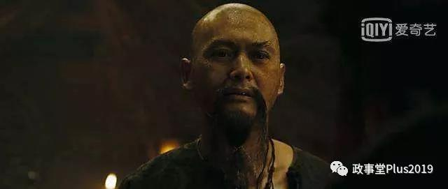

##正文

日前，凭借《复仇者联盟》横扫全球影视圈的漫威，宣布首部华裔超级英雄单人电影《上气》将于2021年上映。

说来将华裔超级英雄搬上屏幕这本是一件好事儿，但是由于影帝梁朝伟在片中饰演超级大反派“满大人”，引发了国内舆论的巨大反弹。

大反派“满大人”的英文Mandarin直译就是“普通话”，而且网友们认为满大人的原型是臭名昭著的”傅满洲”，是最近一个多世纪以来，西方丑化和歧视中国人最常用的经典形象。

 

由于傅满洲的主张是“杀光白人，抢走他们的女人！”，因此一直被西方视为“黄祸”的代表人物。

 

再加上片中的主角“上气”设定又是傅满洲的儿子，因此很多网友更是表示愤然：过去你们用傅满洲辱华，如今又用他的儿子来赚中国人的钱？

于是，很多网友纷纷强烈建议梁朝伟罢演，并表示要抵制该片子。

不过，政事堂并不喜欢把问题看得这么表面。

无论是傅满洲还是满大人，都是西方人塑造的一个中国的形象，他们在艺术创作过程中对中国的丑化，都是有着历史和政治的原因。

譬如创造傅满洲的英国人，当时满清王朝刚刚覆灭，在两次鸦片战争中占据先机的大英帝国更需要尽快在中国跑马圈地，因此既需要丑化中国人来彰显正义，又需要夸张中国大地上的财富，吸引英国人来神秘的东方淘金。

 

而赶在英国人之前，在庚子拳乱之中，将中国人塑造为“黄祸”的德国人，作为后发展的陆权国家，则是希望英法俄三国在遥远的中国因为利益起纷争，而让处于欧洲大陆中心的自己能够坐享渔翁之利。

 

至于接过英国人接力棒，将傅满洲和满大人形象发扬光大的美国人，则是因为20世纪初接连不断的经济危机，美国政府需要给底层群众树立一个敌人以转移视线，于是就把矛头指向了勤劳善良的中国人。

看看如今的特朗普为了争取蓝领阶层搞的反移民政策，其实和一百多年前没什么区别。

所以呢，逻辑上我们要明白，傅满洲和满大人并不是一个丑化中国的符号，而是当西方国家需要达成其政治目的的时候，就会放出来他俩。

而根据他们的需要，有的时候需要丑化中国，有的时候也需要美化中国。

譬如随着二战的全面爆发，中国成为了抵抗法西斯的主力，这个时候，不仅美国政府要求对傅满洲系列的电影进行审查，剔除反华要素，甚至小说之中的傅满洲都成为了美国军事上的朋友和反法西斯的先锋。

当然，这种事情别说西方人了，咱们老祖宗玩得更溜，譬如北宋时期，司马光写资治通鉴的时候，就是尊曹抑刘，而到了南宋朱程理学的时代，则是尊刘抑曹，同样都是赵官家的天下，可曹操就从神跌落成了贼。

原因很简单，北宋赵匡胤黄袍加身这事儿就是一个活曹操，那就必须承认曹魏的正统，而南宋被金人打到了黄河以南，金人学曹操在河北也扶持了个朝廷，南宋自然不能承认，就得跟着蜀汉学北伐和骂曹贼。

所以，当二战时期盟国到了最危急的时刻，由于美国需要说服民众同意大规模的援助蒋介石政府，也需要让中国军人们替老美血战在第一线，不仅傅满洲的形象变好了，连美国臭名昭著的“排华法案”也被取消了。

对比抗美援朝之后，原本不待见我们的苏联，突然变成了亲密的老大哥，敞开给我们工业化的援建，我们就会明白，大国游戏的筹码，都是用鲜血换来的。

而随着抗美援朝后，一度蜜月的中美关系迅速恶化，傅满洲们又回来了，丑化中国人又一次成为了美国意识形态中的主流。

而这种主流终结于上世纪70年代，傅满洲生了一个儿子名叫“上气”，“上气”在觉醒之后与父亲决裂，最终弑父。

而“上气”的原型，就是当时如日中天的功夫巨星李小龙。

 

对比一下70年代的中美破冰，美国需要调整民众自抗美援朝以来20年的对抗心态，就会明白，文艺工作者们创造这些人物的背后都有着巨大的政治意义。

而制造出来一个弑父的“上气”，则是在影射中国将与过去告别，敞开怀抱迎接西方社会，并为此推动美国民众对“新中国”有新的认识。

从这个角度我们也会明白，为什么华裔的功夫巨星李小龙从60年代的默默无名到70年代的突然崛起，除了个人的奋斗，最重要的还是踩在了历史的进程之上。

好了，逻辑说完了，回归到此次梁朝伟的“辱华”出演。

其实，无论满大人还是傅满洲，都是西方人心目中百年以来的中国人标签，绝不可能很轻易的抹掉，就像周润发在加勒比海盗中饰演的中国海盗王啸风，用的也是傅满洲的造型。

 

因此，重点不在于造型和历史，而在于故事情节中对该人物的塑造，就像周润发在畅销全球的加勒比海盗中，虽然一副傅满洲的样子，却为修正西方人对中国的认知做出了贡献。

同理，梁朝伟饰演满大人虽然是大反派，但是根据漫威的习惯以及考虑到中国市场的影响，再加上梁朝伟的颜值和演技，有机会就能把满大人洗白成万人迷的大反派“洛基”。

 

此外，“上气”可以肯定是个绝对正面的角色，甚至也会出现类似70年代，给美国民众传递，中国正在努力改变的信号，正好可以修复这两年来贸易摩擦损害的中美关系。

所以呢，很多事情还不能一边倒的去抨击和抵制，毕竟，这部片子给了我们一个向西方展示中国形象的机会，我们可以动用各种力量去影响。

当然，这种求人的做法，并非长久之计，伴随着中国一带一路的走出去，我们的文化也一定要伴随着成长，要知道，全球的贸易战之后必然还有全球文化话语权争夺战，那才是拼底蕴的时候。

而这方面我们可是有着传统优势的，随着权利游戏式的三国演义，复仇者联盟式的水浒传，加勒比海盗式的西游记一个个都拍出来，届时，我们的民族自信文化自信，将跟着我们的文化输出一起走向全世界。

##留言区
 

