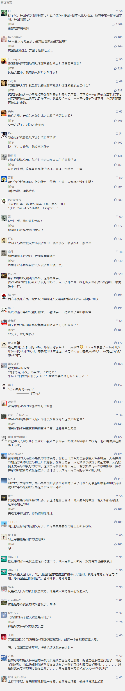

##正文

在全球事务上并没有什么存在感的乌克兰，在昨天搞了一个大新闻，该国安全部门25日宣称，其协同乌军事检察院，在伊兹梅尔港扣留一艘俄罗斯油轮。

虽然最近伊朗和英国互扣油轮已成家常便饭，但哪有什么国家敢在“有仇必报”的俄罗斯面前找茬啊？

这哪里是什么扣油轮，这明明是打普京大帝的脸啊！ 

 

要知道就算面对“全球军力排行第七”，国力远强于乌克兰的韩国，前几天俄罗斯军机也敢玩“闯入领空”，韩国人也只能眼巴巴瞅着将俄机礼送出境，屁都不敢放。

甚至当年韩国客机误入毛子的领空，被不管三七二十一的击落后，一贯民族主义泼狗血的韩国人，愣是装作没事儿，咬碎了牙认了。

毕竟，2008年的入侵格鲁吉亚和2014年的入侵乌克兰让所有人都明白，俄罗斯这头熊疯起来连自己都害怕。

 

那么，为啥被“大毛”俄罗斯按在地上摩擦了几百年的“二毛”乌克兰，突然不长记性，摇杆硬了呢？

很显然，这次乌克兰悍然扣俄罗斯油轮，就和当年敢挑起乌克兰冲突一样，背后站着美国人。

 

就在扣船的前一天，美国乌克兰问题特使沃尔克到达基辅“主持大局”。

这就像前不久美国的小跟班英国，扣了伊朗的油轮一样，一贯唯唯诺诺的乌克兰此次扣船，都是美国老爷让他去的，但公开场合上，却要装称是自己动的手。

 

 

那么，美国人为啥要让傀儡的乌克兰去扣船呢？

直接原因，是乌克兰上台的新总统泽连斯基率领的“人民公仆”党在本月21日举行的乌克兰议会选举中，拿下了424个席位中的246个，成为乌克兰历史上第一个在议会获得绝对多数的党。

这也意味着，之前被议会频频掣肘的泽连斯基，凭借着人民的力量，也将变成一位乌克兰的“青天大老爷”。

 

这对于美国的建制派老爷们来说，可并不是一个好消息，因为当年他们扶持了反俄的乌克兰前政府这个“假麻子 ”，制造了乌克兰危机，将收复“克里米亚”的俄罗斯重归美国的制裁行列。

可是如今，依靠着人民力量支持上台的泽连斯基，拥有了绝对的权力之后，则有脱离美国掌控，不好好当狗的迹象。

毕竟，想要解决经济问题，就必须要有一个和平的环境，泽连斯基一上台，就表示要与普京会谈来解决乌克兰东部问题，而普京也一反常态的不断对乌克兰释放善意，因此一贯敌视俄罗斯的美国建制派必然要出手了。

建制派老爷们而出手的领域自然是有选择的，泽连斯基当选后，在与普京的首次电话通话中表示，俄罗斯释放去年年底在亚速海冲突中的乌克兰水兵，将是“一切谈判的前提”。

因此，在美国建制派老爷们的指使下，乌克兰安全部门抢在总统之前，先把俄罗斯的油轮扣了作为乌克兰水兵的“交换筹码”，逼着靠着民心上台泽连斯基只能明面上支持，暗地里却打碎了牙往肚子里面吞，默许这种“下克上”。

可以说，这一场扣船行动，使得原本迅速回暖的俄乌关系迅速恶化，将泽连斯基外交的既定路线全盘推翻，逼着乌克兰不得不重新依赖于美国的保护，让乌克兰的“普京”栽了一个大跟头。

 

而此次事件中另一个栽跟头的，则是美国版的“普京”。

全球人都知道，特朗普把对普京的爱，几乎都快刻在脸上了。特朗普一直心心念的都是解除美国对俄罗斯的制裁，而制裁起点的乌克兰问题，则是特朗普与普京这对儿好基友必须一起迈过的坎。
 
 

因此反过来看，防止美俄之间因为乌克兰问题的解决，而让特朗普顺势撤销对俄罗斯的制裁，几乎是美国建制派们的第一要务。

而除此之外，就在两天前，俄罗斯外交部拉着伊朗、美国、英国、中国、海湾阿拉伯国家、欧盟国家的外交官，提议“放弃在波斯湾地区永久部署非区域国家军事力量”，获得了以中国为代表的众多国家支持。

虽然特朗普一直试图给海湾地区降温，并试图将军力从中东和中亚撤回，但美国的建制派老爷们则是想尽一切办法，不断在此地区挑事儿，连一贯搅屎的英国佬，都跟伊朗搞了一出相互扣船的戏码。

反正最近大家扣船扣得性质都很高，索性再玩个大的，为了将普京和特朗普搞掰，近期的第三场扣船就这么上演了。

这种戏码可以说已经屡见不鲜了，就像去年11月，阿根廷G20前几天，为了阻止特朗普与普京的会面，美国的建制派们愣是指使乌克兰军方安排船强冲亚速海，将两个政治强人的会面搞砸。

因此，可以预见的是，在上个月大阪G20上刚刚如愿以偿见到偶像的特朗普，接下来又有一堆麻烦要处理了。

当然，在“乌克兰普京”和“美国普京”先后栽了跟头之后，正牌的俄罗斯普京也好不到哪去。

随着近年来油价的持续下跌，“给我20年，还你一个强大的俄罗斯”的普京最近压力还真不小，为了提高最近持续下行的支持率，不仅在安倍参议院选举前对北方四岛问题上表示强硬，甚至还通过战略巡航飞跃韩国和日本的领空来大秀肌肉。

本来，这事就和印度莫迪在大选前空军入境巴基斯坦，以及日本安倍在选举前通过贸易战狠揍韩国一样，都是不撒银子还能获得民心的利器。

可是乌克兰扣船事件，这种蹬鼻子上脸的行为，不仅让普京之前的努力付诸流水，更陷入了左右为难的境地。

可以说，考验普京政治智慧的时候到了。

普京对乌克兰强硬，会导致谈判无望制裁解不开，经济的下滑会导致支持率持续走低，而对乌克兰软弱，则会引发俄罗斯民众的愤怒，依然会使得支持率迅速下滑，反正无论怎么出牌，都避免不了挨一刀。

所以，美国建制派老爷们指使乌克兰安全部门的扣船行为，可以说是“一石三鸟”之计，同时打击了美俄乌三国的“普京”，组织了一个大联盟。

当然，建制派老爷们的这种操作，相信大家也都见惯不惯了，就像特朗普每次试图与中朝两国达成协议之际，也总会冒出千奇百怪的幺蛾子。

而想明白了这个问题，也就想明白了最近香港问题的根源所在了。

##留言区
 

