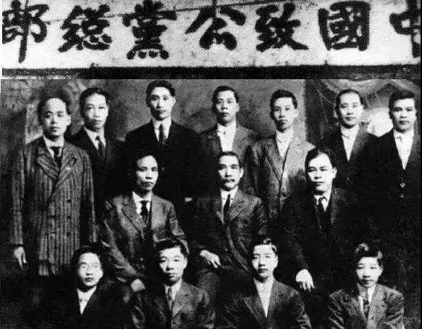

##正文

 
一

有人的地方就有江湖，有江湖就有帮会，有帮会就有大佬。

1949年10月1日，在开国大典上，毛主席庄严宣布：中华人民共和国成立了！此时毛主席的身后，就站在一位帮会大佬。

 

作为能够登上天安门城楼的帮会大佬，他的命运自然也在那段历史的长河之中反复激荡。

1912年，辛亥革命胜利后，孙中山从美国归国出任民国大总统，而之前孙中山的起义经费，在美期间的生活安保，甚至归国的船票都是他负责的。

1933年，罗斯福出任美国总统后虽然卸任给他当了十年的法律顾问，但只要是他写信，总统都会很快写亲笔信答复并尽力解决。

1949年，中华人民共和国成立，毛主席破例用轿子“特赐金銮殿乘舆”把他隆重请进中南海，并安排他坐在了开国宴的第一桌之上。

 

这位空前绝后、荣耀备至的帮会大佬，就是司徒美堂。

 
二

1868年4月，广东开平县牛路里村一个彭姓农民家庭中，诞生了一个男童，由于父亲过世早，家里无力供排行老五的他继续读书，便在十岁的时候让他出来干活谋生。

偶然间，这位少年遇到了一位从美国归来的同乡，听到他描述美国的繁华与淘金梦，便回家再三央求母亲希望允许他去美国搏一把。

为此，母亲借遍亲友筹到了几十块钱，给他买到了一张下等仓的船票，乘坐“加力”号开始了他的美利坚之旅。

蓬头垢面，脖子上围着一条大辫子，还不会说英语的他，自然没机会复制杰克的泰坦尼克，更不要说黄皮肤黑眼睛还让他遭受到了巨大的歧视，刚刚下旧金山码头，就被美国流氓们用马粪抛了一身。

国弱则民无尊严，当时，清廷正在被列强们分食，华人自然也在美国备受欺凌，尤其是他刚到美国没多久，臭名昭著的《排华法案》便被美国政府通过，成为美国第一部针对特定族群的移民法。

因此，少年在美国也只能从事最低级的工作，在餐馆里打工还常被无端的侮辱。没有国家力量的支持，海外华侨们只能相互帮衬，于是少年在17岁那年拜堂盟誓，加入了洪门。

虽然加入了洪门，但随着《排华法案》发布后，美国流氓欺负华人的风气愈演愈烈，他们大多得寸进尺，华人的日子也越来越艰难。

有一天，一位白人流氓来餐厅吃霸王餐，他不仅吃饭不付钱，还抓起店里的椅子到处打砸。

少年见状，上前与那男子交涉，不想两人争执起来。白人仗着人高马大，拿起手边的椅子就朝他扔去。

那一刻，几年来积累的屈辱和怒火，突然爆发了，少年用中国功夫将几招就将白人打倒并丢出店外。

而没想到的是，那个白人并不经打，几下就被打死了，少年也因此被捕。

杀人在任何时期都是重罪，更何况他杀的还是一名白人，很快，少年便被法官判处死刑。

死刑的判处令忍受《排华法案》多年的洪门兄弟们再也忍不下去了，他们为少年奔走呼告，利用法律为武器，最终，少年被改判“自卫过当”，入狱10个月后被释放。

由于判决的轰动性效应，让白人们知道华人敢于正当防卫，也有能力防卫之后，那些常常欺辱华人的白人得以收敛。

从此，敢于跟白人正当防卫的少年成为了旅美华人中的英雄，洪门也借此在美国声誉日隆，少年不仅得到了洪门前辈的赏识，也吸引了不少的追随者。

后来，随着少年的追随者越来越多，少年成立了自己的堂口安良堂，很快，安良堂就成为美国洪门最强势的组织之一，在全美31个城市设有分堂，成员达到2万多人。

而在美国建立堂口的这位彭姓少年，也将自己的名字改为了司徒美堂。

 
三

1904年1月11日，美国檀香山洪门，一场新人入堂仪式正在进行，来人便是后来大名鼎鼎的孙中山。

 

成为洪门党棍的孙中山，所拟定《美洲致公总堂八十条公章》，其中明确规定“本堂以‘驱除鞑虏、恢复中华、创立民国、平均地权’为奋斗宗旨”，而这也是后来同盟会十六字纲领的最初版本。

受其革命理想所感召，孙中山在美活动期间，司徒美堂对他寸步不离，义务当他的房东、保镖兼厨师，当时孙中山是清廷重点的围剿对象，就像电影《十月围城》那样，司徒美堂以巨大的代价完成了对保护中山先生的任务。

1912年前夕，辛亥革命胜利后，孙中山准备回国就任中华民国临时大总统，因缺乏旅费无法成行，又是司徒美堂筹款给孙中山筹足旅费，送他顺利回国出任总统。

临行，孙中山请司徒美堂回国出任地位尊崇的监印官，但司徒美堂却以“功成身退”和“不会做官”为理由，婉言拒绝。

不同于革命胜利后其他大佬们的争权夺利，司徒美堂选择继续发展洪门在美国的力量，而他的这个选择，又引发了极其深远的影响。

 
四

由于历史文化的原因，中国人在海外有两个最严重的问题，一个是喜欢窝里斗，一个是人情社会导致漠视法律。

就像小说《鹿鼎记》中借所谓“天地会总舵主”陈近南之口，承认“会中兄弟良莠不齐”。事实上，洪门各山、堂、香、口从创建以来就自成体系，各无同属，相互之间内斗频频。

1931年“九·一八”事变爆发，日寇占我东北，这让司徒美堂受到很大震动，海外华人们不惜代价和牺牲缔造的国民党政府，竟然只专注于国内的党争，导致日寇铁蹄对我锦绣江山肆意屠戮。

此刻，司徒美堂认识到海外华人再也不能这样“窝里斗”下去了，应该团结一致，共同抗日，于是他立即向对手协胜堂深刻检讨并认错，召开了两堂的“和平大会”，要求在海外的中国人不要再内斗，团结起来一致抗日。

之后，洪门结束了内部长期堂号林立、互不团结的局面，为挽救中华民族危亡之前的门户之见全都“涣然冰释”，不仅为之后的国共合作树立了标杆，在司徒美堂的带动下，旅美华侨们为抗战募捐数千万美元、几十架飞机，成为了中华民族抗日的一股重要力量。

更不要说，随着战争进入后期，苏联和蒋介石政府先后断绝了对中共的援助，海外华侨的外汇秘密通道几乎成为了我党的救命稻草，正如当时《新华日报》对司徒美堂评价的那样：“抗战以来，他领导旅美侨胞作热烈捐献活动，成绩斐然。”

而且，更重要的是，司徒美堂改变了中国人法律意识淡薄的传统，专门为堂会雇佣了律师，来替华侨们打官司，这个细微的举动更是产生了巨大的连锁反应。

就像前段时间斩获奥斯卡的电影《绿皮书》中，黑人音乐家被警察局关起来后，他一个电话就打到了司法部长肯尼迪勒令“放人，同样，司徒美堂也经常给罗斯福写信要求“放人”。

1932年，淞沪抗战爆发，纽约乃至全美国的华侨纷纷上街示威游行，募捐救国，洪门抗日宣传队在街头募捐演出，被警察抓走两名宣传队员。

司徒美堂闻讯赶紧去已任州长的罗斯福处求助，作为司徒美堂法律顾问的罗斯福听完后，立即打电话给警察局长，把人放了。

相比于洪门其他堂口只知道武力搏杀，司徒美堂已经像“教父”那样，与美国的实权派们建立了密切的关系。

 

而意外的收获，则是司徒美堂的律师罗斯福，不仅成为了州长，还竟然成为了美国的总统，而且一干还就是四届。

虽然罗斯福当选美国总统后，辞去安良堂律师的职务。但在罗斯福任总统期间，华侨有什么事，只要司徒美堂写信，罗斯福很快就亲笔写信答复，并尽力帮助解决。

甚至在司徒美堂写信催促下，1940年10月，罗斯福总统咨文国会请废《排华法案》，（当时美日还没有敌对，1941年12月珍珠港才爆发），并最终，在罗斯福的力推下，美国1943年正式取消了《排华法案》。

就像跟俄国人做了多年生意的特朗普上台后，白宫开始不断对俄的善意那样，这位十年间不断为华人打官司，认识到中国人民勤劳朴实善良的总统，在上台之后引导美国对外政策转向全面亲华。

罗斯福不仅率先出手制裁侵华的日本，导致北上南下犹豫之中的日本对美宣战，还在力排众议向中国源源不断的提供援助帮助我们坚持到了抗战的胜利，甚至还在二战即将结束之际，还顶着苏英的反对，强行把中国拉进了安理会五常。

 

可以说，司徒美堂自己都没有想到，自己一只蝴蝶煽动的翅膀，会带来如此深远的国际局势变化。

当然，司徒美堂的偶然之中，也有着历史性的必然，中华民族的基因决定了，每当民族出现危机，国家命运遭遇挑战之际，总会有一批英雄们能够站出来，挽狂澜于既倒，携手奋力共度难关。

这就是中国的精神，也是洪门宣扬之大义。

##留言区
 

