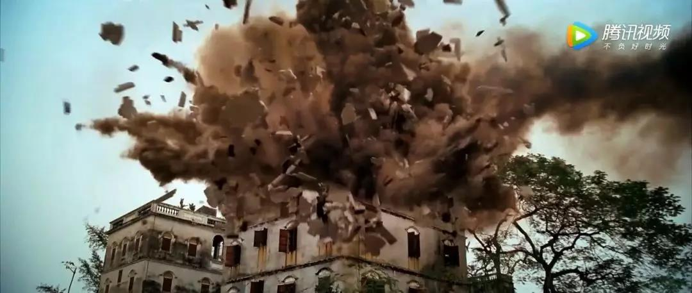

##正文

同一个故事，从另一个角度看，就会有不同的味道。

 
一

1996年5月23日，香港。

此时，据五星红旗取代米字旗在港岛冉冉升起还有一年多一点的时间。

下午六点，一辆黑色的高级房车，从香港中环皇后大道中2号的长江集团中心驶出，开向港岛南区寿山村道2号别墅。

车里坐的，正是香港首富李嘉诚的儿子，长实集团的2号人物李泽钜。

当车辆行驶到深水湾道80号偏僻路段时，房车突然被强行逼停，随后一群手持AK47的匪徒们将房车包围，将李泽钜拖出塞入厢式货车。

这位华人首富的千金之子，怎么也不会想到，自己竟在法制的香港被一群匪徒囚禁于一个废弃的养鸡场之内。

而带头大哥的名字，叫做张子强，也凭借此案的犯罪金额创造了吉尼斯世界纪录。

 
二

上面这场人质劫持的精彩桥段，在香港电影中多次以各种形式展现，甚至很多媒体更是凭空想象了随后李嘉诚与张子强两人之间的对话内容。

在那些杜撰的对话中，面对张子强的单刀赴会，李首富总是那么的淡然和睿智。

不过，这些作家们可能都犯了跟当年金庸先生一样的错误。

在《倚天屠龙记》的后记中，金大师坦然书中最大的两处败笔，一处是张三丰眼见张翠山自杀之时，一处是谢逊听闻张无忌死讯之际，他把两位绝世高手写得都太淡然了。

金大侠能有如此感悟，是因为他成书之后听闻儿子去世的消息，才真正的体会到了什么叫叫做老来丧子的痛彻心扉。

同样，指望李超人听闻一心长子被绑匪所劫还能淡然处之，甚至还能跟绑匪谈心交朋友，那显然都是艺术家们的再创作。

当然，李超人毕竟是拥有巨大能量的“超人”，见过张子强之后，他很守信的并没有报警，而是打给了刚刚退休的老朋友李君夏 。

作为香港第一个华人警务处长，通吃黑白两道的李Sir在香港拥有庞大的人脉网，在听完情况陈述之后，只问了李首富一句话：

你缺钱还是缺儿子？

李首富的回答也很干脆，

我只是以朋友的身份问你，我要怎么把钱交给张子强比较合适。

最终，一通电话之后，李嘉诚选择了张子强抢劫时最习惯的手段，将10亿元装了一卡车送给了张子强。

而这通电话也没有白打，有了中间人的担保，不仅张子强要求的20亿就像李家棋下的屈臣氏售卖的商品那样，被打了5折的特惠，李超人的儿子也得以毫发无伤的安全获释。

当然，忙也没有白当，李处长在这次解救过程中，展示出来黑白两道的能量，也使得李首富许诺每年给他10亿，专门负责家族的安保工作。

大概，这就是做人差距。

 
三

一年半之后，再次拨通了李嘉诚的电话，询问李嘉诚应该如何投资理财，潜台词就是继续要钱。

而此时交足了保护费的李超人腰杆自然硬了，他只说了一句话，我不能教你投资，却能教你做人。

于是，在超人那里吃了瘪的张子强，便把目光盯向了“香港第二富豪”，郭得胜的儿子郭炳湘……

在绑架李泽钜之后丝毫没有遭受惩罚的张子强，此次更是肆无忌惮，在郭炳湘乘车来到位于深水湾道豪宅大门外时，张子强直接冲过去，明目张胆地的将郭炳湘强行掳走。

公平起见，张子强这次的赎金要求依然是二十亿，与李泽钜一致。

不过，豪门故事多，平民出身的张子强这次遇到了一点麻烦。

新鸿基创始人郭得胜有郭炳湘、郭炳江、郭炳联三个儿子，随着郭得胜去世，长子郭炳湘继承大业。

 

就像西安事变中拥有继承权的何应钦与孙科拒不和谈那样，郭炳江、郭炳联兄弟也没有很乖的偷偷支付赎金。

于是，没拿到钱还搞得尽人皆知的张子强自然要发泄愤怒。

具体发生了什么谁也不知道，但是被黑道控制的香港影视业，在后来的警匪片中，和绑架有关的剧情，经常会出现人质被剥光衣服、关入小木笼，用水枪虐待人质，甚至直接把木笼从山坡滚下……

而这场惨无人道的虐待，直到郭炳湘夫人出面，与张子强达成6亿的赎金之后，香港第二富豪才得以脱身。

不同于李泽钜痛快的释放之后，顺利继承家业，郭炳湘被释放后患上了严重的心理问题，最后落得被母亲和兄弟们联手废黜。

可以说，即使是香港最顶尖的富豪们，当年在匪徒面前，也不过是一盘肉鸡罢了。

 
四

罗马不是一天建成的，张子强也不是突然就成为世纪劫匪的。

1991年，默默无名的张子强还那时没有那么大的胆子，只是在通过在安保押运公司当文员的妻子，获取了运钞车行驶路线和时间表后，他伙同两人在启德机场抢劫了隶属他老婆公司的一辆运钞车，收获了1.7亿的港币。

整个过程干净利落，唯一的漏洞是抢劫过程中，押运员面罩掉落，意外看到了张子强的脸。

而且，警方在调查中发现，罪犯对运钞车出现的时间把握十分准确，就像知晓消息一样，安保公司肯定有内鬼。

而张子强的妻子罗艳芳恰好在这家保安公司任职，并在案发不久后向银行一次性存入了四十多万正是此次被劫的现钞。

证据链确凿，张子强随即被逮捕入狱，判了18年。

本来，张子强要在狱中接受惩罚，无法再搞出后来的那些惊天绑架案，可能出狱之后还可能做个好人。

可是此时，英国人在香港的媒体和司法系统开始发挥威力了，张子强的老婆，一个傻到存赃款现钞的普通文员，竟然懂得召集记者开新闻发布会了。

在新闻发布会上，罗艳芳撩开长裙，向记者展示大腿上部的刀疤，声称是香港警方所为，此外，重金聘用的金牌律师团以押运员的辨认过程有疑点、几十万现钞并不能证明劫案、以及张子强被严刑拷打的理由，要求翻案。

虽然人证物证确凿，却因为张子强用抢劫的赃款雇佣到了金牌律师和大量的媒体而被翻盘，上诉到香港最高法院后，那些外籍法官们裁定张子强的罪名不成立，给予当庭释放。

 

而且张子强也不是吃素的，无罪释放后，他还反咬一口告了香港警局，获得了800万港币的赔偿款，香港纳税人的钱，就这么进了劫匪的腰包。

而获得胜利后，张子强也以胜利的手势在法院门口拍下了这张经典的照片。

 

此时，不明真相的香港群众们还在香港媒体的鼓吹之下叫好，认为对张子强的释放是民主和法制的胜利，可是Naive的香港人没有想到，正是他们自己盲目，放出来了一个超级恶魔。

当证据确凿的抢劫犯都能被放出来，警察还怎么抓人？杀人放火金腰带，在张子强被释放后，整个香港的治安迅速恶化，大量劫匪开始蜂拥涌现。

而对此尝到甜头的张子强更是利用赃款网罗了著名的律师团队，在香港黑道、警局、法院、媒体建立起了庞大的人脉网，进入了为所欲为的状态。

 

 
五

1997年，随着香港回归祖国的怀抱，五星红旗取代了米字旗，驻港部队开始接手香港的防务，张子强们的日子不好过了，连续几次的行动都被新政府所破坏。

上帝欲使其灭亡，必先使其疯狂，此时的张子强已经膨胀到计划炸掉香港监狱，制造巨大的混乱给新政府以难堪，向新政府来证明香港是他的地盘。

不过，不懂政治的张子强犯了一个致命的错误，那就是“香港回归后仍不收手”。

虽然香港的司法和媒体系统已经跟张子强形成了同盟关系，但是祖国大陆这边，又岂能任其逍遥？

1998年1月10日,广东省公安厅厅长接到公安部领导的一个重要电话，通报了香港张子强犯罪集团的情况，要求广东省警方立案侦查。
”
两天后,在广州白云机场,一驾波音747飞机在夜幕下徐徐降落。飞机刚刚停稳,就有一辆轿车开上了停机坪,三位身穿便衣的公安部要员提着公文箱下了廊桥,轿车立即奔向了广东省公安厅，随后，针对张子强的‘9810’指挥部成立了。

12天后，张子强与其团队二号人物便在江门外海大桥检查站被抓，随后便被批捕起诉。

 

张子强被抓后自是拼死抵赖，强调自己是香港人，以犯罪活动主要在香港为理由要求香港政府引渡他回港。

而且，此时香港的司法系统，媒体，学者和律师们也纷纷助攻，他们认为张子强是香港居民，应于香港受审，甚至夫人罗艳芳也仿照当年大搞新闻发布会，将矛头直指大陆的人权和法治。

不过，大陆这边既然敢抓，必然就有足够的把握搬倒这位世纪大盗，不同于香港方面司法集团保护张子强，大陆公安迅速以张子强的马仔们为突破口各个击破，拿到了一整套非常完整的证据链。

最终，在铁证面前，广州市中级人民法院对张子强犯罪集团43名罪犯进行宣判，以人民的名义，在这场“世纪大审判”中，判处张子强死刑。

一代枭雄就此陨落。

 

而此时香港虽然回归了，但是香港的司法机构依然还是原来的那批人控制，面对大陆提供的铁证，不仅撤销了对张子强夫妇的资产冻结令，令其将数十亿涉黑资产统统转移出国，还判决香港警方再一次对其进行了赔偿。

也许，这是香港司法体制最耻辱的一天，整个香港市民都在为一个抢劫犯买单。

可对于香港的旧司法体系来说可没办法，自家的狗，怎么也得救一把。

 
尾声.让子弹飞

对于香港殖民政府的黄老爷们来说，劫财劫人的张子强不过是个装麻匪的假麻子，用他既能刮城南李郭两大家族的钱，又能借着剿匪的名义敛财。

 

不过，打着着跟新县长三七分利润算盘的黄老爷们没想到，县长一来就把张子强们给毙了，因此只能先忍了，找到机会便暗地里抹黑县长搞乱局势，希望把县长赶走，自己好重新统治。

 

 

不过，黄老爷们想得太美了。

虽然那栋象征着英国殖民主义的大楼看似固若金汤，老爷们以为靠着“武智冲”们就能搞得天下大乱，但殊不知，他们的结局早已注定，只要民众心里的怒被勾出来，当年从我们手里盗取的东西，终究是要还回来的！

这栋大楼迟早是要易主的，就让子弹飞再一会儿吧！

 

##留言区
 

