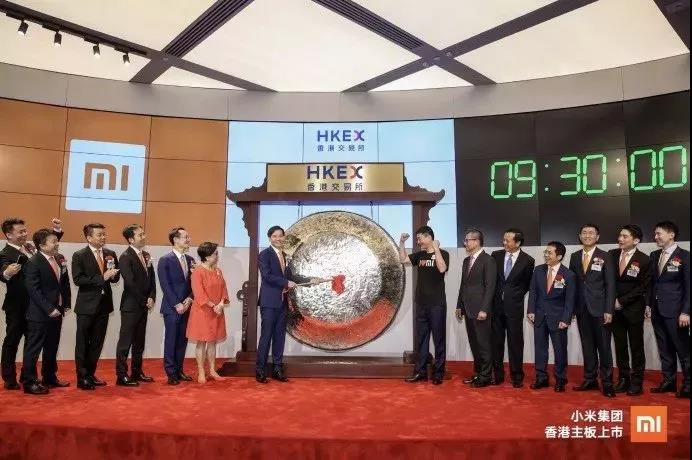
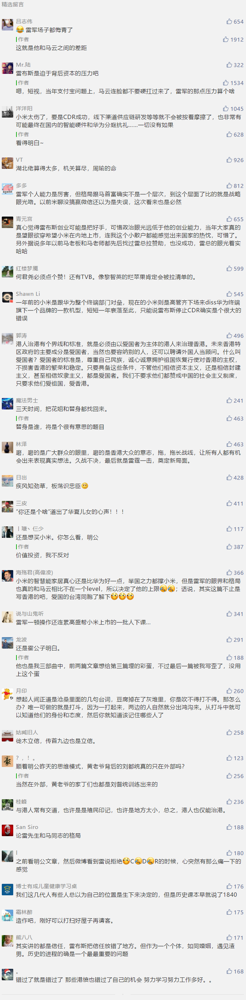

##正文

 
一

2018年7月9日，香港

此刻，中环交易广场1层的港交所人头攒动，冷清了半年的市场在此刻被一波波的热浪所引爆。

这一天，是小米上市的日子。

此刻的港岛，无论是交通枢纽还是街头巷尾，到处可见小米公司的广告牌，没有见识过“小米加步枪”的香港人，也都被“小米”浪潮所包围。

作为首支同股不同权的上市公司，港交所也为小米新定制了一面比人还高的铜锣作为兆头，希望小米能开启一个大时代，甚至李嘉诚、马云、马化腾、索罗斯以及众多国资的认购，更是将气氛推向高潮。

上午九时三十分，容光焕发的雷军带着他的高管团队，拿起裹着红绸的木槌，准时鸣响了小米上市的大锣。

 

可不曾想，不争气的小米开盘便被破发，让无数投资人大跌眼镜。

面对现场那些亏损的投资人，盯着大屏幕雷军，不得不以他那标志性的湖北普通话说出“股价短期波动不重要”以安人心。

 

甚至在当晚的庆功晚宴上，雷军更是向着一众投资人拍胸脯保证，“要让在上市首日买入小米公司股票的投资人赚一倍”。

雷军的“一倍”诺言不仅没有实现，年初估值2000亿美金的小米，在上市前估值缩水了一半，变成了1000亿美金，等真正敲锣的时候，又缩水了一半，成为了540亿美金。

而更令雷军难堪的，经过了一年的单边下跌，如今小米的市值再次缩水一半，变成了270亿美金。甚至上个月小米连续展开了18次回购，都没有能够提振低迷的股价。

大概，当初听信了雷军“赚一倍”而没有跑，如今悉数被埋的投资人，想到当年雷军拍胸脯的承诺，怕是都在暗骂“我信你个鬼”......

 

 
二

镜头调回小米香港上市的一个月前。

6月的金融街19号，即使在夜里也是灯火通明。

11日凌晨，证监会披露了小米CDR招股书，此时距离CDR相关文件的发布仅仅过去四天。

而通宵的加班并没有因为招股书的披露而停止，此刻距离小米港股IPO，仅留不到下一个月的时间，所有人都在为这个新模式赶工，要将上交所确立为小米的主上市地，并确保CDR与港股的同步发行。

15日夜间，这次证监会抢在零点前宣布，小米CDR将于19日召开的2018年88次发行委工作会议中被审核。

谁也不知道这四天的时间里，证监会的同志们是如何完成这600多页招股书的审核工作，更不知道如何能够在接下来的四天完成史无前例的上会准备工作。

只是知道，小米创造了中国资本市场有史以来最快的上会纪录，而这个纪录恐怕以后也很难再有公司能够打破。

而更难打破的记录，则是为了一家公司上市所调集的人力。

很多人并不知道的是，那个月全国为小米CDR备战的同志们，是小米员工的数十倍。

6月11日，也就是证监会披露了小米CDR招股书的那一天，为了配合小米CDR，六只规模上限500亿的战略配售基金开启了地毯式的轰炸营销。

这一天，全国各大银行从上到下都背负了营销任务，几乎所有的合格投资者都接到了客户经理的推荐电话。

当时正值P2P集中暴雷，银行存贷款变得异常稀缺，而CDR基金比货币基金还低的运营费用按照市场化是根本没人会力推的。

而且，看前些年各大银行对马云搞货币基金的大打出手，就会明白金融对于“抢钱”的CDR更会是深恶痛绝。可是在政治任务面前，没有一个人敢多说什么，整个金融体系都在默默的坚决执行。

同样，当时受贸易摩擦影响，A股几乎跌倒了那一年的最低点，整个证券市场都在等着国家队出手救市，希望能够带动主板打一个反击战，却不曾想国家队却在抽血为小米另搞了一个CDR......

大概，就像李云龙的“平安格勒战役”那样，这可能是雷军这辈子最高光的时刻，整个中国的金融系统都在为他一个人做后勤保障。

不过，让人意想不到的是，监管层的草船借满了箭，政策和舆论的东风已然吹起，而这场大戏的主角小米，却临阵脱逃了。

6月19日早上，就在证监会发行委工作会议召开前一个小时，小米通过微博宣布暂缓CDR发行。

为山九仞，功亏一篑。

 
三

就在小米港股上市，CDR泡汤的一年之后，上交所科创板启动，首批科创板公司，享受到了当年小米“注册制”式的绿色通道。

而科创板基金跟当年的CDR基金类似，也都设置了50万的入门门槛.....

......

一切都是如此的相似.....

而不同的，则是“千金马骨”从一家小米，分拆成了25家上市公司。

一年前，雷军在香港上市的时候，为求高市盈率，一直坚称自己是一家互联网公司而不是制造业公司。

一年后，大陆科创板25家制造业公司平均市盈率约120倍，上市首周平均涨幅更是高达140%。

而此刻，在香港混迹的小米，不仅比去年上市时跌了一半，市盈率更是跌到了惨不忍睹的7倍。

同样是制造业企业，甚至科创板中还有多家小米供应链上的企业，可市盈率差距为啥就这么大呢？

这当然不是市场单纯决定的。

如果小米也能按照科创板的120倍来估值，那么现在的市值不应该是300亿美金，而是4300亿美金，与马云的阿里巴巴几乎相当......世界首富甚至都在向雷军招手.....

当然，历史没有如果。

就像《战国策》中，燕昭王给第一个送马骨的人支持高额的酬劳，是为了引来千里马，但是他并不再会为第二件马骨买单。

对于雷军来说，有些事情，错过，就是错过了。

 
四

“我做了两件事，改革开放和一国两制”
——邓小平

1977年，邓小平第三次复出后不到一个月，美国总统卡特就派国务卿万斯来北京，探讨中美关系正常化的问题。

当时，对于急于建交的中美两国来说，台湾问题仍是建交最主要的障碍，对此，小平同志提出“考虑台湾特殊情况”，“保持某些制度不变”的想法，这也是“一国两制”的雏形。

而这时候英国管辖下的香港，回归还没有被提上议事日程，甚至负责港澳工作的廖承志也公开表示，“香港的现状，看来要维持相当长的时间。”

但是这一切随着香港总督麦里浩1979年访华而改变，就像最近要硬脱欧的英国首相那样，不愿意被不确定性纠缠的英国试图明确97年之后香港的归属问题。

此刻，此正在建立中美关系的邓小平认识到台湾的统一大业目前时机还不成熟，则顺势将针对台湾的“一国两制”政策转移到香港问题上，把香港作为解决台湾问题的示范。

1981年8月26日，邓小平在北京会见港台知名人士傅朝枢，首次公开提出解决台湾、香港问题的“一国两制”构思。

从此之后，香港也就也就成为了“千里马”台湾回归祖国前的“马骨”，而赶上历史进程的李嘉诚们，就像如今气势如虹的科创板企业那样，迅速将他们的商业版图扩张至全中国。

 
结语

如果明白了中央对于香港与台湾之间的逻辑，也就明白了近期香港问题背后，为什么真正站着的是控制着台湾的美国。

因为搞乱香港，是美国妄图继续控制台湾最便捷的方式。

而如果明白了这个逻辑，也会明白为什么中央政府一直在隐忍。

因为中央政府需要在过程中发现，谁是香港真正的爱国者，就像当年小平同志说的，“港人治港”必须“以爱国者为主体的港人来治理香港。”

中国大一统的秦朝，就是从商鞅变法的徙木立信为开端，作为港澳台回归的开端，未来，在中央的支持下，有14亿同胞作为后盾，香港的繁荣和稳定必然可期。

但是请记住，香港的繁荣红利只会属于那些真正的爱国者。

反之，香港自建埠以来，靠的就是作为中国对外的纽带，对大陆有着极高的依赖度，就像无论是小米的CDR还是科创板的基金，背后都是国家力量默默的支持。

而一旦离开大陆十四亿同胞的支持，就会像割裂了A股CDR的港股小米一样，从此之后只能跌跌不休。

各位香港的大佬们，路怎么走，你们自己挑。

只是奉劝一些被短期利益迷失了心智的团体，好好想明白：

离开了强大的祖国，你还是个啥？

 

##留言区
 

