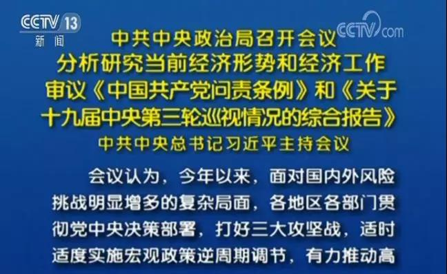

##正文

7月30日，分析研究当前经济形势，部署下半年经济工作的中央政治局会议如期召开。

 

相比于以往，此次政治局会议中释放了大量“猛料”，将对于众多行业产生深远的印象。

因此，今天政事堂就跟大家一起学习领会中央的精神，紧跟时代的脉搏。

首先聊的，自然是大家最关心的房地产。

说起来，想要深刻理解国家的宏观调控政策以及风向的变化，必然要将先后两次的政治局会议通稿进行对比。

毕竟通稿中每个字都是反复斟酌出来的，任何的一丝变化，都意味接下来的宏观政策将进行相应的调整。

所以，我们把决定今年下半年经济工作的730政治局会议，与决定二季度经济工作的419政治局会议对比，挑出房地产部分的内容进行逐字分析：

>坚持房子是用来住的、不是用来炒的定位，落实好一城一策、因城施策、城市政府主体责任的长效调控机制

>4月19日政治局会议通稿

>坚持房子是用来住的、不是用来炒的定位，落实房地产长效管理机制，不将房地产作为短期刺激经济的手段。

>7月30日政治局新闻通稿

对比两次会议的通稿，我们就会发现，除了“房住不炒”都保留之外，中间发生了两个变化。

首先，本次政治局会议中，将上次长效机制中的“城市政府主体责任”去掉，意味着过去交给地方政府来调控房价权力，可能有部分将上交至中央来宏观调控。

这意味着一方面，今年下半年，以菏泽为代表的率先取消限售以及苏州假装遏制不住的小阳春，将成为过去式，百姓们关心的**遏制房价上涨将成为中央行政命令**；

而另一方面，由中央主导的房地产税等长效机制将逐步成为房地产调控的主力，**今年下半年立法方面很可能有动作**。

其次，也是大家最关注的，本次政治局会议中，第一次出现了“不将房地产作为短期刺激经济的手段。”

要知道，“不”字作为单独的否意词，而不是词组中的一部分（如房住不炒、坚定不移），并未在近年来的政治局会议通稿中出现过，尤其是本次政治局会议更是要求了：

>各级党委和政府要坚决贯彻党中央决策部署，尽心尽责做好各项工作，以优异成绩庆祝中华人民共和国成立70周年。

这意味着**国家在下半年将坚决放弃房地产刺激，没有任何的商量**。

考虑到，继2018年10月31日，12月13日两次政治局会议中均未提到的“房住不炒”，在2019年4月19日的政治局会议出现后，中国房地产信托规模随后出现断崖式下跌。

可以预见的是，随着本次政治局会议中房地产调控内容的逐级落实，别指望什么政策解绑了，中央层面会有更多遏制房价上涨的动作，**传统意义上金九银十的房地产行业将会提前感受到冬天的寒意。**

大家且行且珍惜，上半年破产的270家房地产公司只是开始。

说起来，作为中国经济最近十年以来，反复被拿来使用的经济刺激手段，真要放手是非常痛苦的，而且，对比一下最近两次布置经济工作的政治局的通稿会明白，下半年的经济压力是非常大的：

>外部经济环境总体趋紧。国内经济存在下行压力，这其中既有周期性因素，但更多是结构性、体制性的。

>4月19日政治局新闻通稿

>当前我国经济发展面临新的风险挑战，国内经济下行压力加大。

>7月30日政治局新闻通稿

我们把两则通稿连起来读，意思就是在国内经济上半年存在的下行压力之外，下半年面临的新的风险挑战，压力加大。

意味着，国家除了要提升经济质量，还要进行相应的经济刺激。考虑到已经说了“坚决放弃房地产刺激”，这意味着必然要在其他领域进行强力的对冲。

毕竟，相比于今年上半年取消了去年“六个稳”的提法，下半年“六个稳”的提法再次出现，肯定要有新的刺激来维稳。

而本次政治局会议中，也将财政领域的刺激方向，均一一列举：

>稳定制造业投资，实施城镇老旧小区改造、城市停车场、城乡冷链物流设施建设等补短板工程，加快推进信息网络等新型基础设施建设。

可以预见的是，上述领域的基建速度均将大幅提速，各垂直领域也都将会收益。

而从金融的角度，也很容易就能理解中央的意图，本次政治局会议就是要**把原来金融系统投向房地产领域的资金，大规模的向实体经济领域转移。**

甚至为了表明态度，会议上也把中国房地产最大推手都直接祭旗，向大家表明中央要发展实体经济的信心，所以，我们必须要紧跟中央一起进行此次转型。

而实体经济是需要庞大市场的，因此，政事堂预测，**明年中央有可能会启动新一轮“家电下乡”来消化实体经济注入资金后增加的产能**。

而该计划一旦实施，也就意味着整个行业和资本市场都将面临一轮新的大洗牌。

不过，财政政策领域虽然通过基建取代了房地产，但是有可能并不足以对冲下半年“面临的新的风险挑战”，而且考虑到美联储很可能在今晚降息，因此，可以预见的是，货币政策领域势必也要加码。

但是，中央已经明确了坚决放弃房地产刺激，因此直接降息的可能性并不大，除了定向降准之外，最有效的动作，应该就是通过证券市场来定向“制造货币”了。

所以，我们依旧可以对比一下最近两次的政治局会议，看看对于证券市场是怎么描述的：

>要以关键制度创新促进资本市场健康发展，科创板要真正落实以信息披露为核心的证券发行注册制。

>4月19日政治局新闻通稿

>科创板要坚守定位，落实好以信息披露为核心的注册制，提高上市公司质量。

>7月30日政治局新闻通稿

对比就会发现，**如果说4月份的政治局会议，是要把科创板搞起来，那么7月份的政治局会议，就是要把科创板富起来。**

因此，可以预见的是，随着前几波科创板企业的先遣队已经打通了经络，接下来，**将会有一大波真正的独角兽将正式登陆科创板**，将科创板打造成中国的纳斯达克。

考虑到科创板目前的市盈率，以及符合科创标准的企业，大概，全球财富排行榜已经在向手握全家桶的马老板们招手了，那些跟对马老板的也能坐上风口喝碗汤。

在中国，巨大成功的背后都没有偶然。

回首改革开放四十年，跟对了国运，有谁曾被亏欠过?

##留言区
 

