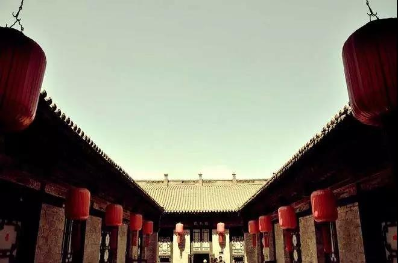
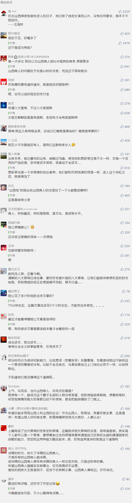

##正文

 
一

1991年，张艺谋的《大红灯笼高高挂》上映，电影描述了巩俐饰演的大学生颂莲因家道中落，为钱所迫嫁给陈家作四太太，后来在陈家的宫斗中迷失了自我的故事。

这部取得了巨大成功的电影，不仅拿下了威尼斯电影节银狮奖和奥斯卡最佳外语片的提名，也创下了当时华语电影在北美的票房纪录。张艺谋不仅将巩俐带到了奥斯卡的颁奖典礼上，也带火了电影的拍摄地，乔家大院。

 

至此，张艺谋为了寓意设计的火红灯笼，便成了这栋古宅最显著的标志，而随着《乔家大院》同名电视剧的播出，也使其成为了山西旅游文化的象征。

不过近日，大红灯笼高高挂的乔家大院，却被“摘”了下来，国家文化和旅游部发布公告，乔家大院被摘去5A景区金字招牌。

山西的一个金字招牌，就这么被搞砸了。

 
二

去过乔家大院的人，恐怕第一反应就会想到中国最成功的山西商人李彦宏。

就像之前在百度上搜一则疾病，第一页几乎都是广告那样，从停车场到乔家大院，这人为设计的一公里路线上，几乎被卖东西的摊位所布满，找个地方跟找迷宫差不多。

而且，就像那些山寨医院一样，很多人在买了包装精美的山西乔家特产后都发现上当了，美丽的盒子里不是只有很小一块糖就是塞满了草纸，搞的很多游客们乘兴而来败兴而去。

看着如今百度跌跌不休的股价，突然感受到成功总有不同的途径，而失败往往有着相似的原因。此次乔家大院因过度商业化被国家的摘牌，仿佛也是近年来山西商人衰败的一个缩影。

十年前，山西的商人们几乎是中国最牛逼的一个群体，尤其是互联网行业，BAT一哥的李彦宏是无数少女的梦中情人，凡客的陈年差点颠覆服装行业，乐视的贾跃亭几乎重塑了一个互联网生态圈，甚至39个涨停板的暴风冯鑫也颠覆了中国的资本市场。

可是，一度作为互联网一极的山西商人们，就像他们的祖先八大皇商一样昙花一现，以暴风的冯鑫刚刚入狱为代表，乐视的贾跃亭“下周回国”，凡客早已从大众的视线中消失，而曾经互联网霸主的百度更是已沦为第二梯队的中游。

也许，山西人是应该反思一下了。

 
三

2015年3月24日，暴风科技登陆创业板，是国内第一家拆VIE结构回归A股上市的互联网公司。

之后的一个多月里，暴风以39个涨停板，超过 1000倍的市盈率，成为了当时中概股回归的“千金马骨”，也成为了当年大A股飙涨的吹风号。

于是，凭借着上市拿到钱的冯鑫，就像他的老乡贾跃亭一样，开始了资本市场的疯狂运作。

贾跃亭搞啥，冯鑫就搞啥，贾跃亭投啥，冯鑫就投啥，贾跃亭PPT写啥，冯鑫口号就喊啥，甚至贾跃亭唱《野子》，冯鑫也跟着唱《野子》，以至于资本市场都认为暴风是小一号的乐视，冯鑫是小一号儿的贾跃亭。

而就像张艺谋的《大红灯笼高高挂》搞火了乔家大院那样，山西人做生意，似乎都明白借助影视行业的流量，譬如凡客不仅请了韩寒王珞丹，还搞来了德艺双馨的苍老师。

 

而影视出身的贾跃亭和冯鑫更是都知道明星流量的重大意义，贾跃亭签了刘涛和李小璐，冯鑫就去收购赵丽颖和刘诗诗，甚至后来贾跃亭还把张艺谋都变成了乐视的当家导演。

看着冯鑫的暴风准备以18亿的稻草熊，不得不慨叹山西的老板们对于中国娱乐圈做出的巨大贡献。

山西的煤老板们诞生了中国影视行业的第一个黄金期，山西的丁书苗诞生了中国影视行业的第二个黄金期，山西的互联网大亨们则开创了中国影视行业的第三个黄金期。

当然，这种疯狂不仅仅局限在国内，在资本的推动之下，似乎没有什么是这些山西商人们不能搞的，贾跃亭和冯鑫们的跑马圈地都杀到了海外市场。

乐视拿到了欧洲五大联赛、ATP、WTA等大量版权，暴风则通过收购MP&Silva拿下了意甲、英超、苏超、美洲杯、解放者杯、南美杯的版权.....

可结果，这些疯狂加杠杆的海外并购没有带来成功，最终成为了这些山西商人倒塌的掘墓人，让他们重蹈了当年山西八大皇商前辈们的覆辙。

 
四

当年，张艺谋在山西的乔家大院拍摄的《大红灯笼高高挂》时，对于女主角心理的扭曲，做了非常立体的刻画。

片中，妻妾成群的陈老爷子从挂灯笼到安排给太太们捶脚，再到一起吃饭，没有一个无用的动作。

那挂红灯笼就像上市公司的挂牌，是给其他姨太太们看的，锤脚就像IPO时候的敲锣，就是制造出巨大的响声给其他姨太太们听的，受到宠幸的太太可以在第二天点自己喜欢的菜，就像上市公司可以增发来鲸吞并购一样，可以吧唧嘴给其他姨太太们制造味觉上的冲击。

最终，从红灯笼的视觉冲击和锤脚的听觉冲击，再到吃饭的味觉冲击，有钱的陈老爷把一个个姨太太们都变成了巴普洛夫的狗，甚至丫鬟们也都以将当姨太太作为目标。

就像巩俐饰演的颂莲，有一天老爷没点他的灯，她正难以遏制的自己来搓脚，二此时恰好传来其他姨太的锤脚声.......从此之后,那个不甘心加入陈家的大学生，很快也加入到宫斗之中，变成了讨好巴普洛夫老爷的狗。

 

其实，把乔家大院的陈老爷看成资本，把贾跃亭和冯鑫看成陈老爷家的太太，就会很容易明白这俩山西商人的激进行为，在资本不断的刺激之下，只有不断的并购扩张，才能够吸引到资本的注意力和宠幸，而资本的宠幸又会推动他们的继续扩张。

最终，当这种扩张成为了毒品之后就无法抛弃了，就像到了断臂求生的时候，贾跃亭还在坚持六个生态一个都不能少，工资都开不出来了，还在拼了命的推动20 亿美元的海外收购项目。

到了最后，这些丧失资本青睐的山西商人们，就像享受过锤脚却又失去青睐的姨太太，为了缓解这种难受与煎熬，则会想尽一切办法让自己能享受到锤脚，忘记了什么是自己的初心。

 
尾声

山西乔家大院的乔致庸之所以能够在八大皇商没落之后再次带领着晋商崛起，靠的不是向关外走私获利，而是靠着货卖天下，让天下没有难做的生意，之后又利用其生意网络成功转型金融，通过发行银票取代大清的“现金”白银。

商业的逻辑其实都是相通的，只是可惜，那些鼎盛时期的山西商人们没有一个去复制老祖宗留下来的成功套路，却被一个千里之外的浙江丑小子把路趟出来了......

##留言区
 

