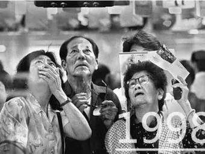

##正文

 
一

1995年，美国权威杂志《财富》，推出了一篇名为《香港之死》的封面专题报道，预言两年后香港回归中国后，将变成“一潭死水”。

拥有全球500强排行榜的财富杂志是全球最有公信力的媒体之一，因此，这篇封面专题也带动了西方主流媒体纷纷采取了悲观论调，看空97之后的香港。

在舆论引发的恐慌之下，一大批英国的富豪们纷纷开始撤离，而不知不觉中，大量的美国游资却在偷偷的涌入。

随着资本的不断涌入，在这两年的时间里，恒生指数在直线拉升突破了16666点的历史最高位，香港房价更是翻了一倍，香港的资本市场似乎正以欣欣向荣的姿态欢庆回归祖国。

当然，这一切，都是资本布的一个局。

1997年7月2日，就在五星红旗在港岛上飘扬的次日，以索罗斯带头的美国游资发动一连串的打击，迫使香港的好邻居泰国放弃与美元联系汇率制，泰铢开启大规模贬值，东南亚金融危机爆发。

而此时，看到近年来一波波的避险资金涌入拉升股市而兴奋的香港市民们，并没有意识到这是一场席卷东南亚的风暴序曲，更没有想到索罗斯真正的目标是香港。

草蛇灰线，伏行千里。

1995年，就在财富杂志以《香港之死》带领着全球媒体看衰香港回归之际，索罗斯这个被财富杂志誉为资本市场最高水平的专家，此刻正在带领着他的量子基金布局泰铢。

作为美国在东南亚树立的民主标杆，在在国际舆论一边倒的压力之下，坚持采取政府管制的泰国财政部长被迫辞职，泰国资本市场对着游资们的洞门大开，

如果说，泰铢是这场大戏中的第一张多米诺骨牌，那么香港则是酝酿已久的高潮。

在计划中，在这一场血腥的收割之中，无论是嗜血的资本还是看空香港的媒体，都将在这一场围剿的盛宴中，名利双收。

而且他还还不用受任何的指责，因为剧本早就写好了，这一轮暴跌的屎盆子和引发的民愤，都将扣在收回香港主权的中国政府身上。

 
二

历史不会重演，但总会惊人的相似。

1990年，随着前一年的东欧剧变，美苏两大阵营的对立正在解体，吸收苏联在欧洲势力范围的欧盟迅速崛起，甚至连一贯高傲的英国，也决定加入欧洲汇率体系。

坐享美元霸权的美国资本家们，自然不愿意看到一个比苏联还有威胁的竞争对手出现，因此就放出了一条狗，他的名字叫索罗斯。

 

索罗斯并没有直接出击，而是跟五年后看空香港一样，一边通过基金会和智库推动舆论上看衰欧洲经济一体化，一边提前潜伏起来等待时机。

1992年2月7日，等了两年之后，时机终于来了。

欧盟12个成员国签订了《马斯特里赫特条约》，启动货币上的统一，随即，布局已久的索罗斯开始启动他做空欧洲的计划。

配合着国际舆论上对欧盟和货币一体化的看空，索罗斯牵头的美国财团们开始大量做空“欧洲泰国”的意大利，在打爆意大利里拉后，财团们旋即集中火力猛攻“欧洲的金融离岸中心香港”英国。

法德两国在国际舆论的压力之下，为了维护自由市场的尊严，再加上欧洲刚启动一体化缺乏联动机制，导致迟迟无法实施对英国的援助，而英国国内强大的脱欧派也在政府的救助计划中作梗。

最终，使得索罗斯一战成名，将英格兰银行踩在脚下，成为了世界上首个战胜英国中央银行的男人。

 
三

随着索罗斯在对抗英格兰银行过程中取得的骄人战绩，使得其成为资本市场乃至坊间流传的神话。

当时流传着一个段子，如果一个外汇交易员听到消息说日本央行干预市场，大家会哈哈一笑，该干什么干什么；如果一听说“Soros in!!"，所有交易员会立刻跳起来行动，可见当时索罗斯的威名和实力。

但实际上，索罗斯能够撬动的那点资产，对于数百年积淀的伦敦城，根本就是九牛一毛，英国佬捏死他并不是什么难事儿。

索罗斯能够单挑一国央行的背后，靠的可不仅仅是个人的奋斗，而是随着苏联解体，”统一”的欧洲成为美国的主要对手，肢解威胁美元霸权的欧洲货币体系便成为了躲不开的历史进程。

同理，随着1997年全球自由港香港的回归中国，对于遏制迈向统一的中国，以及防止整个亚洲经济的一体化，也是维护美国国家利益的一种体现。

于是，随着美联储在1995年进入加息周期，索罗斯再一次肩负起历史的宿命，返回东南亚以香港为目标，替美国来实施“亚太再平衡战略”。

只不过，这一次他的对手后面，站着一个他未知的对手。

 
四

1997年7月末，港币和港股就如事先写好的剧本一般，遭遇到了资本市场恶意的抛售，不仅与美元挂钩的港币汇率受到严重冲击、恒生指数以及期货指数更是直线下滑，在祖国回归之际，市场反而出现了极度的恐慌。

香港作为自由港，长期以来都是采取不干涉政策，以至于面对索罗斯的咄咄逼人，香港金管局总裁任志刚被舆论戏称“任一招”，每每金融炒家做空的时候，金管局唯一的一招就是提高利率，增加金融炒作的成本，来维持港币对美元的汇率。

但是提升利率不仅重创了香港的实业，还引发了对利率极其敏感的房地产和股票的狂跌，造成了市民阶层的极度恐慌。

 

而且，早已埋伏股指做空的索罗斯们，反而因为香港的“任一招”政策赚得盆满钵满，拥有了更多的筹码可以继续做空。

本来，香港也可能和泰国那样按照剧本被国际炒家们击溃。

但是，香港回归之后，背后就有了一个比英国强大的祖国，旋即，在香港上市的24家蓝筹红筹的上市公司开启了大规模的市场扫货，炒家们抛多少，中国国家队就买多少，直接帮助港府稳定住了资本市场，也稳定住了汇率。

甚至由于国家队买入时间点对港府决策层完全透明，还使得金管局还在买卖港元过程中获利颇丰，并没有像其他东南亚政府那样过度耗损外汇储备，这也为最后的反击战留有了充足的弹药。

而几次交锋之后，感觉吃不下香港的索罗斯不得不将剑锋转移至印尼、缅甸、马来西亚等东南亚国家，开始在那边的肆虐。

香港金融战的第一阶段防御战，取得了阶段性的胜利。

 
五

当然，索罗斯身上是有着政治任务的，时隔一年之后，他调集全部力量回来了。

1998年7月，索罗斯们兵分三路，向香港汇市、股市、期市同时发难，恒生指数大跌2000多点之后，再次直线暴跌并洞穿6660点的“心理防线”。

在经历了一年的东南亚收割后，索罗斯的力量远比一年前要盛，因此便集中了全部的兵力，希望毕其功于一役。

此时，恒指距离一年前的最高点，已经跌了万点，民众与金融界人心惶惶。索罗斯更是在《华尔街日报》上公然叫嚣：“港府必败”！甚至还有炒家们口出狂言，要把“任一招”的香港当作他们的“超级提款机”。

此时，在国际炒家们的连续攻击之下，香港的资本市场纷纷认为“大势已去”甚至不少人开始跟着国际炒家们一起做空香港市场，引发利率飙涨，股市和房市狂跌不止。

就像中国历史上，每到危急存亡之秋，总有人站出来挽狂澜于既倒，扶大厦之将倾，在香港特别行政区成立一周年庆典大会上，董建华站出来了，他号召全体香港人“拿出前所未有的勇气”去战胜困难。

一个月后，他又以实际行动为全港市民做出了表率。

面对疯狂的国际游资，特首董建华只用了半个小时就做出了决定，不要怂，就是干！

政府入市干预！

董先生此举令整个西方世界哗然，《华尔街日报》甚至以“香港犯大错”为题，声色俱厉地指责特区政府违背了自由市场的准则，全球主流媒体几乎都是一边倒的斥责和丑化董先生。

也许，当时董先生心中也默念了林则徐说过的那两句话，并不为西方媒体的所动摇，在他的坐镇之下，调动起整个香港政府与国际炒家们进行全面的对抗。

作为首任香港特区行政长官，他要做的不只是不让股市和汇市崩盘，他有责任挽救整个城市，挽救香港开埠以来几代人积累下的财富。

而这一经典战役，也成为现代金融史上，最激动人心和波澜壮阔的一页。

 
六

如果说淮海战役是靠百万小推车推出来的胜利，那么香港金融保卫战的背后，则是数千万国内的下岗工人。

虽然大规模下岗令国内矛盾急剧激化，可是为了保住了香港几十年发展成果，中央政府还是咬紧了牙将资本调集到香港。

1998年3月19日，北京人民大会堂，面对众多海内外媒体，时任国务院总理朱镕基同志作出庄严承诺:“只要特区政府向中央提出要求，中央将不惜一切代价维护香港的繁荣稳定，保护它的联系汇率制度。”

而就在总理任命各部委官员之后，央行系统一套协助香港打赢金融战的班子，也建立了起来。

8月，随着国际炒家的资金开始集中做空，央行的官员们和枕戈待旦的内地资金也悄然进入香港市场。

获得国家助力的港府，得以通过各种秘密渠道大量买入国际炒家抛出来的空盘，起手就将恒指从6660点一路推至7820点，使得索罗斯等炒家们的账面上出现巨额亏损。

对此，炒家们自然不甘心，但并没有想到其中还有“国家队”的身影，便继续从全球资本市场筹集资本制造空单，利用作为攻击方的先手优势，不断在午盘和尾盘集中砸盘来击溃港府当局的信心。

而手里有粮心里不慌的港府便敞开大门让他砸，在结算日之前只做弹性防御，不断诱敌深入吃进炒家们的空单，等待的，就是结算日的那一场大决战。

1997年8月28日，这一天是恒指期货8月合约结算日，也是双方决战的这一天。

在多空双方定价权的搏命拼杀之下，上午开盘仅五分钟，成交额就达40亿，在这一天里，杀红了眼的炒家们集中全部资源在股汇两市拼死一博。

但是，背后有着12亿同胞支持的港府，仿佛有着无穷的筹码，最终还是把恒指锁定在了7800点之上，对索罗斯等炒家们手中的大量空单来了一个瓮中捉鳖。

随后，在9月港府又进一步推出了外汇、证券的结算新规，让恒指站上了8000点大关，将空单全部闷杀。

最终，在中央的坚定支持和董先生的带领下，这一战让索罗斯等炒家们损失惨重，宣布了香港金融战的胜利，也打破了索罗斯不可战胜的神话。

而就在香港金融保卫战打赢的，香港全球金融和自由港重新迸发出活力之后，丧失了筹码的美国贸易谈判代表，不得不在中国进入WTO贸易谈判的协议上签字，中国从此按上了经济高速发展的引擎。

 
尾记

2001年，举世瞩目的《财富》全球论坛选择在香港召开，此时，香港已经一扫当年危机时的阴霾，重新回到了全球镁光灯的中央。

活动现场，当策划《香港之死》的财富杂志主编被记者要求再度评价香港时，无奈的他不得不说了一个词——“活力之都”。

##留言区
 

