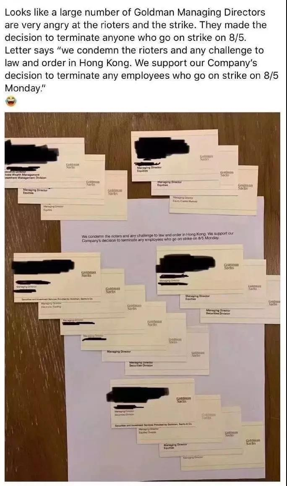

##正文

2003年，北京

那一年，突如其来的SARS，让很多人在春季中感受到了寒冬般的凉意。

此时，以华盛顿邮报为代表的西方媒体开始大肆宣扬“中国病毒”的威胁，甚至新加坡总理吴作栋公然拒绝访问中国。并表示中国需要花2到3年的时间来治理SARS，在此期间，外资应该撤离中国，而不应该“把 所有鸡蛋放在一个篮子里”。

一时之间，随着两年前加入世贸而带来的大好局面戛然而止，大批外商纷纷开始撤离，整个市场人心惶惶。

而就在不明真相的老外们纷纷乘坐飞机逃离中国的时候，一家从纽约飞来的专机落在了首都机场，来者就是被冠以“华尔街权力之王”头衔的高盛董事长保尔森。

 

应时任北京市长之邀访华的保尔森，不仅以实际行动向西方展示SARS之后中国的安全，更通过媒体向外界表示“在纽约被车撞到的概率，远远大于从美国到中国来一趟而得上SARS的概率。”

而且，作为全球经济界的大佬，保尔森更是对中国经济做出了积极的判断，打破了西方经济界对SARS之后中国发展的悲观态度。

以至于《人民日报》海外版在头版头条刊文，称他“患难之中见英雄”，甚至当时的浙江省级晚报都亲切的称之为“华尔街一哥”。

 

当然，成年人的友谊最初往往都是从利益开始，就在保尔森访华之前，高盛内部就启动了代号“汉克计划”的一个方案，准备让高盛成为第一家在中国开设证券公司的外国投行，而汉克，就是高盛内部对保尔森的昵称。

就在保尔森离开北京的几个月后，北京市的一份报告递交到了证监会，请求同意刚刚成立的北京高华证券与高盛成立一家合资证券公司。

不过，值得玩味的是，组成北京高华证券的方风雷等人，注册资本共计8.04亿，而同期，方风雷等人又向高盛借9775万美元，按照当时的汇率计算，刚好也是8.04亿元。

虽然大家都明白是怎么回事儿，但又有谁会为难曾与中国人民共患难的老朋友呢？

于是，就在逆行访华的次年，2004年，高盛通过“曲线方式”在中国拥有了一家绝对控制权的投行。

而2004年对于中国来说，也是一个重要的历史时刻，在这一年，随着WTO合作的推进，中国的市场经济地位得到了众多国家的认可，国内各类企业都出现了迅猛发展的势头，而提前布局的高盛，则把握住了最好的机会。

甚至这都成为了高盛员工们晋身的阶梯，阿里巴巴的二把手蔡崇信，腾讯的二把手刘炽平都曾是高盛员工，百度的二把手马东敏早年也是在美国混高盛圈子的。甚至滴滴的二把手柳青，则是代表高盛投资滴滴不成，然后毅然加入了滴滴...

更不要说高盛的大Boss保尔森了，在推动中国市场化的过程中，他与一大批中国分管经济的高级官员们建立的深厚友谊，而这又成为了他跻身布什政府内阁的重要筹码。

 

2006年，在出访中国并会见了一大批的中国经济决策者的一周后，保尔森返回白宫，与布什长谈了一个下午，在取得布什承诺，拥有与国务卿和国防部长一样成为高级内阁成员之后，保尔森同意出任财政部长，也成为了美国政府有史以来权力最大的财政部长。

而这位中国人民的老朋友刚刚上任就马上出访中国，在他和他的老朋友们推动之下成立了中美双边对话机制，而这个各层次各领域的全面对话通道，也成为了未来十年中美经济全面挂钩的基石。

当然，对政治如此热衷的高盛人，保尔森而不是唯一的，这种政治敏感的基因是刻在高盛骨子里面的。

作为一家150年历史的金融机构，高盛的高管们完美地演绎了什么叫做铁打的高盛，流水的总统，每一届的总统上台前都要大骂他们，可上台后还得继续用他们。

譬如特朗普在竞选的时候，为了争取支持就多次指责希拉里为华尔街站台，并承诺自己上台后会遏制华尔街。

甚至，在2016年11月初的竞选宣传片中，特朗普阵营还特别附上高盛现任CEO的照片以抨击万恶的金融巨头。

可以一上台，特朗普就在内阁班子里面安排了三名高盛员工作为褒奖，而且特朗普针对资本市场的减税政策更是让高盛们赚得盆满钵满。

同样，被特朗普一直盯着骂的奥巴马，在竞选时声称坚决反对挽救华尔街，要打击那些贪婪的资本家，可是他上台后，财长和经委主任都是前高盛董事长一手提拔出来的。

于是，每隔几个星期，就有一名高盛高管进入奥巴马政府的财政部或美联储等重要部门，最终推动万亿美元针对华尔街的大规模救助计划。

 

就像保尔森时期的高盛曾在年报中如此写道：“高盛有着担任公职的悠久传统。许多曾经的高盛人后来都走上政府和非营利机构的重要位置，他们的成就是我们所有人的自豪。”

当然，美国内阁成员的年薪只有十几万美元，相比高盛大佬们动辄几千万美元的年薪以及以亿为单位的股权奖励都相形见绌，可大佬们还是热衷于政坛，这也是有原因的。

首先，投行大佬们几千万美金的年薪虽然已经已经很逆天了，但他们最主要收入是公司的股票期权。在美国卖股票是需要缴纳巨额的增值税的，由于手握的股票期权实在是太多了，甚至有人需要支付亿级的税金。

美国法律又有一个漏洞，出任公职需要撇清与前公司的联系，因此必须抛售所持的公司股票。而出任公职出让股票可以免税，因此高盛大佬们在公司干够本之后，往往会选择通过进入政坛而享受豁免缴税。

其次，掌握了美国政府的权力之后，便可以将权力与金融相融合。

譬如就在保尔森上任的一年后，次贷危机爆发，财长保尔森否决了对高盛老对头雷曼兄弟的救助，却随后救助了一大批高盛投资的金融机构。

最后，投行大佬们不仅与美国国内的众多企业有着千丝万缕的联系，甚至即使伊朗、委内瑞拉等跟美国对抗的国家，也很放心的把外汇储备交给高盛打理。

因此，在美国的体制下，朋友圈遍天下的高盛大佬们很容易被各股势力推上台，成为游说美国政府的代理人，毕竟，游说一个算了几十年帐的投行大佬可比同时应对数百个国会议员容易多了。

而且，精于计算并在各国高层均拥有庞大人脉网的高盛大佬们，能够很轻松知道各方手里握有什么牌，因此也总能做出对自身最有利的决策。

所以，当最近一则图片流出，高盛的大佬们一致谴责暴乱分子，并决定解雇参与闹事儿的员工时，**意味着他们已经提前探明美国政府的底牌和未来的结果了**，像16年前那样，看好中国的未来，再次提前布局了.....

不出意外，未来我们又会有不少的老朋友了......

 

##留言区
 

