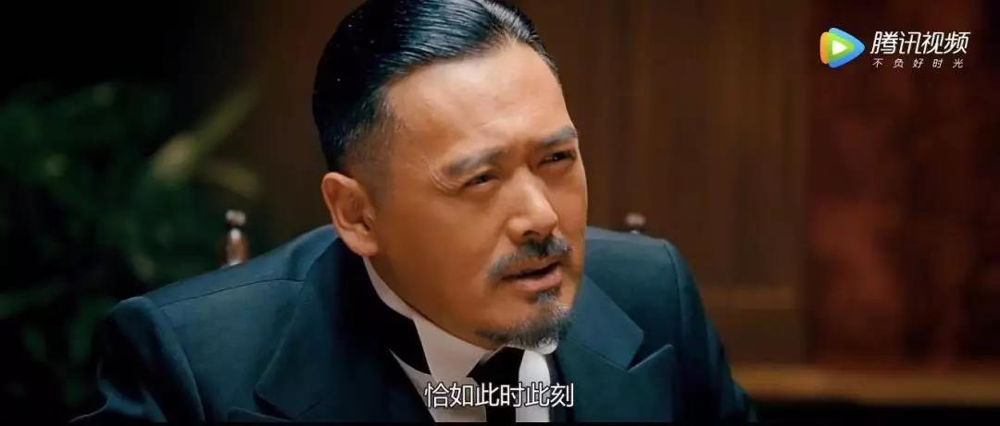
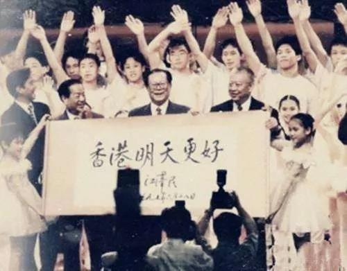
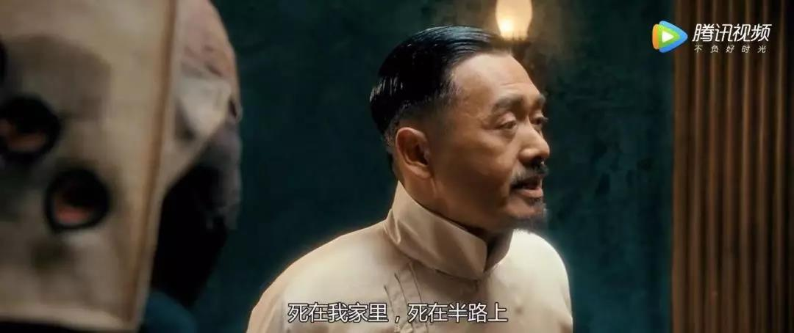
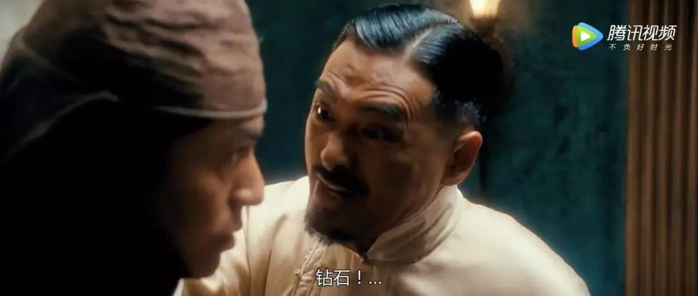
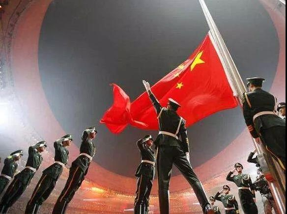
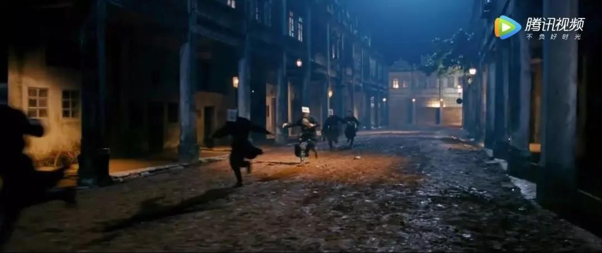

##正文

本文原创作于19年8月4日，作者进行部分修订

 

 

 
一

1995年，美国权威杂志《财富》以一篇《香港之死》的封面报道震惊了全世界，专稿通过各方面详尽的叙述，预言香港回归中国后将变成“一潭死水”。

作为全球最有公信力的媒体之一，财富杂志的全球500强排行榜更是被全球企业级大佬们奉若圭臬，因此随着这期杂志的刊印，西方主流媒体纷纷加入到看空香港回归的阵容。

三人成虎，在舆论引发的恐慌之下，大批英殖民地时期成长起来的富豪和企业纷纷加速撤离，甚至很多不明就里的香港人也纷纷抢着移民，似乎要给大陆留一个空壳的香港。

不过，英资的疯狂撤离并没有引发资本市场的下行，因为写了《香港之死》的美国人，此时正在驱动资本大规模的进入香港。

随着美元资本的不断涌入，在回归前的两年，恒生指数暴涨50%，突破了16666点的历史最高位，香港房价更是翻了一倍，资本市场在国际炒家的支持下，仿佛一片欣欣向荣的欢庆回归。

当然，这一切都是资本布的一个局，Dollar的另一面就是美刀，国际炒家们此时的涌入，就是为了打击香港的“明天”。

 

1997年7月2日，就在五星红旗在港岛上飘扬的第二天，酝酿两年已久的收割计划正式启动。一场蓄谋已久的风暴率先袭击了泰国，在索罗斯带头的美国游资发动一连串的打击下，泰国政府放弃与美元联系汇率制，随即泰国股市汇市双双崩盘。

而此时，看到一波波避险资金涌入港岛股市和房市而兴奋的香港市民们，并没有意识到这将是一场席卷东南亚风暴的序曲，更没有想到这些国际炒家们的真正目标，就是刚刚回归的香港。

 
二

草蛇灰线，伏行千里。

1995年，就在财富杂志以《香港之死》带领着全球媒体和资本市场看衰香港回归之际，索罗斯，这个被财富杂志誉为资本市场最高水平的专家，此刻正在带领着他的量子基金布局泰铢。

作为美国在东南亚树立的民主标杆，在国际舆论一边倒的压力和美国政府的强烈要求之下，坚持采取政府管制的泰国财政部长被迫辞职，泰国资本市场至此洞门大开。

之所以选择泰国作为切入口，是因为索罗斯们明白，直接搞垮拥有全球第三大美元外汇储备，与整个东南亚拥有密切经贸往来的香港，几乎是一个不可能完成的任务，更不要说香港的背后还有着庞然大物的中国。

因此，想要完成这个不可能完成的任务，就必须引发整个东南亚市场的恐慌，造成践踏式的资本撤离。

就像索罗斯自己说的，羊群效应是他每一次投机成功的关键，所以，美国的炒家们需要一只头羊先动起来，才会让其他的羊也不假思索地一哄而上。

而最合适的目标，莫过于冷战时期北约在东南亚的大本营，美国人经营了半个多世纪的泰国。

因此，在美国政府一系列的“窗口指导”下，昏招频出的泰国成为这一轮东南亚风暴中倒下的第一张多米诺骨牌，股市、汇市、房市全面崩盘，一度繁荣的泰国瞬间坠入人间炼狱。

当然，泰国只是一个先动起来的羊，在国际炒家们的打击下，随着周边的东南亚国家梯次崩盘，东南亚的金融中心香港自然难以独善其身，成为餐桌上的猎物。

只要将香港击垮，那么这一场围猎的盛宴中，无论是事先布局东南亚的资本，还是两年前就精准预测看空香港回归的媒体，都将以胜利者的姿态名利双收。

而且，他们的胜利还不会受到任何的指责，因为剧本早就写好了，这一轮暴跌的屎盆子和引发的民愤，都将扣在收回香港主权的中国政府身上。

所以，选择7月2日，中英“鸿门宴”后的第二天，就成为了索罗斯等国际炒家们最佳的突袭时间。

 

 

也许，就这么把香港这颗镶在王冠上的钻石还给中国，无论英美谁都不甘心，因此便定下了这个“杀鸡取卵”之计，先用钻石麻痹众人，然后再组织队伍抢回来。

 

当然，索罗斯的对手并没有闭眼睡觉，中国国务院一只高规格的考察团此刻在东南亚各处进行详细的调研，成员中，就有20年后成为中国央行行长的易先生。

 
二

历史不会重演，但总会惊人的相似。

1990年，随着前一年的东欧剧变，柏林墙的倒塌，美苏两大阵营的对立正式解体。此时，吸收苏联东欧势力范围的欧盟迅速崛起，甚至连一贯高傲的英国，也决定加入欧洲汇率体系。

一旦欧洲人联合起来搞“一国N制”，GDP加起来将远超美国，必然会形成一股威胁美国霸权的势力。

因此，坐享美元霸权的资本家们，自然不愿意看到一个比苏联还有威胁的竞争对手出现，于是，他们就放出了一条狗，名字叫做索罗斯。

 

聪明的索罗斯面对庞大的欧盟并没有直接出击，而是跟五年后做空香港一样，一边事先通过基金会和智库推动舆论上看衰欧洲经济一体化，一边提前筹集资金潜伏起来等待时机。

1992年2月7日，蛰伏两年之后，索罗斯的时机终于来了。

这一天，欧盟12个成员国签订了《马斯特里赫特条约》，启动货币上的统一，随即，布局已久的索罗斯立刻启动他的做空欧洲计划。

配合着国际舆论上对欧盟和货币一体化的看空，索罗斯牵头的美国财团们开始大量做空“欧洲泰国”的意大利，就像两次世界大战中的那样，意大利再一次率先撑不住高举白旗。

当然，炒家们打爆意大利只是为了挑起市场情绪，制造恐慌成功的索罗斯旋即调转枪口，集中火力猛攻“欧洲香港”的英国。

此时，欧洲刚启动一体化缺乏联动机制，决策起来异常困难，再加上美国主导的国际舆论要求欧洲维护自由市场，还有英国国内强大的脱欧派也在政府的救助计划中作梗。

因此，唯一能对抗索罗斯的，只有欧盟的牵头者德国。可是由于东西德刚刚合并，德国政府要对东德庞大的失业人口救助而无力施加援手，最终，德国人婉拒了英国的援助请求。

于是，这场一个人挑战一个国家的战役，仅仅进行了半年就结束了，1992年9月15日，英国宣布退出欧洲汇率体系。

而这次的退出，也为二十多年后的英国脱欧埋下了一个重要的伏笔。

 
三

炒家和韭菜之间最大的差异，也许就是能否透过现象看本质。

索罗斯大战英格兰银行之后，全球媒体们很默契的没有讨论英国脱离欧洲货币体系引发的深远影响，也没有深究美国在此次事件中的动作，而是把镁光灯都聚焦在了索罗斯身上。

在媒体们的炒作之下，成功预判德国国家战略的索罗斯一战成名，成为了世界上首个战胜英国中央银行的男人，也成为了资本市场上的神话。

甚至坊间还流传着一个段子，如果一个外汇交易员听说日本央行干预市场，大家会哈哈一笑，该干什么干什么；可如果一听说“Soros in !”，所有交易员会立刻跳起来行动。

当然，这都是编给老百姓们听的故事，真正的大佬们都明白，就索罗斯能够撬动的那点资产，对于数百年积淀的伦敦城根本就是九牛一毛，只要内部达成一致，三喵军团掐死索罗斯就跟掐死一只耗子一般的容易。

这背后的逻辑其实不难，就像一位长者说过的，一个人的命运当然要靠自我奋斗，但也要考虑到历史的进程。

索罗斯之所以能够顺风顺水，是因为随着苏联解体，“一国N制”的欧洲取代了苏联成为美国的主要对手，欧洲的货币体系更是直接挑战了美元的霸权。

 

因此，美国的老爷们自然就需要一些狗腿子，去替他们搅得天下大乱，防止欧洲的“一国N制”。

 

历史不会重演，但总会惊人的相似。

随着1997年香港从英国回归大陆，未来中国也将以“一国两制”的模式，从美国手中收回台湾。

因此，对欧洲这个离岸平衡的逻辑，自然也从亚欧大陆的西侧复制到了东侧，搞乱香港对于美国来说，既可以阻碍中国的统一大业，又可以遏制亚洲经济的一体化。

于是再次放狗，也就成为美国维护国家利益的一种必然选择。

1995年，随着美国进入加息周期，美元资本开始了流回，索罗斯再一次扛起了历史的进程返回东南亚，以香港为目标，替美国来实施20年前的“亚太再平衡战略”。

只不过，刚刚打赢米字旗的索罗斯没有想到，这一次他的对手紫荆花旗后面，站着一个远超他想象的对手。

 

 
四

1997年7月末，港币和港股就如事先写好的剧本一般，遭遇到了资本市场恶意的抛售，不仅与美元挂钩的港币汇率受到严重冲击、恒生指数以及期货指数更是直线下滑。

就像媒体和资本家们计划中的那样，回归后的香港迅速进入了羊群状态，市场出现了巨大的恐慌，回想到美国媒体两年前“香港之死”的预判，很多人都在拼命抛售股票与房产。

而面对索罗斯们的进攻，延续着英国文官制度的香港一时间也被打了个措手不及，作为全球最著名的自由港，港府长期以来都主张不干涉货币政策，并没有太多的反击手段。

而这种放任的行为面对索罗斯的咄咄逼人瞬间变得无效，香港金管局总裁任志刚被舆论戏称“任一招”，每每金融炒家做空的时候，金管局唯一的一招就是提高利率，增加金融炒作的成本，来维持港币对美元的汇率。

但是，提升利率不仅重创了香港的实业，还引发了对利率极其敏感的房地产和股票的狂跌，造成了市民阶层进一步的恐慌，看着手头的股票和房产一朝回到解放前，无数人都崩溃了。

 

而使用美元兑换的港币，早已埋伏股指做空的索罗斯们，反而利用香港“任一招”的加息政策在期货市场赚得盆满钵满，拥有了更多的筹码可以继续做空港币和港股。

此时的香港由于机制问题，几乎已经成为了国际资本大鳄桌子上任人宰割的小羊羔，闻到血腥味的鲨鱼纷纷跟着索罗斯涌入，加入到这一场血腥的盛宴中，誓要将香港建埠以来几代人创造的财富掠夺一空。

就在恒指屡创新低，香港资本市场阴云压顶，所有人都一脸绝望的时刻，一群“红色”的超级玩家们出现了，同一时间，香港上市的24家蓝筹红筹的上市公司开启了大规模的市场扫货，炒家们抛多少空单，国家队就买多少。

超级玩家们不计成本的扫货，不仅直接帮助港府稳定住了资本市场，更稳定住了港币的汇率。

甚至由于国家队买入时间点对港府决策层完全透明，还使得金管局在买卖港元过程中获利颇丰，并没有像其他东南亚政府那样过度耗损外汇储备，这也为最后一场的血战储备下了充足的弹药。

对于索罗斯等国际炒家们来说，超级玩家们的出现打了他们一时措手不及，毕竟大家都是要赚钱的，因此几次交锋下没吃到好处后，他们选择先将重心转移到印尼、缅甸、马来西亚等相对脆弱的东南亚国家。

随着索罗斯带领的国际炒家们的攻城略地，东南亚无数家的银行破产，股市梯次崩盘，没有国家力量保护的东南人民突然发现，他们曾经拥有的财富都被索罗斯刮起的风暴所卷走。

而背靠强大祖国的香港，此刻则成为了这场东南亚金融风暴中平静的台风眼。

 
五

该来的，总是要来的，战略上的收缩，是为了打出更猛烈的一拳。

时隔一年之后，横扫东南亚的索罗斯，带领着一大群腰带上挂满了战利品的国际炒家们，再一次将枪口瞄向了港岛。

1998年7月，索罗斯们兵分三路，同时向香港汇市、股市、期市发难，恒生指数大跌2000多点之后，再次直线暴跌并洞穿6666点的“心理防线”和股票质押线。

此时，距离一年前的最高点，恒指已经重挫了一万点，房价也已经腰斩。

而经历了一年的东南亚收割后的索罗斯，力量远比一年前要强大的多。

就像五年前，在数百万的东德失业工人的压力下，德国放弃了救助英国，五年后的中国大陆，1998年，一场史无前例的下岗潮正在全国蔓延，数千万的国家主人翁们突然间就丢了他们的铁饭碗。

 

看到幸运女神的再一次眷顾，信心满满的索罗斯《华尔街日报》和CNN上公然叫嚣：“港府必败”！并四处游说其他国际炒家，希望毕其功于一役，一举掀翻香港。

而看到机遇的国际炒家们更是口出狂言，誓要把“任一招”的香港当作他们的“超级提款机”。

就在国际炒家们摩拳擦掌之际，另一边的香港金融界却已未战先溃，由于他们的精神母国早在六年前就被索罗斯按在地上摩擦，没有人相信香港会比英国更厉害，汇丰渣打会比英格兰银行更厉害。

而且整个东南亚在国际炒家打击下全面沦陷，使依赖于转口贸易的香港不仅经济上沦为孤岛，各国放在香港的外汇更是早已纷纷抽回救命。

因此，香港的资本市场从上到下纷纷认为“大势已去”，甚至不少人开始转过头来当汪精卫，跟着国际炒家们一起做空香港市场，引发港币汇率危机，股市和房市更是狂跌不止。

此刻，香港到了最危急的时刻。

就像中国历史上，每到危急存亡之秋，总有人站出来挽狂澜于既倒，扶大厦之将倾。

值此万马齐喑之际，在香港特别行政区成立一周年庆典大会上，特首董建华站出来了，他号召全体香港人“拿出前所未有的勇气”去战胜困难。

一个月后，他又以实际行动为全港市民做出了表率。

面对疯狂的国际游资，特首董建华只用了半个小时就做出了决定：不要怂，就是干！

请求中央政府的支持！港府入市干预！

董先生此举令整个西方世界哗然，《华尔街日报》甚至以“香港犯大错”为题，声色俱厉地指责特区政府违背了自由市场的准则，全球主流媒体几乎都是一边倒的斥责和丑化董先生。

这对于已过花甲之龄的老人来说，不啻于一击暴击，十几年的媒体宠儿到老，却成为了人人喊打的过街老鼠。

我们并不知道董先生当时是如何下的这个决定，也许当时董先生心中也默念了林则徐说过的那两句话，以决然的姿态把即将投降香港政府重新振作起来，与国际炒家们进行全面的对抗。

作为首任香港特区行政长官，他要做的不只是不让股市和汇市崩盘，他有责任挽救整个城市，有责任挽救香港开埠以来几代人积累下的财富，只有这样，才能不愧历史，不愧于炎黄子孙。

而这一经典战役，也成为现代金融史上，最激动人心和波澜壮阔的一页。

 
六

如果说淮海战役是靠百万小推车推出来的胜利，那么香港金融保卫战的背后，则站着数千万国内的下岗工人。

虽然大规模下岗令国内矛盾急剧激化，可是为了保住了香港几十年发展成果，为了遵守“香港明天会更好”的诺言，中央政府还是咬紧了牙，从全国调集资本支援香港。

1998年3月19日，人民大会堂，面对众多海内外媒体，刚刚当选的朱总理在两会上作出庄严承诺:“只要特区政府向中央提出要求，中央将不惜一切代价维护香港的繁荣稳定，保护它的联系汇率制度。”

不同于西方政客，上台时的承诺都是说说而已，随着新一届国务院班子的成立，一整套协助香港打赢金融战的金融班子也在新任总理的任命下建立了起来，只要接到香港特区的请求，枕戈待旦的中央军随时可以起身迎战。

因此，两会几个月后，就在国际炒家们的资金纷纷涌入香港，开始集中做空的时候，人民银行和中国银行的高管们，也带着巨额的资金悄然进入了香港，准备给索罗斯挖坑了。

 

虽然索罗斯看起来很强大，但他的死穴也很明显，做空港币是上峰的行政命令，趁机做空港股才是他自己赚钱的买卖，只要在港股上的打击让索罗斯亏他自己的钱，那么在投资人的压力之下就必然得撤退，届时，香港的汇率威胁自然能够不战自解。

于是，在东方神秘力量的力推下，香港政府大规模买入国际炒家们抛出来的空盘，起手就将恒指从6666点一路推至7820点，使得赚了一年顺风钱的国际炒家们，账面第一次出现了巨额亏损。

对此，炒家们自然不甘心，但并没有想到他们背后的对手是谁，盘算着港府弹药消耗的索罗斯们继续从全球资本市场筹集资本加杠杆后继续制造空单，利用作为攻击方的先手优势，不断在午盘和尾盘集中砸盘，试图击溃港府当局的信心。

此时，拥有中央坚定支持的香港政府自然是手里有粮心里不慌，国际炒家们的空盘打下来多少，港府就拉起来多少，弹性防御之下，不断诱敌深入吃进炒家们的空单，等待的，就是结算日的那一场大决战。

1998年8月28日，决战日终于到了，这一天是恒指期货8月合约结算日，股指的数字，将决定了双方一个月天量多空博弈的最终成败。

此刻，盘算着港府已经打出了数百亿弹药的国际游资们自然是信心满满，准备毕其功于一役，誓要教育年轻的香港金融界如何做人。

面对国际资本大鳄，早已等待多时的中港联军也在股市、汇市、期指等多个战场展开了协同作战，港府金管局手握外汇主要负责汇率战场，以中银为代表的中港金融机构主要负责期指战场，而港交所内，央行则为港股24家红筹蓝筹公司提供了充足的弹药进行贴身的肉搏。

大决战开始了。

一年多来势如破竹的国际游资决定先发制人，股市一开盘就就试图以闪电战的大规模抛售击溃市场的信心，引发香港资本市场的集体倒戈。

却不想中港联军早就准备了充裕的弹药，上午开盘仅五分钟，港股成交额就达40亿，空方打出了以往一天的成交额，而股指却还紧紧的站在7800点之上。

此时，期货和汇率市场的贴身肉搏也在同时进行，在这场没有硝烟的战场之上，双方都在不计成本的倾泻火力和派遣预备队，一时之间，香港成为了资本的绞肉机，此刻上千亿的资本对于双的指挥官来说，不过是纸面上的数字而已。

三板斧打完，出师不利的国际炒家不得不频频更换攻击目标寻求漏洞，而防御的中港联军也一次次的将登上山头的敌军打了回去，此刻的香港仿佛回到了40多年前的朝鲜战场，只不过站起来的中国人民此刻抵挡子弹的不再是血肉之躯。

时间就这样一秒一秒的流逝，面对不断美式饱和攻击的倾泻，各条战线上的中国军队都在死战不退，每一次冲锋都被我们打了回去，最终，随着一声铃响，港股收盘，恒指被锁定在了7800点之上，在志愿军帮助下，香港政府对做空的国际炒家们来了一个瓮中捉鳖。

获取了胜利的香港政府随即宣布：在打击国际炒家、保卫香港股市和港币的战斗中，香港政府已经获胜！

进入9月，部分不服气的国际炒家仍然试图卷土重来，在中央的支持下，港府又进一步推出了外汇、证券的结算新规，在国家队公开的支持下，恒指进一步站上了8000点大关，将那些还试图做空香港的境外资本全部闷杀。

最终，亏了自己钱的索罗斯们在投资人的压力下，不愿意再充当炮灰，很快就与港府达成妥协，在各条战线逐步退出。

这一战，不仅打破了索罗斯不可战胜的神话，也断绝了当年索罗斯击溃英镑埋下的英国脱欧伏笔。

而且这一场失败也让“放狗”的美国资本家们，认识到一味的打击并不能获取利益，于是一度中断的WTO谈判很快得以重启。

一年后，随着香港迅速的繁荣和复苏，缺少了重要谈判筹码的美国贸易谈判代表，不得不躲在卫生间里，偷偷正在飞机上洗澡的克林顿打了个电话，然后无奈的在中国进入WTO的协议上签上自己的名字。

 
后记

2001年，举世瞩目的《财富》全球论坛选择在香港召开，此时，香港早已一扫当年危机时的阴霾，重新回到了全球镁光灯的中央。

活动现场，当策划《香港之死》的财富杂志主编被要求再度评价香港时，一脸愧疚的他不得不将“一潭死水”改成了“活力之都”。

##留言区
 

