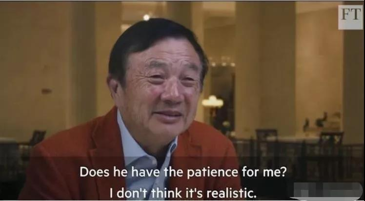

##正文

近日，一个外资银行CEO的离职，引起中国网友一轮叫好。

8月5日早，汇丰控股宣布，该行历史上最年轻的CEO范宁（John Flint）在上任不到一年半后将离职。

 

随着近年来汇丰不断缩减业绩不佳的欧洲和美洲业务，积极将战略重心转向亚洲，“中国的国际银行”成为了汇丰公司的口号。

不过，这家试图靠拢中国的公司，却在CEO范宁的任期内对中国搞了一个大新闻。

之前华为的孟大小姐在加拿大被抓，就是因为汇丰银行配合美国政府罗织可以打压的“证据”所致，任正非也在不久前的媒体访谈中确认了此事。

 

大概，这就是一边吆喝赚你的钱，一边背后捅你的刀子吧。

当然，对于汇丰来说，人家在中国搞背后捅刀子也是有着历史传统的。

 
一

清光绪七年，也就是1881年，大清首富胡雪岩站到了他人生中的顶峰，因协助抬棺出征的左宗棠收复新疆有功，被朝廷特赏穿黄马褂、带二品顶戴，并总办“四省公库”。

随即，这位爱国商人耗银2000万之巨在上海开办蚕丝厂，试图通过垄断丝茧贸易夺回国际市场的定价权，并以此支撑左宗棠东征西讨所需的军饷。

因此，中国历史上第一场中外大商战就这么开始了。

一开始，胡雪岩通过地利与人和，将国内新丝悉数收入囊中，占尽了先手优势，将外商打得节节败退，可不想此时中法战争突然爆发，引发国内金融动荡，而胡雪岩的靠山左宗棠更是被法国人缠的脱不开身。

而这就给左宗棠政敌一个非常好的机会，认为“倒左必先倒胡”的李鸿章立即开始了他的布局。

首先，李鸿章利用自己的影响力，要求东南各地方政府想尽办法拖欠应付胡雪岩的协饷，其次，他又让自己的钱袋子盛宣怀则联络各大商帮拒绝借钱给胡雪岩。

而李鸿章的杀手锏，就是胡雪岩的主要贷款银行，汇丰银行。

一天，汇丰银行突然通知胡雪岩，他的一笔80万两贷款将不予展期，需要立即偿还。

这下可把胡雪岩搞懵逼了，因为这笔钱是清政府以自己名义贷的，有地方协饷作为担保，相当于AAA的国家主权债务，没道理不予展期的。

而且，胡雪岩在汇丰的贷款有千万两的规模，是汇丰在国内最大的客户之一，双方利益捆绑极大，没道理搞这么一出。

可是，当胡雪岩从其他地方筹钱准备偿还汇丰银行的时候，旋即遭遇了李鸿章和盛宣怀埋下的伏兵，胡雪岩竟然无法从市场上融到一分钱。

随即，发现胡雪岩出现危机的各方立刻参与到挤兑中来，于是，手握数千万资产的胡雪岩，就这么倒在了几十万两的贷款上面，这位被鲁迅誉为中国封建社会最后一位商人，就这么被汇丰银行直接一刀捅死了。

很多人都怀疑，为啥汇丰宁可给自己造成千万的不良资产，也不愿意给自己最大的客户做几十万的展期？

历史给了我们答案，随着李鸿章击败左宗棠成为总理大臣，清廷也开启了大规模的对外借款，而有李鸿章支持的汇丰一家就拿到了整个清朝70%的业务，成为了亚洲最大的“投行”。

而凭借着给清政府不断的借款，曾经胡雪岩的黄马褂和二品顶戴，也最终成为了汇丰大班的标配，成为了清廷的红顶商人。

这一刀，捅得值。

 
二

1903年，这一年，大日本帝国和俄罗斯帝国为了争夺中国辽东半岛和朝鲜半岛的控制权，在满清的龙兴之地打了个昏天暗地血流漂杵。

此时，距离大清朝的覆灭只有八年的时间，明眼人都知道大清撑不了多久了，而关外龙兴之地都没了的满清贵族则都在给自己寻求退路，由于当时都没有存钱的习惯，王爷贝勒们往往都是在家里“面币思过”。

 

历史总是被不断打破的。

这一天，东郊民巷的汇丰银行迎来了一位铁帽子王，竟带来了足足120万两黄金。

当时黄金兑白银大概为1：60，这笔黄金数额之巨，相当于之前马关条约赔款的三分之一。

汇丰银行很清楚这笔钱来路不正，对方没有讨价还价的空间，于是摆足架子，多方刁难，数次往返，才答应收存，月息也仅给二厘。

而这位存钱的人，就是当时的大清首席军机大臣，总理外务部的铁帽子庆亲王奕劻。

天下没有不透风的墙，很快，庆亲王向汇丰银行存款的消息就被御史蒋式瑆知道了，于是蒋御史便以“风闻奏事”的特权对起诉并通过报纸大肆宣扬。

虽然贪腐问题在当时满清皇族都是普遍现象，此次的数额实在是过于巨大，足够武装一支百艘战舰的北洋水师，也够老佛爷修十几次院子，搞得举国震惊。

而且当时大清正在筹办大清银行，用以编练新军捍卫王权，急需原始资本金，而庆亲王作为首席军机大臣就是直接的负责人。

要知道，各地摊牌的大清银行股本才一千万两白银，而庆亲王一次就在外资银行存了七千万两，

因此，连自家王爷都不把钱存到大清的银行，这对于市场的信心打击实在是太大，于是面子上挂不住老佛爷让左都御史和户部尚书等人组长了一个庞大的专案组进行调查。

可是当专案组去汇丰查账的时候，却找不到任何进出帐的痕迹，120万两黄金就这么凭空消失了。

这样，事件的结果便出现了反转，被撤职查办的不是庆亲王，而是变成了百口莫辩的御史蒋式瑆。

而此次事件的爆发，虽然让庆亲王的名声大坏，大清银行也成为了草台班子，但是却是给汇丰银行一次绝佳的宣传机会。

当大家看到连首席军机大臣都往汇丰存钱，而且银行的保密与安全还做的这么好，于是一时之间，对清廷早就没有信心的公侯王孙们纷纷将自家的资产和古玩存入汇丰。

等到辛亥革命一声枪响，清廷又重蹈了当年大明王朝的覆辙，早把钱存到汇丰的满朝王孙连一分钱的军费都掏不出来，然后就被一锅端了。

由于汇丰存款不用实名制而使用“某记”，随着乱世大量王爷和军阀头子们的离奇去世，满清在中华大地搜刮了数百年的财富，最终都便宜了一家外国银行，使其拥有了无尽的财富.......

当然，成功哪有那么多的巧合。

背后捅了庆亲王一刀，将其存款信息透露给蒋御史的，就是汇丰银行。

这一刀，捅得更值！

 
尾记

回顾历史我们就会明白，看似客户至上的汇丰银行，当年就是通过捅了左宗棠和庆亲王各一刀，分别实现了投资银行和商业银行的历史性跨越，从一家默默无名的小银行成为全球金融巨擎。

而如果了解了这种基因的传承，也就会明白，如果对某些人不给点颜色看看，让他们磕掉几颗门牙，他们以后还是会继续捅刀子的，甚至还会带动其他蠢蠢欲动的搅屎棍。

所以呢，是否让在华为背后捅了一刀的汇丰进入“不可靠实体清单”，就看搅屎棍们接下来的表现了！ 

##留言区
 

