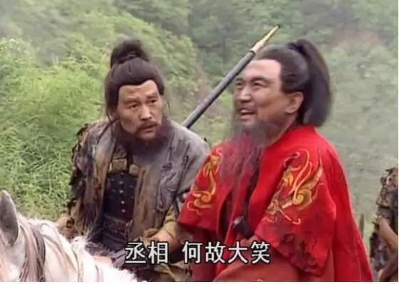
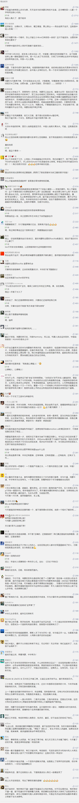

##正文

1964年10月16日，全世界的目光都集中在东京举行的第18届奥运会上，可是中国罗布泊一颗闪亮的蘑菇云却让东瀛闪耀的星光骤然泯灭。

曾经挨过两颗原子弹的日本，此刻正眼睁睁看着被自己多次蹂躏的“东亚病夫”，成为继美苏英法之后，第五个拥有核武器的国家。

而且，在原子弹爆炸后，周总理首先就把这个好消息分享给了日本首相佐藤荣作，并再三承诺，我们研发原子弹不会发动战争，不是用来打架的，只要别人不欺负我们国家，我们也不会对别人怎样。

 

一年前，就已经被美国告知中国可能会在近期试射原子弹，但却不以为意的日本人此刻才如梦方醒。

此刻的日本人，就像被宿舍经常欺负的室友叫醒，说他新买了一把菜刀那样，看到蘑菇云后的第一反应就是赶紧找“告状”。

作为日本反华派的先锋，首相佐藤荣作紧急拜会美国爸爸，向总统约翰逊表示，既然中国人有了“蛋蛋”，那么我们日本人也必须要有。

听完汇报，约翰逊爸爸赶紧慰安佐藤，一边抽着烟一边表示，既然已经都净过身了，我会对你负责的，虽然蛋蛋不能有，但我可以给你提供核保护啊。

有了安全措施的保障，佐藤回国后底气也是硬了，这位首相向下属们表示，中国只能搞点原子弹，可咱爸爸有威力巨大的氢弹保护咱们，根本不用怕。

 

不过，佐藤首相还是高兴的有点早，三年后，1967年，中国再一次成功发射了氢弹。

这次，吓尿了的佐藤又赶紧去找约翰逊爸爸，可是这次约翰逊爸爸直接翻脸无情，逼着日本签署核不扩散条约。

刚离虎穴又进狼窝的佐藤急忙大叫：不“约”不“约”，爸爸我们不“约”！
.......

 

嗯，究竟发生了什么我们并不知道，不过当年12月，回国后的佐藤在国会正式提出了“无核三原则”方针。

而且，这位首相还私下向下属们表示，中国就算有核武器又如何，技术落后的他们又没有精准的运载设备。

 

当然，首相这一次似乎又高兴的有点早，三年之后，1970年，中国长征运载火箭把卫星都送上了天。

这次，佐藤再想去“约”约翰逊，可惜已经约不上了，此时的美国总统已经成了尼克松，而他正准备秘密访华建立牢固的中美友谊。

 

嘿嘿，事情总是进展的比预想的要快。

就在1970年中国两弹一星全部完成后，1971年7月，尼克松发布即将访华的核弹级重磅声明，10月，联合国大会恢复中国的安理会合法权力，1972年2月，尼克松访问中国，签署了中美上海公报.......

此时被爸爸忽悠多年的佐藤才如梦方醒，请求亲自访华，但却被当年第一个就通知他中国核试验成功的周总理拒绝了，中国表示不以他为谈判对手。

最终，这位连任三届、战后任期最长的日本首相不得不黯然下台，换上了中方接受的谈判对象田中角荣。

从此以后，那些曾经喜欢闹腾我们的国家，都不自觉的开始习惯，先听中国讲讲真理，然后真心诚意的被真理所shui服。

 

不战而屈人之兵，这就是“两弹一星”的威力，虽然不能吃不能喝，甚至都不能用，但是就像基础科学那样，无用之物方有大用。

在当年研发原子弹的过程中，我们被美国、英国等西方国家一起围剿，日本和老蒋也不断的使绊子，甚至苏联还威胁使用战术核武器打击。

可是，随着罗布泊的那一声巨响，联合日本准备反攻大陆的老蒋彻底蔫了，转而开启对话，一度剑拔弩张的中苏关系迅速缓和，熊哥连珍宝岛吃了那么大的亏都忍了，甚至英美更是手拉手把中国往西方社会里面拉。

曾经被各路诸侯围剿的我们，立刻成为了大家都在拉拢的对象。

而且，有了这个筹码之后，曾经被万般阻挠的我们，转身成为牌桌上的玩家，然后和其他玩家一起，去封其他棋子们进入的大门。

我们可以对比一下原子弹爆炸前后中方的态度：

>1963年：中方认为，美英苏三国在莫斯科签订的部分禁止核试验条约，是一个愚弄世界人民的大骗局！

>1964年：中国郑重建议召开世界各国首脑会议，讨论全面禁止和销毁核武器问题。

 

 

事物之间的逻辑，往往都是相通的，当年中国围剿之中发射原子弹的意义，这是正值中国科技界被美国围剿，五家科技公司同时被禁之际，华为发布的鸿蒙OS的意义之所在。

 

就像段子手们写的那样：

>美国为啥要以可能有大规模杀伤性武器为由入侵伊拉克？
>那是因为美国人知道他没有。

>那么美国为啥不打违规拥核的朝鲜？
>因为他真的有。

想一想萨达姆、卡扎菲，再对比一下如今的朝鲜........历史已经无数次的证明了，当美国指责你有什么问题的时候，你最好真的有。

而中华有为的华为，面对美国的科技围剿，甚至连安卓系统都不允许用的时候，这次就真的“有”了。

 

华为的鸿蒙系统，在未来的物联网时代，就是这个零到一的突破，就像当年的核弹那样，虽然我们承诺不“首先”在手机上使用，但是未来足可以把美国人逼到桌子上，凭实力换来的筹码，以后就有机会一起“分赃”。

因此，就像罗布泊的那颗核弹，既没有投射工具当量也不足，华为此次推出的系统相比于成熟的安卓系统可能会有一些不尽如人意的地方。

没什么一开始就是完美的，人谁无过，有过则改，咱能用就尽量用，有问题就指出来，有咱14亿人的支持，就能一起推动鸿蒙的进步！

就像当年我们最困难的时刻，尚能三年炸氢弹，三年射卫星，凭借着中国人民的智慧和毅力，总有一天，会让西方人再次见识到：

咱们中国人，我命由我不由天 ！！

 

##留言区
 

