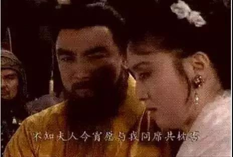

##正文

今天放松放松脑子，写一则三国的段子

说起三国，坊间有一个流传甚远的段子：“东吴控萝莉，曹魏爱人妻，蜀汉全是基”，由于曹操总是喜欢把战败对手的老婆收入帐中，因此曹操这个“人妻控”的名声也一直在三国聊天中被广泛传播。

那么，曹操真的是喜欢人妻么？

当然，”人妻“之类的说法，那都是小孩子们关注的，争夺天下的各路诸侯们考虑的当然都是利益。

在三国时代，无论是曹操刘备还是孙权，这些家族势力远不如那些袁绍袁术兄弟的诸侯们，家底不厚是他们的先天不足。

试想官渡之战的时候，曹操一大批的手下几乎都在和袁绍暗通款曲，就会明白对于曹操来说嫡系部队的重要性。

所以，曹操每逢干掉一个对手，都喜欢把对方的老婆收到帐下，并不是有多么爱人妻，而是在吸收对方的势力，让每一次的战争都能壮大自己。

 

而且，古代搞是门当户对的一夫一妻制。

因此，曹操对手的老婆们家里势力也都非常雄厚，而早已结婚的曹操是无法通过联姻获取这种政治联姻的，因此，这种收纳未亡人的方式，能让曹操随着领土的不断扩张，也成为了众多势力的好女婿，并得到他们的支持。

所以呢，曹操对于那些“喜当爹”的事件就不是很在意。

 

毕竟就像历史上“田氏代齐”中，田成子为了多生儿子不惜让敞开大门，让门客们半夜来帮忙。同样，曹操的那些干儿子们，如曹真、秦朗、何晏等后来也都成为了曹魏代汉乃至对抗司马家族的主力。

想一想后来堂堂一个大魏国，王室子弟的规模和质量都不如和一个河内司马氏，就会明白曹操真的需要不断的通过收寡妇们来增强自身的家底。

而寡妇由于过于稀缺，也使得曹操的俩儿子为了争夺王位也参与到了寡妇的争夺战，曹丕的老丈人是南郡太守，曹植的老丈人更是清河崔氏，都没办法“死老婆”，于是平定河北之后，袁绍的媳妇中山甄氏，就成了曹操父子三人一起争夺的对象.......

同样，曹操最广为诟病的在宛城去撩张绣的寡妇婶婶，也是想利用这种方式把张济张绣集团直接吃掉。
 
 

所以，张绣的怒而造反也并不是因为婶婶被怎么样了，而是曹操的吃像有点太不地道了，威胁到了张绣的独立指挥权。

当然，不仅曹操如此，刘备孙权也是这么玩的。

刘备之所以不怎么搞人妻，一方面是因为他早年混的太惨，接连几个正妻和儿子都死得不明不白，因此也得以非常开心的不断换老婆......

而另一方面则刘备前半辈子一直都是输多赢少，几乎都是被人家追着跑，根本没啥机会去消化别人家的寡妇。

而和曹操一样，婚姻对于刘备来说也都是自带嫁妆的，譬如混徐州的时候，就娶了当地大家族的糜夫人为妻，等糜夫人在长坂坡投井了之后，给孙权当小弟的刘备麻溜的的娶了孙权的妹妹孙夫人。

等孙夫人跑了之后，入川的刘备又娶了东州派老大吴懿的妹妹，而根本不在乎吴夫人也是一个死了老公的“人妻”......

同样，爱萝莉的东吴也是如此，由于东吴基本上是继承了袁术的势力和基本盘，甚至历史上小霸王孙策平定江东的时候，周瑜、鲁肃等未来的东吴众都督还都在袁术的手下当差。

因此，老孙家在对袁术造反成功之后，也疯狂的跟袁术家族联姻。

譬如袁术的儿子娶了孙权的妹妹，袁术的女儿嫁给了孙权，袁术的孙女嫁给了孙权的儿子......幸好辈分从来没乱，否则都不知道这一大家族人凑到一起该怎么相互称呼了......

历史没那么多恶趣味，从成年人的角度来，联姻和爱“人妻”这事儿，自古以来背后都是赤裸裸的政治交换。

因为联姻的本质就是一个协议，协议达成之后，女方出钱出地出人，帮着男方打他的对手，一起赌一个未来。

##留言区
 

