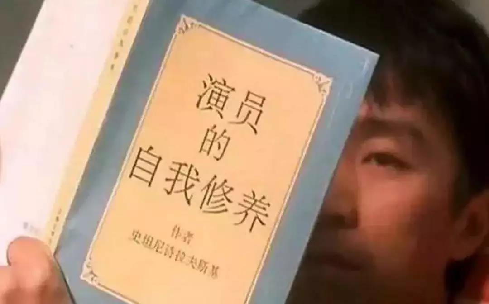
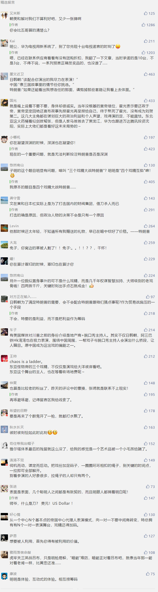

##正文

最近全球的外交局势都变得异常纷乱，日韩这对重要的军事盟友相互之间已经到了撕破脸的程度，相互将对方移除贸易的“白色清单”，而曾经一度剑拔弩张并在交火边缘的朝美却突然甜的似蜜。

本月9号，特朗普宣布自己收到了一封来自金正恩的“美好”、“非常积极”的长篇信件。特朗普还表示，“我期待在不远的未来与金正恩会面！一个没有核武器的朝鲜将最终成为世界上最成功的国家之一！”

可是，就在特朗普刚秀完金正恩“美妙来信”的第二天， 朝鲜又射了，在金正恩的现场指导下，朝鲜试射了一种性能优越的“新型武器”。

正在度假中的特朗普不顾被打的脸，马上又通过推特表示，之前金正恩的来信“也是对试射短程导弹的小小道歉”。

仿佛在向美国民众表示，神秘的金将军连射个导弹都要向美国总统打报告。

大概只有上一次在沙特王储谋杀案中，特朗普才会如此费劲心机的帮助别人开脱，不得不慨叹，特朗普和金正恩之间的化学反应速度还真有点快。

不过，就在对美国批评放缓的同时，近期朝鲜针对韩国政府的谴责声势却愈盛，而且在韩国国内，因朝鲜频繁炫耀武力，导致文在寅上台以来亲密的朝韩关系也蒙上了阴影，甚至连特朗普都在猛烈抨击自家盟友韩国军费交的少。

可以说，整个东北亚的外交关系，全被搞乱了。

当然，乱只是表象，治才是内核，东北亚各国此刻都在外交关系大乱的局势下，默默推进各国的既定战略。

其实本次美韩军演，韩国本可以拒绝的，但此次演习的背后，是要加速完成战时作战指挥权从美军向韩方的移交，这对于韩国来说意义重大，韩国文官政府也在紧随日本之后，试图利用特朗普执政期间将自己头上的狗链子摘除。

而且，军演这事儿还真不能主动拒绝，一旦表现出来为了朝鲜而忤逆美国军工集团，必然会给接下来的朝美谈判造成巨大的困扰。

因此，这段时间韩国人就和日本人一样，对着特朗普主张的美军撤离日韩，表面上都在哭着喊着“不要走”，内心里面都是在高呼“不要停”。

 

同样，朝鲜这也是在演戏，一方面，为了满足国内和国际需要，朝鲜对美韩的军事演习必须要反应，不能惹特朗普就只能让文在寅委屈委屈了。

而另一方面，在特朗普和金正恩的第四次会面之前保持较差的朝韩关系，又利于不刺激美国的鹰派们继续搞事儿。

日韩两国尚且如此，更不要说门阀世家出身的老戏骨安倍晋三了，给特朗普当了这几年的捧哏，一次都没掉过链子，演技堪称奥斯卡级的，一直在为日本修宪与正常化而做不懈的努力，哄得特朗普特别开心。

 

而目前撕逼不停的日韩，背后的原因很简单，一方面日韩都预判了朝鲜要跟美国和解，那么那么还没有给与朝鲜战争赔偿的日本，势必要通过对韩国的喊价而“杀价”，毕竟这这是一笔巨额开支。

而韩国则希望能够让日本多分担一些朝鲜的重建工作，毕竟现在韩国的经济也受创严重，靠自己养不起开放后的朝鲜。

 

而另一方面，跟安倍跟文在寅之间的撕逼，然后再去找特朗普仲裁，会给特朗普一种日韩俩儿子尽在掌握的假象，能够很好的掩盖哥俩各自推动的解套行为。

因此，东北亚此刻的局势，就变成了日韩朝三国在台上大乱斗，然后一起给特朗普演戏。
 
 

当然，鸡贼的特朗普也不是不明白这哥仨都在琢磨什么，因为对于他来说，最重要的是明年的大选，无论是朝美的历史性和解，还是日本韩国两个经济大国能够出的血，都是他明年竞选时振奋人心的重要筹码。

因此，他看似傻呵呵的放纵，本质上是作为一个“政治素人”的无奈之举，特朗普需要把这些东亚的国家和利益集团都绑在了自己的战车之上，说白了就是昨天文章中的曹操，想要玩政治，就得收寡妇认干儿子。

不要以为特朗普真的傻，靠着自己的能力当上美国总统的都不是一般的人杰，朝鲜马上就要召开今年年内的第二次最高人民会议，这种极为罕见的行为背后，都是在为接下来的朝美和谈进行推进。

而这种会议召开的背后，都是国家的长远战略，特朗普很清楚的知道，日韩朝三个国家只要被自己释放的利好启动了国家战略，在惯性之下就没办法停下来，届时都会在明年成为自己手中的人质和筹码。

到时候，没有退路的他们，就会像沙特和以色列那样，在特朗普需要的时候进行无条件的付出和配合。

说白了，大家都在演一场戏。

你在算计别人的时候，别人也在算计着你。

##留言区
 

